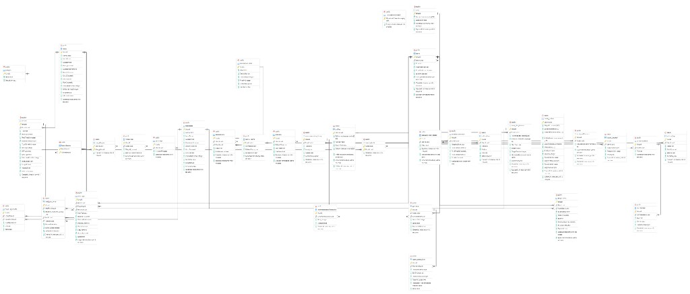

# MenuGreen System 🥗🔋

Welcome to the **MenuGreen System** repository! This is a modern, enterprise-grade backend ecosystem designed to help users track nutrition, manage kitchen ingredients, and build custom meal plans optimized by budgets and fitness targets.

The backend is built using a robust **.NET 9 N-Tier Architecture** coupled with **Entity Framework Core (EF Core)** and **PostgreSQL**.

---

## 🏗️ Project Architecture

The solution `MenuGreen.sln` follows a clean, modular N-Tier layered architecture:

- **Presentation Layer (`MenuGreen.API`):** Handles client HTTP requests, API routing, and security.
- **Business Logic Layer (`MenuGreen.BusinessLogicLayer`):** Implements services, validators, DTO mappings, and calorie formulas.
- **Data Access Layer (`MenuGreen.DataAccessLayer`):** Manages DB connection states, entities, Fluent Configurations, and Repository/UnitOfWork patterns.

---

## 📋 Chức năng của hệ thống (System Features)

Hệ thống MenuGreen được phân chia rõ ràng thành các gói tính năng phục vụ các nhu cầu dinh dưỡng khác nhau của người dùng:

### 1. Tính năng cơ bản (Miễn phí)

- **Phân tích sức khỏe cá nhân:** Theo dõi sát sao tình trạng sức khỏe tổng quan của người dùng. Hệ thống sẽ tự động đưa ra các cảnh báo trực quan để người dùng tránh xa các món ăn có chứa các thành phần gây dị ứng đã thiết lập.
- **Gợi ý theo hàm lượng Calo:** Cho phép gợi ý các món ăn phù hợp dựa vào lượng calo mục tiêu mà người dùng nhập vào. Ngoài ra hệ thống hỗ trợ lọc phân loại thức ăn theo sở thích cụ thể (ví dụ: món canh, đồ khô).
- **Quản lý nguyên liệu:** Hỗ trợ người dùng quản lý tủ lạnh ảo bằng cách nhập các nguyên liệu hiện có sẵn tại nhà.
- **Lịch sử hoạt động:** Nhật ký lưu trữ lịch sử ăn uống hàng ngày và tổng hợp các hoạt động thể chất/nhật ký thói quen đã thực hiện.
- **Thông báo nhắc nhở:** Tích hợp hệ thống gửi thông báo nhắc nhở tự động từ ứng dụng di động để duy trì lối sống lành mạnh.

---

### 2. Tính năng tính phí (Premium)

> [!TIP]
> **Mức phí dự kiến:** 80.000 VNĐ / nhóm tính năng.

#### 🎡 Nhóm tính năng "Chưa biết ăn gì"

_Dành cho đối tượng người dùng muốn tối ưu hóa thời gian lựa chọn món ăn và quản lý tài chính cá nhân._

- **Vòng quay thức ăn Eco-money:** Tự động đề xuất danh sách gồm 10 món ăn được chọn lọc kỹ lưỡng, đảm bảo đáp ứng tốt tiêu chí ngân sách (giá rẻ, tiết kiệm) và thời gian chuẩn bị/nấu nướng nhanh chóng.
- **Trò chuyện cùng AI:** Trợ lý ảo AI thông minh luôn sẵn sàng tư vấn thực đơn cá nhân, giải đáp các thắc mắc chi tiết về mặt dinh dưỡng và sức khỏe 24/7.

#### 💪 Nhóm tính năng dành cho Gymer

_Tập trung chuyên sâu vào cải thiện hình thể và tối ưu hiệu suất tập luyện._

- **Phân tích dinh dưỡng chuyên sâu:** Tính toán chi tiết đến từng gram các chỉ số Calories tổng và tỷ lệ Macros (Đạm - Protein, Đường/Tinh bột - Carbs, Chất béo - Fat).
- **Lộ trình ăn uống cá nhân hóa:** Thiết lập kế hoạch ăn uống dài hạn dựa trên dữ liệu khảo sát thể trạng đầu vào của người dùng.
- **Gói đăng ký linh hoạt:** Hỗ trợ đăng ký linh động theo nhu cầu ngắn hạn hoặc dài hạn (gói 7 ngày theo tuần hoặc theo tháng).
- **Thực đơn tự động:** Dựa vào mục tiêu calo mỗi ngày để phân chia danh sách món ăn tối ưu cho từng bữa (Sáng, Trưa, Chiều, Tối). Người dùng có toàn quyền điều chỉnh tổng khối lượng calo và chủ động thay đổi món ăn linh hoạt theo khẩu vị.

#### 🏢 Nhóm tính năng dành cho Dân văn phòng

_Tối ưu hóa thời gian chuẩn bị và hỗ trợ duy trì năng lượng làm việc bền bỉ cho người làm việc trí óc._

- **Kiểm soát dinh dưỡng đặc thù:** Theo dõi lượng Calo và Macros được đo đạc chuyên biệt, phù hợp với tính chất lối sống ít vận động hoặc làm việc văn phòng căng thẳng.
- **Lên lịch nấu nướng thông minh:** Hệ thống dựa vào quỹ thời gian rảnh thực tế của người dùng để gửi thông báo nhắc nhở chuẩn bị nguyên liệu và bắt đầu nấu nướng từ sớm.
- **Thực đơn gợi ý tiêu chuẩn:** Tập trung thiết kế thực đơn khoa học gồm **1 món sáng và 3 món trưa** (bao gồm 2 món chính đầy đủ dưỡng chất và 1 món tráng miệng nhẹ nhàng) để đảm bảo năng lượng dồi dào suốt ngày làm việc.

---

## 🛠️ Technology Stack

- **Language:** C# 13
- **Framework:** .NET 9.0 (ASP.NET Core Web API)
- **Database Provider:** EF Core with Npgsql (PostgreSQL provider)
- **Encryption & Security:** BCrypt.Net for password hashing, JWT for bearer tokens.

---

## 🚀 Setup & Execution

### 1. Prerequisites

- Install [.NET 9.0 SDK](https://dotnet.microsoft.com/download/dotnet/9.0)
- Install [PostgreSQL Database](https://www.postgresql.org/download/)

### 2. Database Migration Commands

Cập nhật hoặc khởi tạo cơ sở dữ liệu PostgreSQL từ Entity Model:

```bash
# Cài đặt EF CLI tool
dotnet tool install --global dotnet-ef

# Chuyển đến thư mục backend
cd backend

# Thực thi migration tạo database
dotnet ef database update --project MenuGreen.DataAccessLayer --startup-project MenuGreen.API
```

### 3. Database Seeding (Nạp dữ liệu mẫu)

Hệ thống cung cấp sẵn dữ liệu mẫu (Seed Data) được chia nhỏ thành các file SQL trong thư mục [MenuGreen_AI_SeedData](file:///e:/EXE201-MenuGreen/MenuGreenSystem/backend/MenuGreen_AI_SeedData).

Để tự động nạp toàn bộ các file SQL này vào cơ sở dữ liệu, bạn sử dụng script PowerShell [run_seed_data.ps1](file:///e:/EXE201-MenuGreen/MenuGreenSystem/backend/run_seed_data.ps1) trong thư mục `backend`:

1. **Mở PowerShell** (hoặc Terminal trong VS Code).
2. **Di chuyển vào thư mục `backend`**:
   ```powershell
   cd backend
   ```
3. **Thực thi script** (bỏ qua chính sách bảo mật của PowerShell nếu bị chặn):
   ```powershell
   PowerShell -ExecutionPolicy Bypass -File .\run_seed_data.ps1
   ```
4. **Nhập lựa chọn**:
   - **`1`**: Chạy trên Docker container `menugreen_db`.
   - **`2`**: Chạy trên PostgreSQL cục bộ (local psql) — *Script sẽ tự động kiểm tra và tạo database `MenuGreenDb` nếu chưa tồn tại*.
   - **`3`**: Gộp 55 file thành 1 file duy nhất `combined_seed_data.sql` để import thủ công qua PgAdmin/DBeaver.

### 4. Running the Web API

Khởi chạy dự án API:

```bash
dotnet run --project MenuGreen.API
```

Sau khi chạy thành công, truy cập Swagger UI tại địa chỉ:

- `http://localhost:5000/swagger`

---

## ERD (Entity Relationship Diagram)



---

## Session Summary (Cumulative)

### 2026-06-01 - Priority implementation (Allergy mapping first)

- Main objective:
  - Implement user-facing APIs for Flutter in priority order, starting with Allergy.
- Completed tasks:
  - Added backend endpoint `GET /api/UserSubscription/plans` in `UserSubscriptionController` for mobile plan listing.
  - Added Flutter endpoint mappings for Allergy APIs: `GET/POST/DELETE /api/Allergy`.
  - Implemented `AllergyRepository` in Flutter and connected onboarding allergy step to real APIs.
  - Updated allergy onboarding flow to load existing allergies and sync selected items on finish.
- Key decisions and solutions:
  - Used set-based sync strategy in onboarding: create newly selected allergies and delete unselected existing allergies.
  - Kept current UI structure and only added loading/saving state to reduce behavior risk.
- Tech stack used:
  - Backend: ASP.NET Core Web API (.NET 9, C#)
  - Frontend: Flutter (Dart)
  - Auth: JWT Bearer
- Files modified:
  - `backend/MenuGreen.API/Controllers/UserSubscriptionController.cs`
  - `frontend/lib/core/network/api_endpoints.dart`
  - `frontend/lib/features/onboarding/repositories/allergy_repository.dart` (new)
  - `frontend/lib/features/onboarding/views/steps/allergies_step.dart`
  - `README.md`

### 2026-06-01 - Greeting and session-summary rule execution

- Main objective:
  - Respond to a greeting and execute the required end-of-request cumulative session summary rule.
- Completed tasks:
  - Replied to the user greeting.
  - Reviewed the existing cumulative session summary format in `README.md`.
  - Appended this session summary entry to keep historical records cumulative.
- Key decisions and solutions:
  - Followed the existing summary structure to maintain consistency and readability across sessions.
  - Kept this entry lightweight because no feature implementation or bug fix was requested.
- Tech stack used:
  - Documentation update in Markdown (`README.md`).
- Files modified:
  - `README.md`

### 2026-06-01 - Language preference update (Vietnamese + English)

- Main objective:
  - Update response language style to bilingual Vietnamese and English.
- Completed tasks:
  - Received and accepted the user's request to respond in both Vietnamese and English.
  - Confirmed future responses will follow bilingual formatting.
  - Appended this cumulative session summary entry.
- Key decisions and solutions:
  - Prioritized the latest explicit user instruction for communication style.
  - Kept implementation scope to conversational behavior and documentation update only.
- Tech stack used:
  - Documentation update in Markdown (`README.md`).
- Files modified:
  - `README.md`

### 2026-06-01 - User API mapping audit (Backend vs Flutter)

- Main objective:
  - Verify whether user-related backend APIs are fully mapped in Flutter.
- Completed tasks:
  - Scanned backend controllers and extracted endpoints related to user flows (`UserController`, `UserSubscriptionController`, `AuthController`, `ProfileController`, `AllergyController`).
  - Cross-checked Flutter endpoint definitions in `api_endpoints.dart` and repository usage.
  - Identified mapped endpoints and highlighted non-mapped admin-only endpoints.
- Key decisions and solutions:
  - Treated "user APIs" as both direct `User*` controllers and user-facing account flows (Auth/Profile/Allergy/Subscription).
  - Marked admin-protected endpoints in `UserController` as intentionally not mapped for mobile user app context.
- Tech stack used:
  - Backend: ASP.NET Core Web API (.NET/C#)
  - Frontend: Flutter (Dart)
  - Verification approach: static code mapping audit
- Files modified:
  - `README.md`

### 2026-06-01 - Focus narrowed to end-user Flutter APIs only

- Main objective:
  - Re-scope API mapping verification to Flutter endpoints used by normal app users only.
- Completed tasks:
  - Excluded admin-only routes from validation scope.
  - Confirmed user app flows are centered on Auth, Profile, User(change-password), Allergy, and UserSubscription.
  - Prepared focused mapping conclusion for end-user mobile usage.
- Key decisions and solutions:
  - Treated admin-protected endpoints as out of scope for this audit.
  - Used endpoint + repository cross-check as the source of truth for Flutter mapping status.
- Tech stack used:
  - Backend: ASP.NET Core Web API
  - Frontend: Flutter (Dart)
  - Documentation: Markdown (`README.md`)
- Files modified:
  - `README.md`

### 2026-06-01 - Audit mapped APIs without direct UI usage

- Main objective:
  - Check which Flutter-mapped APIs do not currently have direct UI triggers in end-user flows.
- Completed tasks:
  - Traced endpoint usage chain from `ApiEndpoints` to repositories and then to screen widgets.
  - Verified direct UI usage across auth/profile/subscription/onboarding screens.
  - Identified one mapped endpoint used internally (token refresh) without direct UI action.
- Key decisions and solutions:
  - Evaluated "has UI" by checking whether a screen invokes repository methods that call the endpoint.
  - Counted silent background auth refresh as non-UI direct usage but still valid runtime usage.
- Tech stack used:
  - Flutter (Dart)
  - Static reference tracing with code search
  - Documentation update in Markdown (`README.md`)
- Files modified:
  - `README.md`

### 2026-06-01 - Built detailed end-user workflow from SRS document

- Main objective:
  - Read `d.txt` and produce a detailed user workflow for the MenuGreen app.
- Completed tasks:
  - Parsed SRS sections related to Guest/User journey: authentication, health profile, recommendation, tracking, AI assistant, and subscription interactions.
  - Organized the workflow into lifecycle phases (onboarding, daily usage, recommendation, tracking, premium, fallback).
  - Included exception paths (OTP expired, token refresh, AI fallback to rule-based recommendations).
- Key decisions and solutions:
  - Focused only on end-user experience, excluding admin operation workflows.
  - Structured output for product, QA, and engineering alignment (step-by-step, trigger-action-output style).
- Tech stack used:
  - Product specification analysis from SRS (`d.txt`)
  - Documentation in Markdown (`README.md`)
- Files modified:
  - `README.md`

### 2026-06-01 - Created Vietnamese user workflow README

- Main objective:
  - Create a dedicated README file describing the full end-user app workflow in Vietnamese.
- Completed tasks:
  - Created `README_USER_WORKFLOW.md` from scratch.
  - Documented end-to-end user journey: registration, authentication, onboarding, profile, allergies, recommendation, AI, tracking, and subscription.
  - Added exception scenarios, input-process-output model, and QA verification checklist.
- Key decisions and solutions:
  - Kept scope strictly on mobile app user workflows (excluded admin flows).
  - Structured document for direct use by Product, Dev, and QA teams.
- Tech stack used:
  - Documentation authoring in Markdown
  - Source analysis from SRS content (`d.txt`)
- Files modified:
  - `README_USER_WORKFLOW.md` (new)
  - `README.md`

### 2026-06-01 - Updated workflow README with Vietnamese diacritics

- Main objective:
  - Convert the user workflow README content from non-accented Vietnamese to fully accented Vietnamese.
- Completed tasks:
  - Rewrote the entire `README_USER_WORKFLOW.md` content with proper Vietnamese diacritics.
  - Preserved the original structure and sections (journey, detailed workflows, exceptions, IPO model, QA checklist).
- Key decisions and solutions:
  - Kept terminology and flow unchanged to avoid semantic drift while improving readability.
  - Applied full-text rewrite for consistency instead of partial edits.
- Tech stack used:
  - Markdown documentation editing
- Files modified:
  - `README_USER_WORKFLOW.md`
  - `README.md`

### 2026-06-01 - Audited API coverage against user workflows

- Main objective:
  - Verify which user workflows in `README_USER_WORKFLOW.md` are already covered by existing backend APIs.
- Completed tasks:
  - Cross-mapped workflow sections (4.1 -> 4.11) with controller endpoints in `backend/MenuGreen.API/Controllers`.
  - Classified coverage levels into full, partial, and not-yet-implemented.
  - Identified concrete endpoint groups for each workflow (Auth, Profile, HealthProfile, Allergy, Food/Recipe/Ingredient, Recommendation, NutritionTracking, Notification, UserSubscription).
- Key decisions and solutions:
  - Evaluated from backend API availability perspective, not UI wiring completeness.
  - Focused strictly on end-user app workflows and excluded admin-only controllers from primary coverage assessment.
- Tech stack used:
  - ASP.NET Core Web API endpoint inspection
  - Workflow-to-endpoint trace analysis
  - Documentation update in Markdown (`README.md`)
- Files modified:
  - `README.md`

### 2026-06-01 - Flutter UI workflow usability test

- Main objective:
  - Validate whether end-user workflows are actually usable from Flutter UI, not only available in backend APIs.
- Completed tasks:
  - Ran `flutter analyze` in `frontend` and captured current diagnostics.
  - Ran `flutter test` and recorded failing default widget smoke test.
  - Built and launched app on Windows (`flutter run -d windows`) to confirm app bootability.
  - Traced UI navigation and repository calls to classify workflows as usable, partial, or placeholder-only.
- Key decisions and solutions:
  - Assessed workflow usability from actual screen-to-repository wiring.
  - Marked flows as "partial" when backend API exists but UI still uses mock/static data.
- Tech stack used:
  - Flutter (Dart) UI/runtime checks
  - Static code trace for screen -> repository -> API mapping
  - Markdown documentation update (`README.md`)
- Files modified:
  - `README.md`

### 2026-06-01 - Executed next-step documentation plan (P1/P2/P3)

- Main objective:
  - Implement the next actionable steps by turning workflow analysis into an execution roadmap.
- Completed tasks:
  - Rebuilt `README_USER_WORKFLOW.md` into a clean Vietnamese version (removed duplicated mixed-accent content).
  - Added a coverage matrix: what is usable on UI now, what is partial, and what is API-only.
  - Added prioritized implementation roadmap (P1/P2/P3), technical checklist, and Definition of Done.
- Key decisions and solutions:
  - Focused roadmap on closing the UI-API gap first (onboarding, tracking, recommendation UI) before advanced AI enhancements.
  - Kept the document execution-oriented so product and engineering can use it directly as a sprint guide.
- Tech stack used:
  - Markdown documentation refactor
  - Workflow and API/UI trace synthesis
- Files modified:
  - `README_USER_WORKFLOW.md`
  - `README.md`

### 2026-06-01 - Implemented P1 onboarding API wiring

- Main objective:
  - Start P1 implementation by connecting onboarding health inputs to real backend APIs.
- Completed tasks:
  - Added new Flutter endpoint mapping: `GET/PUT /api/HealthProfile/me`.
  - Created `HealthProfileRepository` to load/update user health profile via authenticated API client.
  - Refactored onboarding `BasicInfoStep` to collect validated health data (height, weight, body-fat, activity level, goal).
  - Updated `CalorieGoalStep` to async finish callback and saving state.
  - Wired `OnboardingScreen` to persist health profile before navigating to `MainScreen`.
  - Ran analyzer for modified scope and confirmed no compile-blocking issues from newly introduced code.
- Key decisions and solutions:
  - Normalized frontend activity/goal values before sending to backend to match server-side calculation rules.
  - Kept calorie step value for UX continuity while backend remains source of truth for target calculations.
- Tech stack used:
  - Flutter (Dart)
  - ASP.NET Core Web API integration (`HealthProfileController`)
  - Static analysis via `flutter analyze`
- Files modified:
  - `frontend/lib/core/network/api_endpoints.dart`
  - `frontend/lib/features/onboarding/repositories/health_profile_repository.dart` (new)
  - `frontend/lib/features/onboarding/views/steps/basic_info_step.dart`
  - `frontend/lib/features/onboarding/views/steps/calorie_goal_step.dart`
  - `frontend/lib/features/onboarding/views/onboarding_screen.dart`
  - `README.md`

### 2026-06-01 - Implemented P1 part 2 (Home/History real data wiring)

- Main objective:
  - Continue P1 by replacing Home/History mock data with real NutritionTracking API data.
- Completed tasks:
  - Added NutritionTracking endpoints mapping for `daily` and `dashboard`.
  - Created `NutritionTrackingRepository` and typed models for daily summary + meal logs.
  - Updated `HomeView` to load real daily totals (calories, macros, targets) and render first available meal log summary.
  - Updated `HistoryView` to load selected-date summary from API and build timeline sections from real meal logs.
  - Replaced newly touched deprecated `withOpacity` usages in edited files.
  - Ran scoped analyzer and confirmed no issues in modified files.
- Key decisions and solutions:
  - Used `daily` endpoint first to minimize backend dependency while delivering visible real-data integration quickly.
  - Kept fallback-friendly UI behavior when no meal logs exist (empty states and safe defaults).
- Tech stack used:
  - Flutter (Dart)
  - ASP.NET Core Web API (`NutritionTrackingController`)
  - Static analysis via `flutter analyze`
- Files modified:
  - `frontend/lib/core/network/api_endpoints.dart`
  - `frontend/lib/features/tracking/repositories/nutrition_tracking_repository.dart` (new)
  - `frontend/lib/features/home/views/home_view.dart`
  - `frontend/lib/features/history/views/history_view.dart`
  - `README.md`

### 2026-06-01 - Implemented next step (weight log create + meal log delete from UI)

- Main objective:
  - Continue P1 by enabling direct user actions on tracking data from Flutter UI.
- Completed tasks:
  - Extended tracking endpoints mapping for weight logs and meal-log-by-id delete endpoint.
  - Extended `NutritionTrackingRepository` with dashboard fetch, weight-log creation, and meal-log deletion methods.
  - Added "Add weight" action in `HistoryView` header with dialog-based input and API submission.
  - Added meal-log deletion action from each history meal item via contextual menu.
  - Displayed latest recorded weight in history header using dashboard data.
  - Ran scoped analyzer and confirmed no issues in modified files.
- Key decisions and solutions:
  - Prioritized actions that are immediately usable with existing backend contracts.
  - Deferred meal-log creation UI because backend requires valid `FoodId/RecipeId` selection flow.
- Tech stack used:
  - Flutter (Dart)
  - ASP.NET Core Web API (`NutritionTrackingController`)
  - Static analysis via `flutter analyze`
- Files modified:
  - `frontend/lib/core/network/api_endpoints.dart`
  - `frontend/lib/features/tracking/repositories/nutrition_tracking_repository.dart`
  - `frontend/lib/features/history/views/history_view.dart`
  - `README.md`

### 2026-06-01 - Implemented meal log creation UI in History

- Main objective:
  - Continue tracking workflow completion by enabling meal-log creation from Flutter UI.
- Completed tasks:
  - Added endpoint mappings for food search, recipe search, and meal-log create.
  - Extended tracking repository with:
    - food list fetch (`Food` search endpoint),
    - recipe list fetch (`Recipe` search endpoint),
    - meal-log creation (`NutritionTracking/meal-logs`).
  - Implemented "Add meal log" dialog in `HistoryView`:
    - choose source type (Food/Recipe),
    - optional keyword search and load list,
    - choose item id,
    - choose meal type,
    - enter quantity (grams),
    - submit and refresh timeline.
  - Kept delete meal log and add weight log flows functional in the same screen.
  - Ran scoped analyzer and confirmed no issues.
- Key decisions and solutions:
  - Used API search responses (`items`) directly to avoid introducing heavy catalog screens before core tracking CRUD is complete.
  - Bound create payload to backend contract requiring either `FoodId` or `RecipeId`.
- Tech stack used:
  - Flutter (Dart)
  - ASP.NET Core Web API (`FoodController`, `RecipeController`, `NutritionTrackingController`)
  - Static analysis via `flutter analyze`
- Files modified:
  - `frontend/lib/core/network/api_endpoints.dart`
  - `frontend/lib/features/tracking/repositories/nutrition_tracking_repository.dart`
  - `frontend/lib/features/history/views/history_view.dart`
  - `README.md`

### 2026-06-01 - Meal log display names (Food/Recipe)

- Main objective:
  - Show real food/recipe names in meal logs instead of generic placeholder text.
- Completed tasks:
  - Extended `MealLogResponse` with `FoodName`, `RecipeTitle`, and `DisplayName`.
  - Updated `NutritionTrackingService` to batch-load related Food/Recipe records when mapping meal logs (daily summary, create, update).
  - Extended Flutter `MealLogItem` with `displayName` and fallback parsing from API fields.
  - Updated `HistoryView` timeline titles and `HomeView` recommended meal card to use `displayName`.
  - Verified backend build and scoped `flutter analyze` (no issues).
- Key decisions and solutions:
  - Used dictionary batch lookup in `MapMealLogsAsync` to avoid N+1 queries on daily summaries.
  - Default display label remains `Món đã ghi` when no linked food/recipe name is available.
- Tech stack used:
  - Backend: ASP.NET Core (.NET 9, C#)
  - Frontend: Flutter (Dart)
- Files modified:
  - `backend/MenuGreen.BusinessLogicLayer/DTOs/Responses/MealLogResponse.cs`
  - `backend/MenuGreen.BusinessLogicLayer/Services/NutritionTrackingService.cs`
  - `frontend/lib/features/tracking/repositories/nutrition_tracking_repository.dart`
  - `frontend/lib/features/history/views/history_view.dart`
  - `frontend/lib/features/home/views/home_view.dart`
  - `README.md`

### 2026-06-23 - Database seeding automation instruction

- Main objective:
  - Add instructions and support for automated seed data running using PowerShell.
- Completed tasks:
  - Modified script `backend/run_seed_data.ps1` to automatically check if PostgreSQL database exists and create it before importing seed data (when option 2 is chosen).
  - Documented running steps under the `Setup & Execution` section in `README.md`.
- Key decisions and solutions:
  - Used PostgreSQL command line tools (`psql`) to inspect existing databases non-interactively.
- Tech stack used:
  - PowerShell scripting, Markdown documentation.
- Files modified:
  - `backend/run_seed_data.ps1`
  - `README.md`
