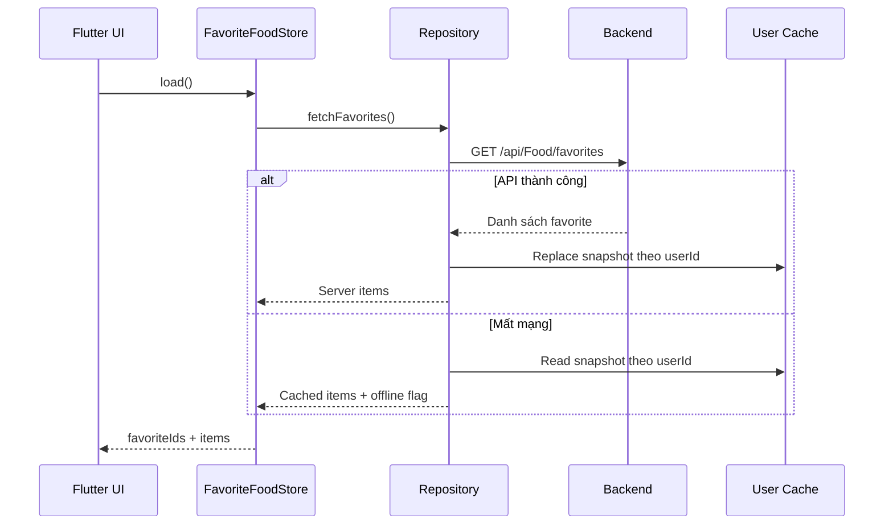

# Kế hoạch triển khai chức năng thêm món ăn vào danh sách yêu thích

**Ngày lập:** 26/07/2026  
**Phạm vi chính:** `frontend/` Flutter, đối chiếu API và database backend hiện có  
**Trạng thái:** Kế hoạch triển khai dựa trên kiểm tra mã nguồn thực tế

## 1. Mục tiêu

Hoàn thiện chức năng cho phép người dùng:

- Thêm một món ăn vào danh sách yêu thích từ các màn hình có hiển thị món.
- Nhận biết chính xác món nào đã được yêu thích.
- Bỏ yêu thích từ màn danh sách hoặc màn chi tiết.
- Xem danh sách yêu thích đồng nhất trên nhiều thiết bị.
- Dùng món yêu thích làm nguồn chọn nhanh khi tạo kế hoạch ăn.
- Không hiển thị thành công nếu backend chưa lưu được dữ liệu.
- Không làm lẫn dữ liệu yêu thích giữa các tài khoản trên cùng thiết bị.

Backend phải là nguồn dữ liệu chính. Cache local chỉ hỗ trợ tốc độ và offline, không được tự tạo ra trạng thái khác với server.

## 2. Phạm vi đề xuất

### 2.1 Giai đoạn 1 — Món trong Food Catalog

Chỉ hỗ trợ các món có `FoodId` hợp lệ và tồn tại trong bảng `foods`.

Các nguồn được hỗ trợ:

- Kết quả tìm món tại `DiscoverView`.
- `FoodDetailScreen`.
- Gợi ý có `RecommendationItem.type == Food`.
- Các danh sách gợi ý an toàn/budget có item là Food.
- Màn thêm món vào kế hoạch.

Giai đoạn này tận dụng bảng `favorite_foods` và API hiện có, không cần migration database.

### 2.2 Không trộn vào giai đoạn 1

- Recipe có `RecipeId`.
- Món AI snapshot chưa tồn tại trong catalog.
- Món/địa điểm giả lập trên bản đồ có ID local.
- Meal template.
- Món vừa scan từ hình ảnh.

Các đối tượng trên không có `FoodId` hợp lệ nên không được gửi vào:

```http
POST /api/Food/{foodId}/favorite
```

Nếu muốn lưu tất cả loại trên, cần triển khai mô hình “Saved item” tổng quát ở giai đoạn 2, không giả lập chúng thành một `FoodId`.

## 3. Hiện trạng đã có

### 3.1 Backend

API:

| Method | Endpoint | Hoạt động |
|---|---|---|
| `GET` | `/api/Food/favorites` | Lấy danh sách món yêu thích |
| `POST` | `/api/Food/{id}/favorite` | Thêm món yêu thích |
| `DELETE` | `/api/Food/{id}/favorite` | Bỏ món yêu thích |

Entity:

```text
FavoriteFood
├── UserId
├── FoodId
└── CreatedAt
```

Ràng buộc hiện có:

- Primary key kép `(UserId, FoodId)`.
- Không thể lưu trùng cùng một món cho cùng user.
- Foreign key tới `users` và `foods`.
- API yêu cầu policy `UserOnly`.
- `FavoriteAsync` và `UnfavoriteAsync` có tính idempotent cơ bản.

### 3.2 Frontend

Đã có:

- `FavoritesScreen`.
- `FoodDiscoveryRepository.getFavorites()`.
- `addFavorite`, `saveFavoriteItem`, `removeFavorite`.
- Nút tim trên `FoodDetailScreen`.
- Nút lưu trong `RecommendationDetailScreen` đối với item loại Food.
- Quick action “Yêu thích” trên Home.
- Entry point từ Discover và Home Search.
- Danh sách yêu thích được dùng trong `AddItemSheet`.

## 4. Kết quả kiểm tra chuyên sâu

## 4.1 P0 — Repository luôn báo thành công dù API thất bại

Hiện tại:

- `saveFavoriteItem` ghi local trước.
- Lỗi từ `POST /favorite` bị bỏ qua.
- Hàm luôn trả `true`.
- `removeFavorite` cũng bỏ qua lỗi API và luôn trả `true`.

Hậu quả:

- Flutter hiển thị “Đã thêm yêu thích” dù backend trả `401`, `404`, `500` hoặc mất mạng.
- Sau khi đăng nhập thiết bị khác, món không tồn tại.
- Lần tải sau trạng thái local và server có thể trái nhau.

Yêu cầu sửa:

- Kiểm tra HTTP status.
- Chỉ trả thành công khi backend xác nhận.
- Nếu dùng optimistic UI, phải rollback khi API lỗi.
- Trả về result có cấu trúc thay vì `bool` mơ hồ.

Ví dụ:

```dart
sealed class FavoriteMutationResult {}

class FavoriteMutationSuccess extends FavoriteMutationResult {
  final bool isFavorite;
}

class FavoriteMutationFailure extends FavoriteMutationResult {
  final String code;
  final String message;
}
```

## 4.2 P0 — Cache local không gắn với user

SharedPreferences đang dùng một key chung:

```text
user_favorite_foods_cache
```

Khi logout, `TokenStorage.clear()` chỉ xóa token và thông tin user; cache favorite không được xóa. User B có thể nhìn thấy favorite local của user A trên cùng thiết bị.

Yêu cầu sửa:

- Phương án khuyến nghị: key theo user:

```text
favorite_foods_cache:{userId}
```

- Xóa cache phiên hiện tại khi logout.
- Không đọc cache nếu chưa xác định được `userId`.
- Không dùng cache của tài khoản cũ làm dữ liệu khởi tạo cho tài khoản mới.

## 4.3 P0 — Local và server đang được merge nhưng không reconcile

`getFavorites()` hiện:

1. Đọc local trước.
2. Đọc server sau.
3. Chỉ thêm server item nếu ID chưa có.

Hậu quả:

- Món đã bị xóa trên server vẫn tồn tại vĩnh viễn ở local.
- Metadata cũ ở local được ưu tiên hơn dữ liệu mới từ server.
- Tên placeholder “Món ăn yêu thích” có thể che tên thật từ server.
- Không thể phân biệt cache stale và dữ liệu chính xác.

Yêu cầu sửa:

- Online: server là source of truth, response server thay thế toàn bộ cache.
- Offline: đọc snapshot cache gần nhất và đánh dấu `isFromCache`.
- Không union hai nguồn không có chiến lược conflict.

Luồng chuẩn:

```text
GET server thành công
  -> map response
  -> replace cache
  -> phát state mới

GET server thất bại
  -> đọc cache của đúng user
  -> hiển thị offline banner
```

## 4.4 P0 — Món trên bản đồ đang bị trộn với Food Catalog

`FoodMapScreen` lưu `MapFoodPin.id` vào `FavoriteFoodItem.foodId`, sau đó gọi API Food favorite.

Nếu ID pin không phải GUID của bảng `foods`:

- URL backend không match route `{id:guid}` hoặc backend trả Food not found.
- Repository vẫn báo thành công vì lỗi bị nuốt.
- `FavoritesScreen` hiển thị món local.
- Khi nhấn vào, `FoodDetailScreen` gọi `/api/Food/{id}` và không tìm thấy món.

Hướng xử lý:

- Tách “Món ăn yêu thích” và “Địa điểm/món trên bản đồ đã lưu”.
- Giai đoạn 1: chỉ hiển thị nút favorite backend khi pin có `catalogFoodId`.
- Nếu pin local không có `catalogFoodId`, dùng tính năng “Lưu địa điểm” riêng.
- Không lưu ID local vào `favorite_foods`.

## 4.5 P1 — RecommendationCard có nút nhưng chưa được nối hoạt động

Widget `RecommendationCard` có callback `onFavorite`, nhưng các màn:

- Recommendation list.
- Budget-aware list.

đang không truyền callback, nên biểu tượng yêu thích không xuất hiện.

Yêu cầu sửa:

- Cấp state `isFavorite` cho mỗi item.
- Chỉ hiển thị nút nếu `item.isFood`.
- Truyền callback toggle từ screen/provider.
- Icon phải là `favorite` hoặc `favorite_border` theo state hiện tại.
- Disable riêng nút đang xử lý, không khóa toàn bộ danh sách.

## 4.6 P1 — RecommendationDetailScreen không tải trạng thái ban đầu

`_isFavorite` khởi tạo `false` nhưng `_loadData()` không kiểm tra item đã nằm trong favorite hay chưa.

Hậu quả:

- Món đã yêu thích vẫn hiện nút “Lưu”.
- Lần nhấn đầu gọi add idempotent rồi mới đổi icon.
- Người dùng phải nhấn lần hai mới thực sự bỏ yêu thích.

Yêu cầu sửa:

- Khi load item Food, lấy trạng thái từ shared FavoriteStore.
- Không gọi `getFavorites()` riêng lẻ ở mỗi màn.
- State phải cập nhật nếu favorite thay đổi ở màn khác.

## 4.7 P1 — Discover list chưa cho lưu trực tiếp

Danh sách Food trong `DiscoverView` chỉ có allergy badge và hành động mở chi tiết. Người dùng phải mở món rồi mới nhấn tim.

Yêu cầu UX:

- Thêm icon tim ở trailing của `_FoodListTile`.
- Allergy badge và favorite button cần bố trí trong một row.
- Nút tim có semantics/tooltip:
  - “Thêm {tên món} vào yêu thích”.
  - “Bỏ {tên món} khỏi yêu thích”.
- Tap tim không kích hoạt tap mở chi tiết.

## 4.8 P1 — Favorite state bị tải lặp và không chia sẻ

Mỗi screen tạo một `FoodDiscoveryRepository` riêng và tự gọi `getFavorites()`.

Hậu quả:

- Nhiều request trùng.
- Màn A thêm favorite nhưng màn B không tự cập nhật.
- Dễ có race condition khi nhấn nhanh hoặc điều hướng.

Hướng xử lý:

- Tạo `FavoriteFoodStore`/`FavoriteFoodProvider`.
- Store giữ:
  - `Set<String> favoriteIds`.
  - `List<FavoriteFoodItem> items`.
  - `Set<String> mutatingIds`.
  - `loading`, `error`, `isFromCache`.
- Cung cấp store ở scope sau đăng nhập để các màn cùng dùng.

## 4.9 P1 — Model Flutter chưa dùng hết dữ liệu backend

Backend trả:

- Protein, carbs, fat.
- Category.
- Estimated price.
- CreatedAt.

Flutter `FavoriteFoodItem` hiện chỉ giữ:

- FoodId.
- NameVi.
- Calories.
- ImageUrl.
- Address local.

Yêu cầu sửa:

- Bổ sung các trường backend cần hiển thị.
- Bỏ `address` khỏi model Favorite Food catalog.
- Nếu cần address, tạo model SavedPlace riêng.
- Parse `createdAt` để giữ thứ tự mới lưu.

## 4.10 P1 — FavoritesScreen thiếu trạng thái lỗi và thao tác an toàn

Hiện tại:

- Không có error state.
- Không có pull-to-refresh.
- Xóa xong gọi lại toàn bộ `_load()`.
- Không confirm hoặc hỗ trợ undo.
- Không hiển thị ảnh món dù response có `imageUrl`.
- Nếu item local không tồn tại trên server, vẫn điều hướng vào detail.

Yêu cầu sửa:

- Dùng provider/store thay vì repository trực tiếp.
- Có loading, empty, offline và error state.
- Pull-to-refresh.
- Optimistic remove kèm Snackbar “Hoàn tác”.
- Hiển thị ảnh hoặc placeholder.
- Chỉ mở detail cho item catalog hợp lệ.

## 4.11 P2 — Backend cần phản hồi API rõ ràng hơn

Hiện controller thường trả `400` cho mọi exception.

Đề xuất:

| Trường hợp | HTTP |
|---|---|
| Food không tồn tại | `404` |
| Food inactive/không được phép lưu | `409` hoặc `422` |
| Thêm thành công | `200` hoặc `201` |
| Đã tồn tại | `200` idempotent |
| Xóa thành công/đã không tồn tại | `204` hoặc `200` idempotent |
| Chưa đăng nhập | `401` |

Response mutation nên trả state cuối:

```json
{
  "foodId": "...",
  "isFavorite": true,
  "message": "Đã thêm món vào yêu thích."
}
```

## 5. Kiến trúc frontend đề xuất

```text
UI Screens/Widgets
        |
        v
FavoriteFoodStore / Provider
        |
        v
FavoriteFoodRepository
   |             |
   v             v
ApiClient     User-scoped cache
        |
        v
/api/Food/favorites
```

### 5.1 FavoriteFoodRepository

Trách nhiệm:

- Gọi API.
- Parse response.
- Quản lý snapshot cache theo user.
- Không chứa UI state.
- Không nuốt lỗi.

API Dart đề xuất:

```dart
Future<List<FavoriteFoodItem>> fetchFavorites({
  bool allowCacheFallback = true,
});

Future<FavoriteMutationResponse> addFavorite(String foodId);

Future<FavoriteMutationResponse> removeFavorite(String foodId);

Future<void> clearUserCache();
```

### 5.2 FavoriteFoodStore

API state đề xuất:

```dart
bool isFavorite(String foodId);
bool isMutating(String foodId);

Future<void> load({bool forceRefresh = false});
Future<bool> toggle(FoodSummary food);
Future<bool> add(FoodSummary food);
Future<bool> remove(String foodId);
```

Quy tắc:

- Store load một lần sau đăng nhập hoặc khi màn đầu tiên cần.
- `favoriteIds` là nguồn cho icon ở mọi màn.
- Không cho gửi hai mutation đồng thời cho cùng `foodId`.
- Có optimistic update và rollback.
- Sau mutation thành công, cập nhật cache.
- Khi logout, dispose store và xóa cache đúng user.

### 5.3 Không dùng placeholder item để cache

`addFavorite(foodId)` hiện tạo:

```text
nameVi = "Món ăn yêu thích"
```

Thay bằng một trong hai cách:

1. Sau POST, backend trả full `FavoriteFoodResponse`; hoặc
2. Store nhận `FoodSummary` đầy đủ từ UI để optimistic update, sau đó refresh từ server.

Khuyến nghị cách 1 để server response là chuẩn.

## 6. Luồng nghiệp vụ chi tiết

### 6.1 Load trạng thái yêu thích



### 6.2 Thêm món yêu thích

1. Người dùng nhấn icon tim rỗng.
2. Store kiểm tra item là Food catalog và chưa xử lý.
3. UI đổi icon theo optimistic state.
4. Repository gọi `POST /api/Food/{id}/favorite`.
5. Thành công:
   - Store giữ trạng thái `true`.
   - Cache cập nhật.
   - Hiển thị Snackbar “Đã thêm vào món yêu thích”.
6. Thất bại:
   - Rollback icon.
   - Hiển thị lỗi phù hợp.
   - Không ghi item giả vào cache.

### 6.3 Bỏ yêu thích

1. Người dùng nhấn icon tim đặc.
2. Store optimistic remove.
3. Gọi `DELETE /api/Food/{id}/favorite`.
4. Thành công: cập nhật cache và tất cả màn đang lắng nghe.
5. Thất bại: rollback.
6. Từ FavoritesScreen có thể hiển thị Snackbar “Đã bỏ yêu thích — Hoàn tác”.

### 6.4 Đồng bộ giữa màn hình

Ví dụ:

```text
Discover list
    -> thêm Bún bò
    -> Store cập nhật favoriteIds
    -> FoodDetail hiển thị tim đặc
    -> FavoritesScreen thêm Bún bò
    -> AddItemSheet có Bún bò trong nhóm yêu thích
```

Không màn nào phải tự gọi lại toàn bộ API chỉ để biết một item vừa đổi.

## 7. Điểm đặt nút yêu thích

| Màn hình | Vị trí | Điều kiện |
|---|---|---|
| Discover food list | Trailing icon | Luôn có với Food |
| Food detail | AppBar icon | Luôn có với Food |
| Recommendation card | Góc phải card | Chỉ `item.isFood` |
| Recommendation detail | Action button | Chỉ `item.isFood` |
| Safe recommendations | Trailing cạnh chevron | Chỉ item Food |
| Budget-aware list | Góc phải card | Chỉ item Food |
| Favorites screen | Tim đặc/xóa | Item đang favorite |
| Food map | Không dùng Food favorite nếu không có catalogFoodId | Tách Saved Place |

## 8. Thiết kế FavoritesScreen

### 8.1 Danh sách

Mỗi item hiển thị:

- Ảnh món.
- Tên món.
- Calories.
- Protein hoặc category.
- Cảnh báo dị ứng nếu cần.
- Nút bỏ yêu thích.

### 8.2 Trạng thái giao diện

- Loading skeleton.
- Empty:
  - “Chưa có món yêu thích”.
  - CTA “Khám phá món ăn”.
- Error:
  - Nội dung dễ hiểu.
  - Nút “Thử lại”.
- Offline:
  - Hiển thị snapshot.
  - Banner “Đang hiển thị dữ liệu đã lưu trên thiết bị”.
- Refresh:
  - Pull-to-refresh từ server.

### 8.3 Hành động tiếp theo

Khi nhấn item:

- Mở `FoodDetailScreen`.

Menu phụ có thể bổ sung:

- Thêm vào bữa hôm nay.
- Thêm vào kế hoạch.
- Bỏ yêu thích.

## 9. Backend cần điều chỉnh

### 9.1 Kiểm tra Food hợp lệ

Khi add:

- Food phải tồn tại.
- Food phải active nếu chính sách catalog không cho lưu món inactive.
- User phải hợp lệ từ token.

### 9.2 Trả item vừa lưu

Thay vì chỉ trả:

```json
{ "message": "Added to favorites successfully." }
```

trả `FavoriteFoodResponse` hoặc mutation response có item đầy đủ.

### 9.3 Endpoint lấy IDs tùy chọn

Nếu danh sách Food lớn và UI chỉ cần tô icon:

```http
GET /api/Food/favorites/ids
```

Response:

```json
{
  "foodIds": ["...", "..."],
  "version": "..."
}
```

Giai đoạn đầu chưa bắt buộc vì `GET /favorites` hiện đủ dùng.

### 9.4 Pagination

Chỉ bổ sung khi số favorite có thể lớn:

```http
GET /api/Food/favorites?page=1&pageSize=20&search=&sort=recent
```

Với quy mô hiện tại có thể giữ endpoint list đơn giản.

## 10. Xử lý offline

Khuyến nghị giai đoạn đầu:

- Cho phép xem cache offline.
- Không giả báo mutation thành công khi offline.
- Hiển thị “Cần kết nối mạng để thay đổi danh sách yêu thích”.

Giai đoạn sau có thể xây mutation queue:

- Mỗi action có `operationId`.
- Đồng bộ lại khi có mạng.
- Last explicit user action wins.
- Cần xử lý xung đột nhiều thiết bị.

Không nên triển khai queue trong giai đoạn 1 nếu chưa có yêu cầu offline mutation rõ ràng.

## 11. Error handling

Mã lỗi đề xuất:

| Code | Thông báo Flutter |
|---|---|
| `FOOD_NOT_FOUND` | Món ăn không còn tồn tại |
| `FOOD_INACTIVE` | Món ăn hiện không còn khả dụng |
| `FAVORITE_ADD_FAILED` | Không thể thêm vào yêu thích |
| `FAVORITE_REMOVE_FAILED` | Không thể bỏ món yêu thích |
| `UNAUTHORIZED` | Phiên đăng nhập đã hết hạn |
| `NETWORK_ERROR` | Không có kết nối mạng |

Flutter không nên nhận biết lỗi bằng cách tìm chuỗi trong message.

## 12. Kế hoạch kiểm thử

### 12.1 Repository tests

- GET thành công thay thế cache.
- GET lỗi dùng đúng cache của user hiện tại.
- User B không đọc cache user A.
- POST thành công trả favorite.
- POST lỗi không ghi cache.
- DELETE thành công xóa cache.
- DELETE lỗi giữ/rollback item.
- Không nuốt `401`, `404`, `500`.

### 12.2 Store/provider tests

- Load danh sách tạo đúng `favoriteIds`.
- Toggle add.
- Toggle remove.
- Chặn double tap cùng food.
- Optimistic add rollback.
- Optimistic remove rollback.
- Hai widget cùng cập nhật khi state thay đổi.
- Logout reset state.

### 12.3 Widget tests

- Food list hiển thị đúng icon.
- Food detail load đúng trạng thái ban đầu.
- Recommendation card chỉ có tim với Food.
- Recipe không gọi Food favorite API.
- FavoritesScreen có loading/empty/error/offline/list.
- Bỏ favorite có undo.
- Semantics và tooltip đúng.

### 12.4 Backend tests

- Add favorite thành công.
- Add trùng là idempotent.
- Food không tồn tại trả `404`.
- User không thể tác động favorite của user khác.
- Delete tồn tại/không tồn tại đều ổn định.
- Composite key ngăn duplicate khi request đồng thời.
- GET chỉ trả dữ liệu của user đang đăng nhập.

### 12.5 E2E

1. Thêm món từ Discover, kiểm tra xuất hiện trong Favorites.
2. Thêm từ FoodDetail, quay lại list thấy tim đặc.
3. Thêm từ RecommendationCard.
4. Bỏ từ Favorites, quay lại FoodDetail thấy tim rỗng.
5. Đăng nhập thiết bị khác thấy cùng danh sách.
6. Logout user A, login user B không thấy dữ liệu A.
7. Mất mạng khi add không hiển thị thành công giả.
8. Map pin không có catalogFoodId không bị đưa vào Food favorites.
9. Món yêu thích xuất hiện trong AddItemSheet và thêm được vào meal plan.

## 13. Kế hoạch triển khai theo giai đoạn

### Giai đoạn 1 — Sửa tính đúng đắn dữ liệu

- Tách API result khỏi cache local.
- Không nuốt lỗi và không luôn trả `true`.
- Server là source of truth.
- Cache theo `userId`.
- Clear cache/state khi logout.
- Tách map pin khỏi Food favorites.
- Bổ sung repository tests.

**Điều kiện hoàn thành:** không còn trường hợp UI báo đã lưu nhưng backend không có dữ liệu.

### Giai đoạn 2 — State dùng chung

- Tạo `FavoriteFoodStore`.
- Cung cấp store ở authenticated app scope.
- Chuyển FoodDetail và FavoritesScreen sang store.
- Đồng bộ state giữa các màn.
- Thêm optimistic update/rollback.
- Bổ sung provider tests.

**Điều kiện hoàn thành:** thay đổi ở một màn được phản ánh ngay ở mọi màn khác.

### Giai đoạn 3 — Kết nối toàn bộ điểm vào

- Discover food list.
- Recommendation list/detail.
- Safe recommendations.
- Budget-aware recommendations.
- AddItemSheet.
- Hoàn thiện FavoritesScreen.

**Điều kiện hoàn thành:** mọi món Food catalog đều có hành vi favorite nhất quán.

### Giai đoạn 4 — Backend/API và kiểm thử E2E

- Chuẩn hóa HTTP status/error code.
- Trả item đầy đủ sau mutation.
- Kiểm tra Food active.
- Viết backend tests.
- Chạy Flutter analyzer, tests và E2E.

**Điều kiện hoàn thành:** đạt toàn bộ tiêu chí nghiệm thu.

### Giai đoạn 5 — Saved item tổng quát, nếu cần

Chỉ thực hiện khi sản phẩm yêu cầu lưu Recipe, AI snapshot hoặc địa điểm.

Mô hình đề xuất:

```text
UserSavedItem
├── Id
├── UserId
├── TargetType: FOOD | RECIPE | AI_DISH | PLACE_DISH
├── TargetId nullable
├── SnapshotJson nullable
├── CollectionType: FAVORITE | TEMPLATE | SAVED_PLACE
└── CreatedAt
```

Cần unique constraint theo `UserId + TargetType + TargetId + CollectionType`.

Không migration sang mô hình này trong giai đoạn 1 nếu yêu cầu chỉ là Food catalog.

## 14. Danh sách file dự kiến chỉnh sửa

Frontend:

1. `lib/features/discover/repositories/food_discovery_repository.dart`
2. `lib/features/discover/models/food_models.dart`
3. Tạo `lib/features/discover/providers/favorite_food_provider.dart`
4. `lib/features/discover/views/favorites_screen.dart`
5. `lib/features/discover/views/food_detail_screen.dart`
6. `lib/features/discover/views/discover_view.dart`
7. `lib/features/discover/views/recommendation_detail_screen.dart`
8. `lib/features/discover/views/recommendation_screen.dart`
9. `lib/features/discover/views/safe_recommendations_screen.dart`
10. `lib/features/discover/views/budget_aware_screen.dart`
11. `lib/features/discover/widgets/recommendation_card.dart`
12. `lib/features/discover/views/food_map_screen.dart`
13. `lib/features/auth/repositories/auth_repository.dart`
14. Các test repository/provider/widget tương ứng.

Backend:

1. `MenuGreen.API/Controllers/FoodController.cs`
2. `MenuGreen.BusinessLogicLayer/Services/FoodService.cs`
3. `MenuGreen.BusinessLogicLayer/DTOs/Responses/FavoriteFoodResponse.cs`
4. Backend tests cho favorite endpoints.

Không cần thay đổi `FavoriteFood` entity hoặc database trong giai đoạn 1.

## 15. Tiêu chí nghiệm thu

| ID | Tiêu chí |
|---|---|
| FAV-01 | Người dùng thêm được Food catalog vào yêu thích |
| FAV-02 | API lỗi thì UI không báo thành công |
| FAV-03 | Icon favorite đúng ngay khi mở mọi màn |
| FAV-04 | Thay đổi favorite đồng bộ giữa các màn |
| FAV-05 | Không có dữ liệu favorite bị lẫn giữa tài khoản |
| FAV-06 | Online response thay thế cache stale |
| FAV-07 | Offline chỉ hiển thị snapshot có nhãn rõ ràng |
| FAV-08 | Recipe/map pin local không gọi nhầm Food favorite API |
| FAV-09 | Add/delete idempotent và không tạo duplicate |
| FAV-10 | FavoritesScreen có loading, empty, error và refresh |
| FAV-11 | Món yêu thích dùng được trong AddItemSheet |
| FAV-12 | Flutter analyzer và toàn bộ test liên quan đều sạch |

## 16. Definition of Done

Chức năng hoàn thành khi:

- Backend là nguồn dữ liệu chính.
- Cache được phân vùng theo user và được dọn khi logout.
- Repository không nuốt lỗi.
- UI rollback đúng khi mutation thất bại.
- Có một FavoriteStore dùng chung.
- FoodDetail, Discover, Recommendations và FavoritesScreen dùng cùng state.
- Map pin/Recipe/AI dish không bị lưu nhầm dưới dạng Food.
- API trả lỗi và trạng thái đủ rõ để Flutter xử lý.
- Có unit test, widget test, backend test và E2E cho các luồng chính.

## 17. Thứ tự ưu tiên thực hiện

1. Sửa repository luôn trả thành công.
2. Sửa cache dùng chung giữa tài khoản.
3. Tách favorite map pin khỏi Food catalog.
4. Tạo FavoriteFoodStore dùng chung.
5. Sửa trạng thái ban đầu tại RecommendationDetailScreen.
6. Nối callback cho RecommendationCard và Discover list.
7. Hoàn thiện FavoritesScreen.
8. Chuẩn hóa API response/error.
9. Viết và chạy toàn bộ test.

