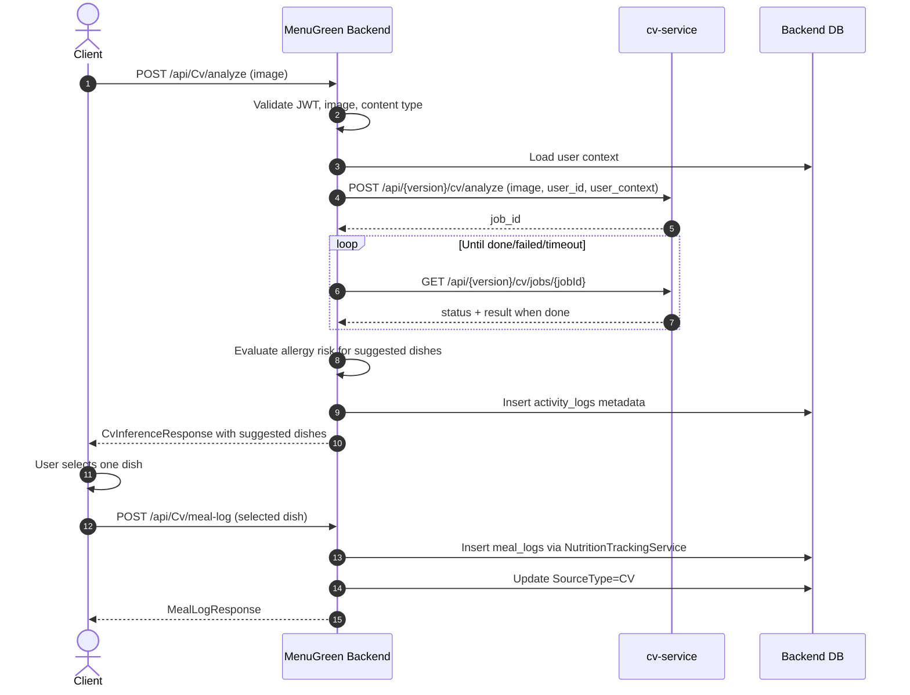

# Quy trinh scan hinh anh mon an

Tai lieu nay mo ta luong hoat dong cua chuc nang scan hinh anh tu client, qua backend MenuGreen, den `cv-service`, va cach luu mon an user chon vao database.

## 1. Thanh phan tham gia

- Client: mobile/web app gui anh va nhan ket qua goi y mon an.
- Backend: ASP.NET Core API trong `MenuGreen.API`.
- Business logic: `CvService` trong `MenuGreen.BusinessLogicLayer`.
- CV service: service xu ly anh tai URL duoc cau hinh qua `CvService:BaseUrl`.
- Database backend: luu audit vao `activity_logs` va luu bua an vao `meal_logs`.

## 2. Cau hinh ket noi CV service

Backend doc cau hinh tu section `CvService`.

```json
{
  "CvService": {
    "BaseUrl": "<CV_SERVICE_BASE_URL>",
    "ApiVersion": "v1",
    "ApiSecretKey": "",
    "PollTimeoutSeconds": 90,
    "PollIntervalSeconds": 3
  }
}
```

Khi deploy, co the set bang environment variables:

```text
CvService__BaseUrl=<CV_SERVICE_BASE_URL>
CvService__ApiVersion=v1
CvService__ApiSecretKey=<secret neu cv-service yeu cau>
CvService__PollTimeoutSeconds=90
CvService__PollIntervalSeconds=3
```

Backend build URL goi CV theo format:

```text
{BaseUrl}/api/{ApiVersion}/cv/analyze
{BaseUrl}/api/{ApiVersion}/cv/jobs/{jobId}
```

Vi du voi config hien tai:

```text
POST <CV_SERVICE_BASE_URL>/api/v1/cv/analyze
GET  <CV_SERVICE_BASE_URL>/api/v1/cv/jobs/{jobId}
```

## 3. Luong scan anh

Endpoint client goi:

```http
POST /api/Cv/analyze
Authorization: Bearer <jwt>
Content-Type: multipart/form-data
```

Form data:

```text
image=<file anh>
```

Backend yeu cau:

- User phai dang nhap va co policy `UserOnly`.
- File `image` khong duoc rong.
- Content type chi chap nhan:
  - `image/jpeg`
  - `image/png`
  - `image/webp`

## 4. Backend truyen gi xuong cv-service

Sau khi lay duoc `userId` tu JWT, backend forward anh sang `cv-service` bang multipart request.

Header:

```text
Authorization: Bearer <CvService:ApiSecretKey>    // chi gui khi config co secret
X-User-Id: <current-user-id>
```

Multipart fields:

```text
image=<file anh>
user_id=<current-user-id>
user_context=<json context cua user>
```

`user_context` gom cac thong tin backend lay tu database:

- `UserId`
- `IsActive`
- `Profile`
  - `FullName`
  - `DateOfBirth`
  - `Gender`
  - `PreferredCuisine`
- `HealthProfile`
  - `HeightCm`
  - `WeightKg`
  - `BodyFatPercent`
  - `ActivityLevel`
  - `Goal`
  - `Bmi`
  - `BmrKcal`
  - `TdeeKcal`
  - `TargetCalories`
  - `TargetProteinG`
  - `TargetCarbsG`
  - `TargetFatG`
- `AiProfile`
  - `Preferences`
  - `DislikedFoods`
  - `EatingPattern`
- `Allergies`
  - danh sach allergy dang active cua user

Muc dich cua `user_context` la de `cv-service` co du lieu user khi can personalize ket qua scan, con backend van tu check allergy lai sau khi nhan ket qua.

## 5. Xu ly job va polling

`cv-service` khong tra ket qua phan tich ngay. Backend hoat dong theo mo hinh job:

1. Backend gui anh den:

```http
POST /api/{version}/cv/analyze
```

2. `cv-service` tra ve `job_id`.

3. Backend poll trang thai job:

```http
GET /api/{version}/cv/jobs/{jobId}
```

4. Backend lap lai moi `PollIntervalSeconds` giay cho den khi:

- `status = done`: lay `result`.
- `status = failed`: tra loi loi tu CV service.
- qua `PollTimeoutSeconds`: tra timeout.

## 6. Backend xu ly ket qua CV

Sau khi job done, backend nhan `CvInferenceResponse`.

Ket qua chinh gom:

- `job_id`
- `request_id`
- `api_version`
- `status`
- `processing_time_ms`
- `nguyen_lieu_tho_quet_duoc`
- `danh_sach_mon_an_goi_y`

Moi item trong `danh_sach_mon_an_goi_y` la `CvSuggestedDish`, gom:

- `id_mon_an_goi_y`
- `ten_mon_an`
- `ten_mon_an_ky_thuat`
- `mo_ta_ngan`
- `do_kha_thi`
- `confidence`
- `nguyen_lieu_su_dung`
- `thong_tin_dinh_duong_mon_an`
- `is_safe_for_user`
- `matched_allergens`

Backend tiep tuc xu ly:

1. Lay danh sach nguyen lieu cua tung mon goi y.
2. Goi `IAllergenMatchingService.EvaluateRecipeRiskAsync(...)`.
3. Cap nhat lai:
   - `IsSafeForUser`
   - `MatchedAllergens`

Vi vay ket qua tra ve client da co thong tin an toan theo allergy cua user hien tai.

## 7. Backend luu audit scan vao database

Sau khi xu ly xong ket qua CV, backend luu mot record vao `activity_logs`.

Gia tri chinh:

```text
UserId=<current-user-id>
Action=CV_ANALYZE_IMAGE
EntityType=CvInference
EntityId=<job_id neu parse duoc Guid, neu khong thi tao Guid moi>
Metadata=<full CvInferenceResponse dang JSON>
CreatedAt=<utc now>
```

Luu y: buoc nay chi luu audit/metadata cua lan scan. No chua tao `meal_logs`.

## 8. Client hien thi danh sach mon an

Sau khi `POST /api/Cv/analyze` thanh cong, client nhan `CvInferenceResponse` va hien thi `danh_sach_mon_an_goi_y` cho user chon.

Client nen giu lai:

- `job_id`
- `request_id`
- mon user chon trong `danh_sach_mon_an_goi_y`

Nhung thong tin nay se duoc gui lai khi user bam luu mon.

## 9. Luu mon user chon vao database

Sau khi user chon mot mon, client goi endpoint:

```http
POST /api/Cv/meal-log
Authorization: Bearer <jwt>
Content-Type: application/json
```

Body mau:

```json
{
  "dish": {
    "id_mon_an_goi_y": "dish_001",
    "ten_mon_an": "Uc ga ap chao",
    "ten_mon_an_ky_thuat": "grilled_chicken_breast",
    "mo_ta_ngan": "Mon uc ga ap chao voi rau",
    "do_kha_thi": "high",
    "confidence": 0.91,
    "nguyen_lieu_su_dung": [],
    "thong_tin_dinh_duong_mon_an": {
      "tong_calories": 420,
      "protein_g": 38,
      "carbs_g": 20,
      "fat_g": 16,
      "fiber_g": 3
    },
    "is_safe_for_user": true,
    "matched_allergens": []
  },
  "mealType": "Lunch",
  "quantityG": 100,
  "loggedAt": "2026-06-29T12:00:00Z",
  "notes": "User selected from CV result",
  "analysisJobId": "job-id-from-analyze",
  "analysisRequestId": "request-id-from-analyze"
}
```

Backend map request nay sang `MealLogUpsertRequest`:

```text
MealType     <- request.MealType
QuantityG    <- request.QuantityG
LoggedAt     <- request.LoggedAt
CaloriesKcal <- dish.thong_tin_dinh_duong_mon_an.tong_calories
ProteinG     <- dish.thong_tin_dinh_duong_mon_an.protein_g
CarbsG       <- dish.thong_tin_dinh_duong_mon_an.carbs_g
FatG         <- dish.thong_tin_dinh_duong_mon_an.fat_g
Notes        <- CV metadata dang JSON
```

Sau do backend goi:

```text
NutritionTrackingService.CreateMealLogAsync(userId, mealLogRequest)
```

Service nay tao record trong bang `meal_logs`, dong thoi sync lai nutrition snapshot trong ngay.

Sau khi tao xong, `CvService` cap nhat record vua tao:

```text
SourceType=CV
```

## 10. Du lieu duoc luu trong `meal_logs`

Record `meal_logs` sau khi user luu mon CV co cac truong chinh:

```text
Id=<meal log id>
UserId=<current-user-id>
MealType=<Breakfast/Lunch/Dinner/Snack/...>
QuantityG=<quantity user chon>
CaloriesKcal=<calories tu CV>
ProteinG=<protein tu CV>
CarbsG=<carbs tu CV>
FatG=<fat tu CV>
SourceType=CV
Notes=<CV metadata JSON>
LoggedAt=<thoi diem log>
IsFromMealPlan=false
```

`Notes` gom metadata:

```json
{
  "source": "CV",
  "analysisJobId": "job-id-from-analyze",
  "analysisRequestId": "request-id-from-analyze",
  "dishId": "dish_001",
  "dishName": "Uc ga ap chao",
  "technicalName": "grilled_chicken_breast",
  "confidence": 0.91,
  "feasibility": "high",
  "description": "Mon uc ga ap chao voi rau",
  "isSafeForUser": true,
  "matchedAllergens": [],
  "userNotes": "User selected from CV result"
}
```

## 11. Sequence tong quat



## 12. Loi va status code

`CvController` dung `CvExceptionFilter` de map loi:

```text
ArgumentException        -> 400 Bad Request
InvalidOperationException -> 502 Bad Gateway
TimeoutException         -> 504 Gateway Timeout
Exception                -> 500 Internal Server Error
```

Mot so truong hop loi thuong gap:

- Thieu anh: `400`
- File khong phai JPEG/PNG/WEBP: `400`
- JWT khong hop le hoac khong co user id: `401`
- Thieu `CvService:BaseUrl`: `502`
- CV service reject request: `502`
- CV job failed: `502`
- CV job poll qua timeout: `504`

## 13. Cac file code lien quan

- `backend/MenuGreen.API/Controllers/CvController.cs`
- `backend/MenuGreen.API/Filters/CvExceptionFilter.cs`
- `backend/MenuGreen.BusinessLogicLayer/Services/CvService.cs`
- `backend/MenuGreen.BusinessLogicLayer/Interfaces/ICvService.cs`
- `backend/MenuGreen.BusinessLogicLayer/Configuration/CvServiceOptions.cs`
- `backend/MenuGreen.BusinessLogicLayer/DTOs/Requests/CvMealLogCreateRequest.cs`
- `backend/MenuGreen.BusinessLogicLayer/DTOs/Responses/CvInferenceResponse.cs`
- `backend/MenuGreen.BusinessLogicLayer/DTOs/Responses/CvSuggestedDish.cs`
- `backend/MenuGreen.BusinessLogicLayer/Services/NutritionTrackingService.cs`
- `backend/MenuGreen.DataAccessLayer/Entities/MealLog.cs`
- `backend/MenuGreen.DataAccessLayer/Entities/ActivityLog.cs`
