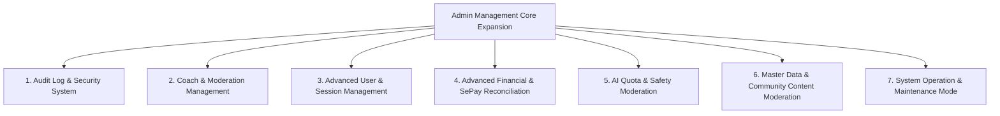
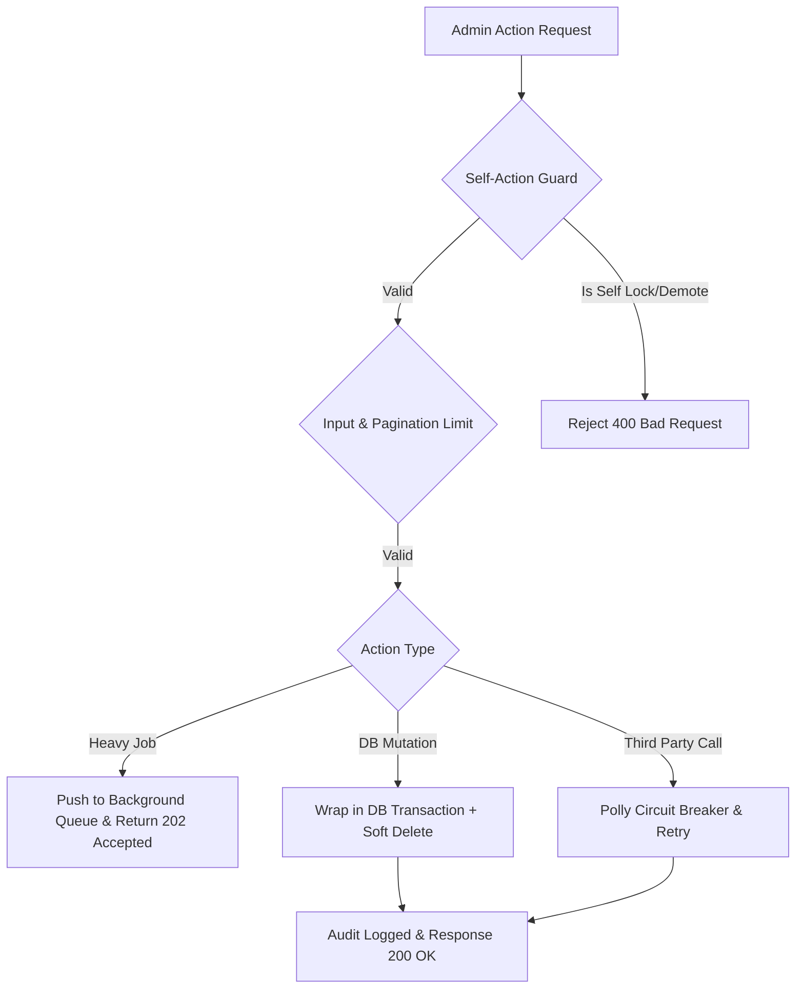

# Kế Hoạch Chuyên Sâu Tăng Cường & Mở Rộng Tính Năng Quản Lý Cho Admin (MenuGreen System)

> **Ngày tạo:** 27/07/2026  
> **Trạng thái:** Kế hoạch Hoàn chỉnh (Bao gồm Kiểm thử & Phòng ngừa Crash)  
> **Phạm vi tác động:** `backend/MenuGreen.API`, `backend/MenuGreen.BusinessLogicLayer`, `backend/MenuGreen.DataAccessLayer`, `database/`

---

## 1. Bối Cảnh & Đánh Giá Hiện Trạng Admin API Controller

Qua việc khảo sát toàn bộ 49 API Controllers trong thư mục `MenuGreen.API`, hệ thống hiện tại mới chỉ đáp ứng một số tác vụ admin cơ bản. Vẫn còn **nhiều khoảng trống lớn** trong công tác vận hành, kiểm duyệt, bảo mật và tài chính.

### 1.1. Các API Admin Hiện Có
- **`UserController.cs`**: `GetAllUsers`, `GetUserById`, `ToggleUserStatus`, `LockUser` (chỉ khóa/mở khóa đơn giản).
- **`AdminMicroLearningController.cs`**: CRUD bài học Micro-learning.
- **`AiAdminController.cs`**: Đọc cấu hình Prompt AI cơ bản.
- **`SubscriptionPlanController.cs`**: CRUD thông tin gói cước.
- **`NotificationAdminController.cs`**: Gửi Push Notification thủ công.
- **`JobTriggerController.cs`**: Kích hoạt Job ngầm.
- **`AnalyticsController.cs` / `DashboardController.cs`**: Xem chỉ số thống kê tổng quan.
- **`AdminMigrationController.cs`**: Chạy script migration dữ liệu.

### 1.2. Những Khoảng Trống (Gaps) Cần Bổ Sung Cho Admin
1. **Quản lý & Duyệt Huấn luyện viên (Coach Management & Verification)**: Chưa có luồng duyệt hồ sơ chứng chỉ Coach, hủy quyền Coach, theo dõi hoa hồng.
2. **Kiểm duyệt Nội dung Tập luyện & Dinh dưỡng (Content Moderation)**: Đánh giá Coach/PT review chưa có công cụ kiểm duyệt; công thức món ăn do user/Coach đóng góp chưa có luồng Admin Approve/Reject.
3. **Quản lý Tài chính & Đối soát SePay (Financial & Payment Moderation)**: Thiếu tra cứu lịch sử giao dịch toàn hệ thống, xử lý hoàn tiền (Refund), gia hạn thủ công (Manual Adjust), và xử lý giao dịch treo.
4. **Giám sát & Giới hạn Hạn ngạch AI (AI Cost & Safety Control)**: Thiếu cấu hình Rate-limit / Quota AI theo từng gói user, thiếu bộ lọc từ khóa cấm (Prompt Safety Moderation).
5. **Nhật ký Đơn vết & An ninh Hệ thống (Audit Logs & Security)**: Không có bảng lưu vết các hành động nhạy cảm của Admin/Users (Ai khóa ai, ai đổi giá gói cước, ai xóa dữ liệu master).
6. **Quản lý Phiên & Chế độ Bảo trì (System Session & Maintenance)**: Thiếu công cụ ngắt phiên đăng nhập khẩn cấp (Force Logout), thiếu cờ Bật/Tắt "Chế độ bảo trì hệ thống" (System Maintenance Mode).

---

## 2. Chi Tiết Kế Hoạch Bổ Sung Các Phân Hệ Quản Lý

---

### Phân Hệ 1: Audit Log & An Ninh Hệ Thống (`AdminAuditLogController`)

#### Mục tiêu:
Tự động ghi lại mọi thao tác làm thay đổi dữ liệu nguy hiểm hoặc cấp quyền trong hệ thống.

#### Đề xuất API Controller mới: `AdminAuditLogController.cs`
- `GET /api/admin/audit-logs` - Tra cứu nhật ký hệ thống (phân trang, lọc theo `UserId`, `Action`, `EntityName`, `FromDate`, `ToDate`).
- `GET /api/admin/audit-logs/{id}` - Xem chi tiết payload cũ và payload mới của thao tác.
- `GET /api/admin/security/suspicious-activities` - Thống kê các tài khoản đăng nhập sai mật khẩu quá 5 lần hoặc địa chỉ IP bất thường.

#### Cấu trúc Database Entity đề xuất (`AuditLog.cs`):
- `Id` (Guid)
- `UserId` (Guid) - Người thực hiện thao tác
- `Action` (string - e.g., `LOCK_USER`, `APPROVE_COACH`, `CHANGE_PLAN_PRICE`, `REFUND_PAYMENT`)
- `EntityName` (string - e.g., `User`, `SubscriptionPlan`, `Recipe`)
- `EntityId` (string)
- `OldValues` (jsonb / text)
- `NewValues` (jsonb / text)
- `IpAddress` (string)
- `UserAgent` (string)
- `CreatedAt` (DateTimeOffset)

---

### Phân Hệ 2: Quản Lý & Phê Duyệt Huấn Luyện Viên (`AdminCoachManagementController`)

#### Mục tiêu:
Đảm bảo chất lượng đội ngũ Coach/PT trên hệ thống thông qua luồng duyệt chứng chỉ khắt khe.

#### Đề xuất API Controller mới: `AdminCoachManagementController.cs`
- `GET /api/admin/coaches/pending-applications` - Danh sách Coach gửi hồ sơ đăng ký đang chờ duyệt.
- `GET /api/admin/coaches/{id}/verification-docs` - Xem bằng cấp, chứng chỉ, hồ sơ năng lực của Coach.
- `POST /api/admin/coaches/{id}/approve` - Duyệt chính thức cho Coach hoạt động (`IsVerified = true`, đổi Role -> `Coach`).
- `POST /api/admin/coaches/{id}/reject` - Từ chối hồ sơ (kèm lý do gửi email thông báo).
- `PUT /api/admin/coaches/{id}/commission-rate` - Thiết lập tỷ lệ chiết khấu hoa hồng dịch vụ của từng Coach.
- `GET /api/admin/reviews/moderation` - Danh sách các review đánh giá Coach/PT bị người dùng báo cáo vi phạm.
- `DELETE /api/admin/reviews/{reviewId}` - Ẩn/xóa review thù lằn, xúc phạm hoặc spam.

---

### Phân Hệ 3: Nâng Cấp Quản Lý Người Dùng & Session (`AdminUserController` Nâng Cấp)

#### Mục tiêu:
Mở rộng `UserController` hiện tại để Admin làm chủ toàn bộ tài khoản và phiên làm việc.

#### Bổ sung API vào `UserController.cs` hoặc `AdminUserManagementController.cs`:
- `GET /api/admin/users/search` - Tìm kiếm nâng cao (Search key, Filter Role, ActiveStatus, Gender, ExpiryDate).
- `POST /api/admin/users/{id}/lock` - Khóa tài khoản kèm lý do (`LockReason`) và thời hạn khóa (Tạm thời X ngày hoặc Vĩnh viễn).
- `POST /api/admin/users/{id}/force-logout` - Đăng xuất và hủy toàn bộ Session / Refresh Token đang active của User.
- `GET /api/admin/users/{id}/active-sessions` - Xem danh sách các thiết bị/IP đang đăng nhập của User.
- `POST /api/admin/users/{id}/reset-password-admin` - Cấp mật khẩu tạm thời cho người dùng khi bị mất tài khoản.

---

### Phân Hệ 4: Quản Lý Tài Chính & Đối Soát SePay (`AdminFinancialController`)

#### Mục tiêu:
Quản lý dòng tiền, xử lý hoàn tiền, gia hạn dịch vụ khi giao dịch lỗi và đối soát giao dịch ngân hàng.

#### Đề xuất API Controller mới: `AdminFinancialController.cs`
- `GET /api/admin/financial/transactions` - Lịch sử toàn bộ giao dịch SePay (Lọc: Thành công, Thất bại, Treo, Đang chờ xử lý).
- `POST /api/admin/financial/reconcile-sepay/{transactionId}` - Thực hiện đối soát thủ công khi giao dịch ngân hàng khớp nhưng hệ thống chưa kích hoạt gói.
- `POST /api/admin/financial/subscriptions/manual-adjust` - Cộng thêm/Trừ ngày sử dụng Premium cho User (Đền bù khi hệ thống bảo trì hoặc khiếu nại).
- `POST /api/admin/financial/transactions/{id}/refund` - Đánh dấu hoàn tiền và hủy gói cước của User.
- `GET /api/admin/financial/revenue-report` - Báo cáo doanh thu theo ngày/tháng/năm, phân rã theo gói cước (Free up Premium, Gymer Plan, Coach Plan).

---

### Phân Hệ 5: Hạn Ngạch & An Toàn AI Assistant (`AdminAiManagementController`)

#### Mục tiêu:
Kiểm soát chi phí gọi Gemini AI API và phòng chống lạm dụng prompt.

#### Bổ sung API vào `AiAdminController.cs`:
- `GET /api/admin/ai/quotas` - Danh sách hạn ngạch (Token limit/Request limit per day) theo từng Role (`Free`: 10 req/ngày, `Gymer`: 50 req/ngày, `Premium`: Unlimit).
- `PUT /api/admin/ai/quotas` - Cập nhật hạn ngạch AI theo từng phân hạng tài khoản.
- `GET /api/admin/ai/blacklisted-keywords` - Danh sách từ khóa cấm nhập vào AI Assistant.
- `POST /api/admin/ai/blacklisted-keywords` - Bổ sung từ khóa vi phạm (an ninh, kích động, sai lệch y tế).
- `GET /api/admin/ai/error-logs` - Nhật ký lỗi khi gọi Gemini API (Lỗi HTTP 429 Rate Limit, HTTP 500, Prompt blocked by Safety Filter).

---

### Phân Hệ 6: Kiểm Duyệt Kho Dữ Liệu Dinh Dưỡng & Món Ăn (Master Catalog QC)

#### Mục tiêu:
Đảm bảo chất lượng dữ liệu món ăn, công thức nấu ăn chuẩn xác trước khi hiển thị cho toàn bộ người dùng.

#### Bổ sung API vào `FoodController.cs` & `RecipeController.cs`:
- `GET /api/admin/foods/pending-verification` - Danh sách món ăn mới do người dùng/Coach tạo chờ Admin kiểm duyệt dinh dưỡng.
- `POST /api/admin/foods/{id}/verify` - Xác thực món ăn đạt chuẩn dinh dưỡng (`IsVerified = true`).
- `POST /api/admin/foods/merge` - Gộp 2 món ăn bị trùng tên/trùng dinh dưỡng trong database thành 1 món duy nhất.
- `POST /api/admin/foods/bulk-import` - Import danh mục hàng nghìn món ăn từ file CSV/Excel chuẩn USDA/NIN Vietnam.

---

### Phân Hệ 7: Bảo Trì & Cấu Hình Hệ Thống (`AdminSystemConfigController`)

#### Mục tiêu:
Giúp Admin chủ động kiểm soát trạng thái hoạt động của hệ thống khi cần nâng cấp.

#### Đề xuất API Controller mới: `AdminSystemConfigController.cs`
- `GET /api/admin/system/maintenance-mode` - Lấy trạng thái Chế độ Bảo trì.
- `POST /api/admin/system/maintenance-mode` - Bật/Tắt Chế độ Bảo trì (`Enable = true/false`, kèm thông điệp hiển thị cho App Client).
- `GET /api/admin/system/health-check` - Kiểm tra kết nối Database PostgreSQL, FastAPI CV Service, Firebase FCM, SePay Webhook.

---

## 3. Lộ Trình Triển Khai Chi Tiết (Implementation Roadmap)

| Giai đoạn | Tên Giai Đoạn | Nội dung Công việc Chi tiết | Controller/Files chính |
| :--- | :--- | :--- | :--- |
| **Giai đoạn 1** | **Audit Log & Lock User System** | Tạo entity `AuditLog`, thêm `AuditLogMiddleware`, mở rộng `UserController` (Lock kèm lý do, Force Logout). | `AdminAuditLogController.cs`, `UserController.cs`, `AuditLog.cs` |
| **Giai đoạn 2** | **Coach & Content Moderation** | Xây dựng luồng duyệt Coach, duyệt hồ sơ chứng chỉ, kiểm duyệt đánh giá PT/Coach. | `AdminCoachManagementController.cs`, `CoachReviewController.cs` |
| **Giai đoạn 3** | **Financial & SePay Reconciliation** | Xây dựng API đối soát giao dịch SePay lỗi, gia hạn thủ công, lịch sử thanh toán toàn hệ thống. | `AdminFinancialController.cs`, `SepayController.cs` |
| **Giai đoạn 4** | **AI Quotas & System Maintenance** | Quản lý Hạn ngạch AI Gemini, Từ khóa cấm, Bật/Tắt System Maintenance Mode. | `AiAdminController.cs`, `AdminSystemConfigController.cs` |

---

## 4. Phân Tích Lỗi Tiềm Ẩn & Giải Pháp Phòng Ngừa Crash Hệ Thống (Crash Prevention Strategy)

Một ứng dụng quản trị Admin có quyền hạn tối cao rất dễ làm sập hệ thống hoặc làm gián đoạn trải nghiệm người dùng nếu xảy ra sai sót khi thiết kế backend.

### 4.1. Các Nguy Cơ & Kịch Bản Lỗi Gây Crash Hệ Thống

| STT | Nguy cơ / Kịch bản Lỗi | Nguyên nhân Kỹ thuật | Hậu quả đối với Hệ thống |
| :--- | :--- | :--- | :--- |
| **1** | **Self-Lockout / Demotion** (Admin tự khóa chính mình) | Admin chọn nhầm ID của mình trong `LockUser` hoặc tự hạ role xuống `Free`. | Mất quyền quản trị tức thì, toàn bộ hệ thống không còn tài khoản Admin điều hành. |
| **2** | **Foreign Key Constraint Crash** khi gộp/xóa món ăn | Admin xóa/gộp món ăn (`MergeFood`) đang có hàng ngàn `MealLog` / `MealPlanItem` tham chiếu. | Ném lỗi `DbUpdateException` (FK Violation), làm treo API hoặc rò rỉ dữ liệu mồ côi. |
| **3** | **Out-Of-Memory (OOM) Crash** từ API Query lớn | API `GetAuditLogs` hoặc `GetTransactions` trả về 100,000+ bản ghi mà không phân trang. | Tràn bộ nhớ RAM trên Server Backend (.NET Process Crash). |
| **4** | **Main Thread Starvation** (Treo Thread API) | Tiến trình Bulk Import CSV hoặc Mass Push Notification được xử lý đồng bộ trong HTTP Request. | HTTP Request Timeout (504), nghẽn toàn bộ worker threads, khiến người dùng không thể gọi bất kỳ API nào. |
| **5** | **Optimistic Concurrency Conflict** | 2 Admin cùng nhấn hoàn tiền (`Refund`) hoặc duyệt 1 giao dịch SePay tại cùng một thời điểm. | Giao dịch bị xử lý 2 lần (Double refund / Double Extension) gây thất thoát tài chính. |
| **6** | **Unhandled Third-Party Failure** | Gọi dịch vụ bên thứ ba (FCM, SePay, Gemini AI API) khi bị ngắt mạng hoặc sai API Key. | Ngoại lệ không được bắt (`Unhandled Exception`), gây crash HTTP pipeline hoặc trả lỗi HTTP 500 kèm thông tin nhạy cảm. |

---

### 4.2. Nguyên Tắc & Kiến Trúc Phòng Ngừa Crash (Resilience Architecture)

Nhằm đảm bảo Admin thao tác **an toàn tuyệt đối**, backend áp dụng 6 quy tắc phòng ngừa sau:

1. **Self-Action Guard Rule**:
   - Trong `UserService`: Thêm câu lệnh Validate bắt buộc:
     `if (targetUserId == currentAdminUserId) throw new InvalidOperationException("Admin không thể tự khóa tài khoản hoặc thay đổi quyền của chính mình.");`
   - Đối với thao tác thay đổi quyền Admin khác: Yêu cầu cấp độ `SuperAdmin` hoặc buộc nhập lại mật khẩu hiện tại.

2. **Soft-Delete & Atomic Transaction Isolation Rule**:
   - Tất cả dữ liệu Master (Món ăn, Công thức, Bài học) tuyệt đối **không dùng `DELETE` vật lý**, thay vào đó dùng thuộc tính `IsDeleted = true`.
   - Với thao tác `MergeFood` (Gộp 2 món ăn): Bắt buộc bọc trong `using var transaction = await _context.Database.BeginTransactionAsync(IsolationLevel.ReadCommitted);`. Chuyển hướng toàn bộ Foreign Keys nguyên tử (Atomic), nếu có lỗi lập tức `Rollback()`.

3. **Strict Pagination & Query Hard Limit**:
   - Tất cả các API `GET` trả về danh sách Admin bắt buộc ép kiểu phân trang: `pageSize = Math.Min(pageSize, 100);` (Tối đa 100 items/trang).
   - Áp dụng `.AsNoTracking()` cho toàn bộ truy vấn chỉ đọc để tối ưu hóa bộ nhớ EF Core.

4. **Asynchronous Background Processing (Non-blocking)**:
   - Các tác vụ nặng (Bulk Import CSV, Mass Broadcast FCM, System Reconcile) **không được chạy đồng bộ** trên API Request Thread.
   - API lập tức trả về `202 Accepted` kèm `JobId`. Tiến trình được đẩy vào `Channel<T>` hoặc `BackgroundWorker` để xử lý ngầm. Admin kiểm tra trạng thái qua API `GET /api/admin/jobs/{jobId}`.

5. **Concurrency Protection (Row Versioning / Optimistic Locking)**:
   - Thêm cột `RowVersion` (`byte[]`) vào các Entity tài chính: `SepayTransaction`, `UserSubscription`.
   - Khi xảy ra tranh chấp 2 Admin cùng sửa một bản ghi, EF Core sẽ ném `DbUpdateConcurrencyException`. Handler sẽ bắt lỗi và trả về HTTP `409 Conflict`: *"Bản ghi này đã được cập nhật bởi một Admin khác, vui lòng làm mới lại dữ liệu."*

6. **Global Exception Handling & Polly Resilience**:
   - Đăng ký `CustomExceptionHandlerMiddleware` ở đầu HTTP Pipeline để chuyển đổi mọi Unhandled Exception thành HTTP 500 theo chuẩn RFC 7807 (ProblemDetails), đảm bảo Kestrel Server **không bao giờ bị Crash Process**.
   - Bọc các lệnh gọi Firebase, SePay, Gemini API bằng thư viện **Polly** với chính sách: *Retry 3 lần (Exponential Backoff)* + *Circuit Breaker (Ngắt mạch 30s khi lỗi liên tục)*.

---

## 5. Kế Hoạch Kiểm Thử Chi Tiết Sau Triển Khai (Quality Assurance & Test Plan)

Sau khi hoàn thành mã nguồn cho 7 phân hệ Admin, quy trình kiểm thử sẽ diễn ra qua **5 ma trận test** sau:

### 5.1. Ma Trận Test Functionality & Self-Protection (Kiểm thử Chức năng & Bảo vệ Bản thân)

| STT | Kịch Bản Test | Bước Thực Hiện | Kết Quả Kỳ Vọng |
| :--- | :--- | :--- | :--- |
| **TC-01** | Test Admin tự khóa chính mình | Login Admin A -> Gọi `POST /api/admin/users/{AdminA_Id}/lock` | Trả về `HTTP 400 Bad Request` với message: *"Không thể tự khóa chính mình"*. |
| **TC-02** | Test Admin tự hạ Role của mình | Login Admin A -> Gọi `PUT /api/admin/users/{AdminA_Id}/role` với `RoleId = Free` | Trả về `HTTP 400 Bad Request`. Role Admin A vẫn giữ nguyên. |
| **TC-03** | Khóa User khác kèm lý do | Gọi `POST /api/admin/users/{UserB_Id}/lock` kèm `reason: "Spam"` | `IsActive = false`, ghi 1 bản ghi vào `AuditLogs` chứa lý do khóa. User B dùng token cũ gọi API bị `401/403`. |
| **TC-04** | Force Logout User B | Gọi `POST /api/admin/users/{UserB_Id}/force-logout` | Toàn bộ Session & Refresh Token của User B bị thu hồi (`IsRevoked = true`). |

---

### 5.2. Ma Trận Test Concurrency & Database Integrity (Kiểm thử Đồng thời & Toàn vẹn DB)

| STT | Kịch Bản Test | Bước Thực Hiện | Kết Quả Kỳ Vọng |
| :--- | :--- | :--- | :--- |
| **TC-05** | Gộp món ăn đang được dùng trong MealLog | Tạo Món A (gắn trong 500 MealLogs), Món B. Gọi `POST /api/admin/foods/merge` (Merge A -> B). | Toàn bộ 500 MealLogs chuyển sang `FoodId = B`. Món A được chuyển `IsDeleted = true`. Không có FK Error. |
| **TC-06** | Test Rollback khi Gộp Món Ăn bị lỗi giữa chừng | Giả lập ngắt DB connection ở bước 2 của quá trình Merge. | Transaction Rollback hoàn toàn. Món A và 500 MealLogs giữ nguyên trạng thái ban đầu. |
| **TC-07** | Concurrent Refund (2 Admin cùng click Hoàn tiền) | Dùng 2 máy/tool gọi đồng thời `POST /api/admin/financial/transactions/TX123/refund`. | 1 request trả về `200 OK` (Hoàn tiền thành công). Request thứ 2 trả về `409 Conflict` hoặc `400 Bad Request` (Transaction đã hoàn tiền). |

---

### 5.3. Ma Trận Test Performance & Out-Of-Memory (Kiểm thử Hiệu năng & Tải)

| STT | Kịch Bản Test | Bước Thực Hiện | Kết Quả Kỳ Vọng |
| :--- | :--- | :--- | :--- |
| **TC-08** | Query Audit Logs tập dữ liệu lớn | Chèn 100,000 bản ghi `AuditLogs`. Gọi `GET /api/admin/audit-logs?page=1&pageSize=100`. | Thời gian phản hồi < 200ms. RAM backend tăng không quá 10MB. |
| **TC-09** | Enforce Max PageSize Limit | Gọi `GET /api/admin/audit-logs?page=1&pageSize=999999`. | Backend tự động cap `pageSize = 100`. Không bị OOM. |
| **TC-10** | Bulk Import 5,000 Món ăn | Upload file CSV 5,000 dòng vào `POST /api/admin/foods/bulk-import`. | API lập tức trả về `202 Accepted` + `JobId`. Worker chạy ngầm chèn dữ liệu theo Batch (500 items/batch). API khác vẫn phản hồi bình thường. |

---

### 5.4. Ma Trận Test Fault Tolerance & Security (Kiểm thử Chịu Lỗi & An Ninh)

| STT | Kịch Bản Test | Bước Thực Hiện | Kết Quả Kỳ Vọng |
| :--- | :--- | :--- | :--- |
| **TC-11** | Test Push Notification khi FCM bị sập | Ngắt API Key FCM -> Gọi `POST /api/admin/notifications/broadcast`. | Polly Retry 3 lần -> Trả về `503 Service Unavailable` hoặc `200 OK` (với status "Push Failed, Saved in DB"). Server backend KHÔNG bị crash. |
| **TC-12** | Test Phân quyền Endpoint (RBAC Test) | Dùng Token của User Role `Gymer` / `Coach` gọi tất cả API `/api/admin/*`. | Tất cả các Endpoint đều trả về `HTTP 403 Forbidden`. |
| **TC-13** | Test Chế độ Bảo trì (System Maintenance Mode) | Admin bật `MaintenanceMode = true`. User thường gọi bất kỳ API nào. | User nhận về `HTTP 539` hoặc `HTTP 503` kèm thông báo bảo trì. Admin vẫn gọi được các API Quản trị bình thường. |

---

## 6. Kết Luận & Tóm Tắt Kế Hoạch

Tài liệu kế hoạch này đã bao phủ toàn diện:
1. **Thiết kế 7 Phân hệ Quản lý mới** nâng cao quyền hạn Admin.
2. **Xây dựng 6 Quy tắc Phòng ngừa Crash Hệ thống** (Self-guard, Soft-delete, Pagination, Async Background Jobs, Concurrency Control, Resilience Middleware).
3. **Thiết lập 13 Ma trận Kịch bản Kiểm thử (Test Cases)** đảm bảo vận hành ổn định 99.9% sau khi bàn giao.
