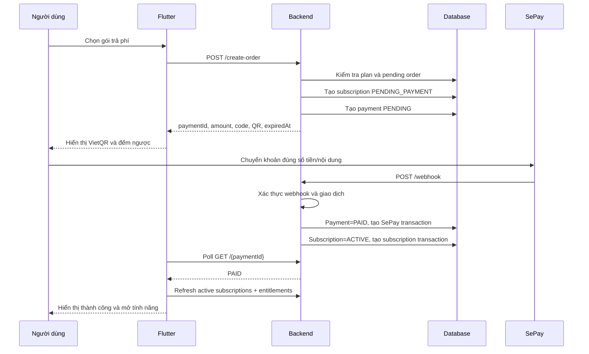

# Kế hoạch chi tiết chức năng thanh toán MenuGreen

**Ngày lập:** 26/07/2026  
**Phạm vi:** Thanh toán subscription qua SePay trên backend .NET và frontend Flutter  
**Trạng thái tài liệu:** Kế hoạch triển khai dựa trên hoạt động hiện có trong mã nguồn

## 1. Mục tiêu

Xây dựng luồng thanh toán an toàn, nhất quán và có thể kiểm chứng từ lúc người dùng chọn gói cho đến khi quyền sử dụng được cập nhật trên toàn hệ thống.

Kết quả cần đạt:

- Người dùng mua mới hoặc gia hạn gói bằng VietQR/SePay.
- Hệ thống chỉ kích hoạt gói sau khi xác nhận đúng giao dịch.
- Webhook có thể gọi lặp lại mà không kích hoạt hoặc ghi tiền hai lần.
- Người dùng có thể tiếp tục một đơn đang chờ sau khi thoát màn hình.
- Trạng thái đơn, subscription và entitlement đồng bộ giữa database, backend và Flutter.
- Có cơ chế đối soát khi webhook đến chậm hoặc bị thất lạc.
- Có log, metric và công cụ hỗ trợ xử lý giao dịch lỗi.

## 2. Phạm vi nghiệp vụ

### 2.1 Trong phạm vi

- Mua mới subscription trả phí.
- Gia hạn subscription đang hoạt động.
- Kích hoạt trực tiếp gói miễn phí, không tạo payment.
- Tạo mã thanh toán và VietQR.
- Kiểm tra trạng thái đơn bằng polling.
- Xác nhận giao dịch bằng webhook SePay.
- Hết hạn đơn chưa thanh toán.
- Tiếp tục đơn đang chờ.
- Đối soát giao dịch chưa được webhook xử lý.
- Kích hoạt entitlement sau thanh toán.
- Lịch sử payment và subscription transaction.
- Thông báo kết quả thanh toán.

### 2.2 Chưa thực hiện trong giai đoạn đầu

- Hoàn tiền tự động qua ngân hàng.
- Lưu thẻ hoặc trích nợ định kỳ.
- Thanh toán nhiều loại tiền tệ.
- Chia nhỏ một đơn thành nhiều lần chuyển khoản.
- Mã giảm giá, voucher và hóa đơn VAT.

Các nội dung trên cần thiết kế extension point nhưng không làm phức tạp luồng SePay hiện tại.

## 3. Hiện trạng trong hệ thống

### 3.1 Thành phần đã có

Backend:

- `SepayController`: tạo đơn, gia hạn, lấy đơn đang chờ, lấy trạng thái và nhận webhook.
- `SepayPaymentService`: quản lý vòng đời đơn SePay.
- `SepayWebhookHmacValidator`: xác thực webhook bằng API key hoặc HMAC.
- `SepayWebhookPaymentVerifier`: kiểm tra số tiền, mã thanh toán và tài khoản nhận.
- `SepayQrUrlBuilder`: tạo URL VietQR và thông tin chuyển khoản.
- `SepayPaymentStatusCache`: cache trạng thái polling.
- `SepayReconciliationBackgroundService`: đối soát giao dịch nền.
- `SubscriptionExpirationBackgroundService`: xử lý subscription hết hạn.
- Các bảng `payments`, `sepay_transactions`, `user_subscriptions` và `subscription_transactions`.

Frontend:

- `UpgradePlanScreen`: chọn gói.
- `SepayPaymentScreen`: tạo/khôi phục đơn, hiển thị QR, đếm ngược và polling.
- `SepayPaymentSuccessScreen`: thông báo thành công.
- `SepayPaymentRepository`: gọi các API thanh toán.
- `UserSubscriptionRepository`: tải subscription và entitlement.

### 3.2 API hiện có

| Method | Endpoint | Chức năng |
|---|---|---|
| `POST` | `/api/payments/sepay/create-order` | Tạo đơn mua subscription |
| `POST` | `/api/payments/sepay/create-renew-order` | Tạo đơn gia hạn |
| `GET` | `/api/payments/sepay/pending` | Lấy đơn đang chờ của người dùng |
| `GET` | `/api/payments/sepay/{paymentId}` | Lấy trạng thái đơn |
| `POST` | `/api/payments/sepay/webhook` | Nhận giao dịch từ SePay |
| `POST` | `/api/UserSubscription/subscribe` | Kích hoạt gói miễn phí |
| `GET` | `/api/UserSubscription/me/active` | Lấy các gói đang hiệu lực |
| `GET` | `/api/UserSubscription/me/entitlements` | Lấy quyền tổng hợp |

### 3.3 Các vấn đề cần xử lý trước khi đưa vào production

#### P0 — Trạng thái payment chưa thống nhất

Luồng webhook đang sử dụng:

- `PENDING`
- `PAID`
- `EXPIRED`

Trong khi background reconciliation đang tìm `Pending` và cập nhật `Success`.

Hậu quả: 

- Reconciliation có thể không tìm thấy đơn do `PENDING != Pending`.
- Nếu cập nhật thành `Success`, Flutter không nhận ra đây là trạng thái thành công vì frontend chờ `PAID`.
- Database có thể chứa nhiều cách viết cho cùng một trạng thái.

Hướng xử lý:

- Chuẩn hóa duy nhất: `PENDING`, `PAID`, `EXPIRED`, `FAILED`, `REFUNDED`.
- Dùng enum/domain constants trong backend, không ghi chuỗi trực tiếp.
- Migration chuẩn hóa dữ liệu cũ.
- Flutter tiếp tục parse không phân biệt hoa thường trong giai đoạn tương thích.

#### P0 — Đối soát chưa an toàn như webhook

Reconciliation hiện chủ yếu khớp nội dung chuyển khoản có chứa mã đơn. Luồng này chưa dùng đầy đủ cùng một bộ kiểm tra số tiền, tài khoản nhận, giao dịch vào và tính duy nhất như webhook.

Hướng xử lý:

- Mọi giao dịch từ webhook hoặc reconciliation phải đi qua cùng một hàm xử lý domain.
- Bắt buộc kiểm tra:
  - Giao dịch là tiền vào.
  - Mã thanh toán khớp chính xác.
  - Số tiền bằng số tiền của đơn.
  - Tài khoản nhận đúng cấu hình.
  - Mã giao dịch SePay chưa từng được xử lý.
  - Đơn còn ở trạng thái cho phép nhận tiền.
- Không tự kích hoạt subscription trực tiếp trong background service.

#### P0 — Thiếu transaction boundary rõ ràng

Việc cập nhật `payments`, thêm `sepay_transactions`, cập nhật `user_subscriptions` và thêm `subscription_transactions` phải thành công hoặc rollback cùng nhau.

Hướng xử lý:

- Dùng một database transaction cho toàn bộ thao tác xác nhận.
- Bổ sung unique constraint cho `sepay_transactions.TransactionCode`.
- Bổ sung unique constraint cho `payments.Provider + ProviderOrderCode`.
- Xử lý race condition khi webhook và reconciliation chạy cùng lúc.

#### P1 — Logic gia hạn giữa webhook và reconciliation chưa đồng nhất

Webhook gia hạn từ `max(subscription.EndDate, now)`, trong khi reconciliation hiện có thể đặt lại `StartDate` và `EndDate` từ thời điểm đối soát.

Hướng xử lý:

- Chỉ có một hàm `ActivateOrRenewSubscriptionAsync`.
- Gia hạn subscription còn hiệu lực: cộng thời hạn từ `EndDate`.
- Gia hạn subscription đã hết hạn: cộng thời hạn từ thời điểm thanh toán/xác nhận.
- Không làm mất thời gian còn lại của người dùng.

#### P1 — Một pending payment đang chặn mọi đơn khác của người dùng

`EnsureNoPendingSepayPaymentAsync` hiện chặn khi người dùng có bất kỳ đơn SePay nào đang chờ.

Cần thống nhất quy tắc:

- Giai đoạn đầu nên cho phép tối đa một đơn pending trên mỗi người dùng để tránh nhầm nội dung chuyển khoản.
- Khi người dùng chọn gói khác, UI phải hiển thị đơn hiện tại và cho phép:
  - Tiếp tục thanh toán đơn cũ.
  - Hủy đơn cũ rồi tạo đơn mới.
- Cần thêm endpoint hủy đơn pending.

#### P1 — Entitlement sau thanh toán có thể chưa cập nhật ngay trên UI

Sau khi payment thành `PAID`, Flutter cần làm mới:

- Active subscriptions.
- Entitlements.
- Home package cards.
- Feature guards/paywall.
- Thông tin gói trong profile.

Không nên yêu cầu người dùng đăng xuất hoặc refresh token nếu quyền được đọc trực tiếp từ database.

## 4. Mô hình trạng thái chuẩn

### 4.1 Payment

```text
PENDING
  ├── PAID       : đã xác minh đúng giao dịch
  ├── EXPIRED    : quá thời gian thanh toán
  └── FAILED     : lỗi nghiệp vụ cần đóng đơn

PAID
  └── REFUNDED   : admin xác nhận hoàn tiền
```

Quy tắc:

- Chỉ `PENDING` được chuyển sang `PAID`, `EXPIRED` hoặc `FAILED`.
- `PAID` là trạng thái thành công duy nhất mà Flutter sử dụng.
- Webhook lặp lại cho payment đã `PAID` trả kết quả idempotent, không tạo giao dịch mới.
- Đơn `EXPIRED` không tự chuyển thành `PAID`. Giao dịch đến muộn được đưa vào hàng chờ đối soát thủ công.

### 4.2 UserSubscription

```text
PENDING_PAYMENT
  ├── ACTIVE
  └── CANCELLED

ACTIVE
  ├── EXPIRED
  └── CANCELLED
```

Quy tắc:

- Mua mới gói trả phí tạo subscription `PENDING_PAYMENT`.
- Payment `PAID` kích hoạt subscription thành `ACTIVE`.
- Gia hạn tạo payment liên kết với subscription `ACTIVE`, không tạo subscription mới.
- `CANCELLED` cần định nghĩa rõ: hủy gia hạn nhưng còn quyền đến `EndDate`, hoặc mất quyền ngay. Khuyến nghị giữ quyền đến `EndDate`.
- Authorization luôn kiểm tra cả `Status` và `EndDate`, không phụ thuộc hoàn toàn vào background job.

### 4.3 SubscriptionTransaction

Các loại chuẩn:

- `SUBSCRIBE`
- `RENEW`
- `CANCEL`
- `EXPIRE`
- `REFUND`
- `ADMIN_ADJUST`

`SubscriptionTransaction` là audit log nghiệp vụ, không thay thế bảng `Payment`.

## 5. Luồng mua mới



Các bước backend:

1. Xác thực JWT và lấy `userId` từ token.
2. Kiểm tra plan tồn tại, active và `PriceVnd > 0`.
3. Kiểm tra người dùng đã có entitlement tương ứng chưa.
4. Kiểm tra đơn pending còn hạn.
5. Tạo mã đơn có unique constraint.
6. Chụp snapshot thông tin thương mại vào payment:
   - Tên gói.
   - Giá tại thời điểm mua.
   - DurationDays.
   - FeatureGroup.
7. Tạo subscription `PENDING_PAYMENT`.
8. Tạo payment `PENDING` với `ExpiredAt`.
9. Trả dữ liệu QR cho Flutter.

Lưu snapshot là cần thiết vì admin có thể thay đổi giá hoặc thời hạn plan sau khi người dùng đã tạo đơn.

## 6. Luồng gia hạn

1. Flutter gửi `UserSubscriptionId`.
2. Backend xác minh subscription thuộc người dùng.
3. Subscription phải là gói có thể gia hạn.
4. Backend lấy giá hiện hành hoặc giá theo chính sách renewal đã công bố.
5. Tạo payment `PENDING`, không tạo thêm `UserSubscription`.
6. Khi thanh toán thành công:
   - Nếu `EndDate > now`: `EndDate = EndDate + DurationDays`.
   - Nếu đã hết hạn: `StartDate = now`, `EndDate = now + DurationDays`.
   - Cập nhật `RenewedAt`.
7. Ghi `SubscriptionTransaction` loại `RENEW`.

## 7. Luồng webhook chuẩn

### 7.1 Xác thực request

- Production chỉ chấp nhận cấu hình webhook authentication hợp lệ.
- Nếu dùng API key: so sánh constant-time.
- Nếu dùng HMAC:
  - Xác minh signature trên raw body.
  - Kiểm tra timestamp trong khoảng cho phép.
  - Không parse rồi serialize lại trước khi tính chữ ký.
- Không ghi API key, secret hoặc toàn bộ authorization header vào log.

### 7.2 Xác minh giao dịch

- `TransferType == in`.
- Transaction ID hợp lệ.
- Transaction ID chưa tồn tại.
- Trích xuất đúng `ProviderOrderCode`.
- Payment tồn tại và đúng provider.
- Payment đang `PENDING`.
- Chưa quá hạn.
- Số tiền khớp tuyệt đối.
- Tài khoản nhận khớp cấu hình.
- Nội dung chứa đúng mã đơn.

### 7.3 Xử lý idempotency

Khóa idempotency chính:

- `SepayTransaction.TransactionCode`.
- `Payment.Provider + Payment.ProviderOrderCode`.

Webhook trùng:

- Trả HTTP 200 với `{ "success": true }` nếu giao dịch đã được xử lý.
- Không kích hoạt subscription lần hai.
- Không cộng thêm thời hạn lần hai.
- Không ghi thêm transaction nghiệp vụ.

### 7.4 Transaction database

Trong cùng một transaction:

1. Insert `SepayTransaction`.
2. Update `Payment = PAID`.
3. Activate hoặc renew `UserSubscription`.
4. Insert `SubscriptionTransaction`.
5. Commit.

Sau commit:

- Invalidate cache trạng thái payment.
- Gửi notification.
- Ghi metric.

Không gửi notification trước khi transaction database commit thành công.

## 8. Luồng polling và khôi phục đơn trên Flutter

### 8.1 Tạo hoặc tiếp tục đơn

Khi mở màn hình:

1. Gọi `GET /pending`.
2. Nếu có đơn phù hợp với gói/luồng hiện tại thì hiển thị lại QR.
3. Nếu có đơn cho gói khác, hiển thị lựa chọn tiếp tục hoặc hủy.
4. Chỉ gọi `POST /create-order` khi không có đơn pending thích hợp.

### 8.2 Polling

- Poll lần đầu sau 2–3 giây.
- Khoảng cách khuyến nghị: 3 giây trong 30 giây đầu, sau đó 5–10 giây.
- Dừng polling khi:
  - `PAID`, `EXPIRED`, `FAILED`, `REFUNDED`.
  - Widget dispose.
  - App chuyển background trong thời gian dài.
- Khi app resume, gọi trạng thái ngay một lần.
- Có nút “Tôi đã chuyển khoản – Kiểm tra lại”.
- Lỗi mạng tạm thời không đổi payment thành failed.

### 8.3 Sau khi thành công

Flutter thực hiện theo thứ tự:

1. Hiển thị payment thành công.
2. Refresh `me/active`.
3. Refresh `me/entitlements`.
4. Invalidate cache gói ở Home/Profile/feature guard.
5. Điều hướng về màn hình nguồn hoặc mở tính năng vừa mua.

Nếu refresh entitlement thất bại:

- Vẫn hiển thị “Đã nhận thanh toán”.
- Hiển thị “Gói đang được đồng bộ”.
- Cho phép thử đồng bộ lại.

## 9. API cần bổ sung hoặc điều chỉnh

### 9.1 Hủy đơn pending

```http
POST /api/payments/sepay/{paymentId}/cancel
```

Điều kiện:

- Payment thuộc người dùng hiện tại.
- Payment đang `PENDING`.
- Chuyển payment sang `FAILED` hoặc bổ sung trạng thái `CANCELLED`.
- Nếu là mua mới, chuyển subscription `PENDING_PAYMENT` sang `CANCELLED`.

Khuyến nghị bổ sung trạng thái `CANCELLED` để phân biệt người dùng chủ động hủy với lỗi hệ thống.

### 9.2 Lịch sử thanh toán

```http
GET /api/payments/me?page=1&pageSize=20&status=PAID
```

Response cần có:

- Payment ID.
- Loại đơn: subscribe/renew/program.
- Tên sản phẩm/gói snapshot.
- Số tiền.
- Trạng thái.
- Thời gian tạo, thanh toán và hết hạn.
- Mã giao dịch đối tác khi được phép hiển thị.

### 9.3 Admin reconciliation

```http
GET  /api/admin/payments/unmatched
POST /api/admin/payments/{paymentId}/reconcile
POST /api/admin/payments/{paymentId}/mark-failed
```

Mọi thao tác admin phải:

- Có role/policy riêng.
- Bắt buộc lý do.
- Ghi audit log.
- Không cho sửa trực tiếp một payment đã `PAID` nếu chưa qua quy trình refund/adjustment.

### 9.4 Chuẩn hóa lỗi API

Thay vì mọi lỗi đều trả `400`, dùng:

| HTTP | Trường hợp |
|---|---|
| `400` | Payload không hợp lệ |
| `401` | Chưa đăng nhập/webhook auth sai |
| `403` | Không có quyền |
| `404` | Không tìm thấy plan/payment/subscription |
| `409` | Đã có pending order hoặc xung đột trạng thái |
| `422` | Giao dịch không khớp số tiền/nội dung |
| `500` | Lỗi hệ thống |

Response lỗi chuẩn:

```json
{
  "code": "PAYMENT_PENDING_EXISTS",
  "message": "Bạn đang có một đơn thanh toán chưa hoàn tất.",
  "traceId": "..."
}
```

Flutter dựa vào `code`, không dựa vào việc tìm chuỗi tiếng Anh trong `message`.

## 10. Thay đổi database đề xuất

### 10.1 Payment snapshot

Bổ sung:

- `OrderType`: `SUBSCRIBE`, `RENEW`, `PREMIUM_PROGRAM`.
- `ProductId`.
- `ProductName`.
- `FeatureGroup`.
- `DurationDays`.
- `Currency` mặc định `VND`.
- `FailureCode`, `FailureReason`.
- `CancelledAt`.
- `RowVersion` hoặc concurrency token.

### 10.2 Constraints và index

- Unique index: `(Provider, ProviderOrderCode)`.
- Unique index: `SepayTransactions.TransactionCode`.
- Index: `(UserId, Status, ExpiredAt)`.
- Index: `(UserSubscriptionId, Status)`.
- Check constraint cho `AmountVnd > 0`.
- Check constraint hoặc enum mapping cho status.
- Chỉ cho phép một payment pending trên mỗi user nếu chính sách này được giữ.

### 10.3 Dọn dữ liệu

- Chuẩn hóa `Pending`, `Success` thành `PENDING`, `PAID`.
- Xác định và đóng các subscription `PENDING_PAYMENT` mồ côi.
- Xác định payment `PAID` chưa có `SubscriptionTransaction`.
- Không xóa dữ liệu giao dịch; chỉ cập nhật trạng thái và ghi audit.

## 11. Bảo mật

- Secrets chỉ lấy từ environment/secret manager, không commit vào repository.
- Webhook production bắt buộc HTTPS.
- Rate limit:
  - Create order.
  - Get status/polling.
  - Webhook.
- Giới hạn kích thước webhook body.
- Không tin số tiền, giá gói hoặc thời hạn gửi từ Flutter.
- Không cho user truy vấn payment của user khác.
- Mask số tài khoản trong log.
- Raw webhook payload chứa dữ liệu nhạy cảm cần có retention policy.
- Cảnh báo khi có nhiều webhook signature sai hoặc nhiều giao dịch không khớp.
- Tắt tuyệt đối `AutoApprovePendingInDev` trong staging/production.

## 12. Đối soát

### 12.1 Nguyên tắc

Reconciliation là cơ chế khôi phục, không phải luồng xác nhận dễ dãi hơn webhook.

### 12.2 Cơ chế đề xuất

1. Job lấy các payment `PENDING` còn trong khoảng đối soát.
2. Gọi API SePay với cursor/thời gian, không tải lịch sử không giới hạn.
3. Chuyển dữ liệu giao dịch về cùng DTO chuẩn của webhook.
4. Gọi chung `ProcessIncomingTransactionAsync`.
5. Chỉ xác nhận khi đầy đủ mã đơn, số tiền, tài khoản và transaction ID.
6. Giao dịch không khớp được lưu vào bảng/hàng chờ unmatched để admin xử lý.
7. Job có distributed lock nếu chạy nhiều instance.

### 12.3 Trường hợp giao dịch đến sau khi đơn hết hạn

Không tự động bỏ tiền hoặc tự mở gói.

Khuyến nghị:

- Lưu giao dịch unmatched.
- Gửi cảnh báo cho admin.
- Cho admin liên kết với payment và kích hoạt có audit.
- Thông báo người dùng rằng giao dịch đang được kiểm tra.

## 13. Logging, metric và cảnh báo

### 13.1 Structured logs

Các trường nên có:

- `PaymentId`.
- `ProviderOrderCode`.
- `UserId` dạng ID nội bộ.
- `ProviderTransactionId`.
- `OldStatus`, `NewStatus`.
- `OrderType`.
- `AmountVnd`.
- `TraceId`.

Không log:

- Secret/API key.
- Authorization token.
- Toàn bộ số tài khoản nếu không cần thiết.

### 13.2 Metrics

- Số order được tạo.
- Tỷ lệ `PENDING -> PAID`.
- Thời gian trung bình đến khi xác nhận.
- Số order expired.
- Số webhook duplicate.
- Số webhook invalid signature.
- Số transaction amount mismatch.
- Số giao dịch unmatched.
- Số lần reconciliation khôi phục thành công.
- Tỷ lệ frontend polling lỗi.

### 13.3 Alert

- Webhook lỗi liên tục trong 5 phút.
- Không có webhook thành công trong khi vẫn phát sinh order.
- Unmatched transaction tăng bất thường.
- Payment `PAID` nhưng subscription chưa active.
- Subscription active nhưng không có payment/transaction tương ứng đối với gói trả phí.

## 14. Kế hoạch kiểm thử

### 14.1 Unit test backend

- Tạo order gói trả phí thành công.
- Từ chối gói miễn phí ở endpoint SePay.
- Từ chối plan inactive.
- Từ chối tạo order thứ hai khi còn pending.
- Đánh dấu expired đúng thời gian.
- Tạo mã đơn không trùng.
- Webhook chữ ký đúng/sai/hết hạn.
- Webhook sai số tiền.
- Webhook sai nội dung.
- Webhook sai tài khoản nhận.
- Webhook giao dịch tiền ra.
- Webhook duplicate.
- Gia hạn subscription còn hạn.
- Gia hạn subscription đã hết hạn.
- Rollback nếu insert transaction hoặc activation thất bại.
- Reconciliation dùng cùng quy tắc xác minh với webhook.

### 14.2 Integration test backend

- PostgreSQL thật hoặc Testcontainers.
- Kiểm tra unique constraints dưới hai request webhook đồng thời.
- Kiểm tra transaction rollback.
- Kiểm tra cache bị invalidate sau payment.
- Kiểm tra authorization không đọc được payment của user khác.
- Kiểm tra migration từ status cũ.

### 14.3 Flutter test

- Parse tất cả payment status.
- Khôi phục pending order.
- Countdown hết hạn.
- Polling chuyển từ pending sang paid.
- Dừng timer khi dispose.
- App resume kiểm tra trạng thái lại.
- Thành công refresh subscription và entitlement.
- Hiển thị lỗi theo error code.
- Không tạo order lặp khi double tap.

### 14.4 E2E

Các kịch bản bắt buộc:

1. Mua mới gói Office.
2. Mua mới gói Gym/PT.
3. Mua mới gói Casual có giá lớn hơn 0.
4. Gia hạn gói đang còn hạn.
5. Thoát app rồi mở lại đơn pending.
6. Webhook gửi lặp.
7. Mất webhook, reconciliation xử lý.
8. Chuyển sai số tiền.
9. Chuyển sai nội dung.
10. Đơn hết hạn rồi mới chuyển tiền.
11. Mạng Flutter bị ngắt trong lúc ngân hàng đã thanh toán.
12. Payment thành công và Home mở tính năng mà không cần đăng nhập lại.

## 15. Lộ trình triển khai

### Giai đoạn 1 — Chuẩn hóa lõi thanh toán

- Tạo constants/enums cho status.
- Chuẩn hóa dữ liệu cũ.
- Tách hàm xác nhận giao dịch dùng chung.
- Bổ sung database transaction và unique constraints.
- Thống nhất logic subscribe/renew.
- Viết unit test cho state transition và idempotency.

**Điều kiện hoàn thành:** webhook lặp hoặc chạy đồng thời không thể cộng gói hai lần.

### Giai đoạn 2 — Hoàn thiện Flutter

- Chuẩn hóa error code.
- Khôi phục pending order.
- Xử lý app lifecycle.
- Refresh subscription/entitlement sau thành công.
- Thêm hành động hủy đơn và tạo lại.
- Bổ sung test widget/repository.

**Điều kiện hoàn thành:** người dùng thanh toán xong thấy quyền mới ngay mà không đăng nhập lại.

### Giai đoạn 3 — Đối soát và vận hành

- Viết lại reconciliation dùng chung payment processor.
- Thêm unmatched transaction queue.
- Thêm admin API/UI xử lý giao dịch.
- Thêm structured logging, metrics và alert.
- Kiểm tra cấu hình production.

**Điều kiện hoàn thành:** webhook thất lạc có thể được khôi phục an toàn và có audit.

### Giai đoạn 4 — Staging và production rollout

- Test SePay sandbox/staging.
- Chạy E2E bằng tài khoản test riêng.
- Kiểm tra webhook public HTTPS.
- Bật dashboard theo dõi.
- Deploy theo feature flag.
- Canary với một nhóm tài khoản.
- Theo dõi ít nhất một chu kỳ order expiry và reconciliation.

## 16. Thứ tự file dự kiến cần chỉnh sửa

Backend:

1. `MenuGreen.DataAccessLayer/Entities/Payment.cs`
2. `MenuGreen.DataAccessLayer/Configurations/PaymentConfiguration.cs`
3. `MenuGreen.DataAccessLayer/Configurations/SepayTransactionConfiguration.cs`
4. Migration chuẩn hóa payment status và constraints.
5. `MenuGreen.BusinessLogicLayer/Services/SepayPaymentService.cs`
6. Tạo payment state/constants và incoming transaction processor.
7. `MenuGreen.BusinessLogicLayer/BackgroundJobs/SepayReconciliationBackgroundService.cs`
8. `MenuGreen.API/Controllers/SepayController.cs`
9. DTO error/history/cancel/reconciliation.
10. Backend unit và integration tests.

Frontend:

1. `features/subscription/models/sepay_models.dart`
2. `features/subscription/repositories/sepay_payment_repository.dart`
3. `features/subscription/views/sepay_payment_screen.dart`
4. `features/subscription/views/sepay_payment_success_screen.dart`
5. Subscription/entitlement cache tại Home và feature guards.
6. Flutter unit/widget/integration tests.

## 17. Definition of Done

Chức năng chỉ được xem là hoàn thành khi:

- Tất cả payment status dùng cùng một chuẩn.
- Không thể kích hoạt/gia hạn hai lần từ cùng một giao dịch.
- Webhook được xác thực và kiểm tra số tiền, mã đơn, tài khoản nhận.
- Tất cả thay đổi tài chính nằm trong database transaction.
- Reconciliation không có quy tắc xác minh yếu hơn webhook.
- Flutter khôi phục được đơn pending và dừng polling đúng lúc.
- Entitlement cập nhật ngay sau thanh toán.
- Có test cho happy path, duplicate, mismatch, expiry và concurrency.
- Có log/metric để truy vết bằng `PaymentId` và `ProviderOrderCode`.
- Secrets production không nằm trong source code.
- Có quy trình xử lý giao dịch chuyển sai hoặc đến muộn.

## 18. Tiêu chí nghiệm thu nghiệp vụ

| ID | Tiêu chí |
|---|---|
| PAY-01 | Người dùng tạo được một đơn QR cho gói trả phí active |
| PAY-02 | Giá và thời hạn do backend quyết định |
| PAY-03 | Chuyển đúng tiền/nội dung kích hoạt đúng một lần |
| PAY-04 | Webhook duplicate không cộng thêm thời hạn |
| PAY-05 | Chuyển sai tiền không kích hoạt gói |
| PAY-06 | Đơn hết hạn không được Flutter tiếp tục polling vô hạn |
| PAY-07 | Người dùng mở lại app vẫn tiếp tục được đơn pending |
| PAY-08 | Gia hạn không làm mất số ngày còn lại |
| PAY-09 | Home và feature guard nhận quyền mới không cần đăng nhập lại |
| PAY-10 | Reconciliation xử lý an toàn khi webhook thất lạc |
| PAY-11 | User không thể xem hoặc thao tác payment của user khác |
| PAY-12 | Admin xử lý ngoại lệ có audit log và lý do |

## 19. Kết luận

Hệ thống hiện đã có phần lớn khung thanh toán SePay và UI cần thiết. Công việc quan trọng nhất không phải tạo thêm một luồng thanh toán mới, mà là chuẩn hóa state machine, gom webhook và reconciliation vào cùng một bộ xử lý idempotent, bảo đảm transaction database, rồi đồng bộ entitlement ngay trên Flutter.

Ưu tiên triển khai theo thứ tự:

1. Sửa trạng thái `PENDING/PAID/EXPIRED`.
2. Bảo đảm idempotency và transaction.
3. Viết lại reconciliation dùng chung verifier.
4. Refresh entitlement ở Flutter.
5. Bổ sung cancellation, history, admin tooling và observability.

