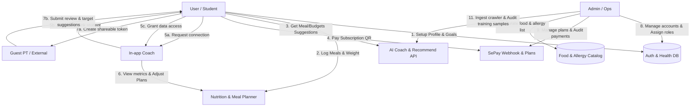

# MenuGreen System — Quy trình & Luồng Nghiệp Vụ (Workflows)

Hệ thống **MenuGreen** là một nền tảng dinh dưỡng cá nhân hóa tích hợp AI và quản lý chế độ ăn uống cho thị trường Việt Nam. Tài liệu này cung cấp cái nhìn tổng quan về luồng nghiệp vụ tương tác giữa các vai trò (roles) trong hệ thống và đóng vai trò làm mục lục cho các tài liệu chi tiết.

---

## 👥 Các Vai Trò Trong Hệ Thống (Roles)

Hệ thống MenuGreen được phân quyền rõ ràng thành 3 nhóm vai trò chính:

1. **User (Người dùng)**
   * **Free User**: Sử dụng các tính năng cơ bản như đăng ký, thiết lập hồ sơ sức khỏe, ghi nhật ký ăn uống (meal log), theo dõi cân nặng, tìm kiếm món ăn/công thức và nhận các gợi ý cơ bản theo quy tắc (rule-based).
   * **Casual User**: Nhóm người dùng thông thường, băn khoăn khi chọn món, sử dụng tính năng Vòng quay may mắn (Lucky Wheel) nhận quà/công thức hàng ngày, Khởi động nhanh thực đơn 1 chạm (Daily Starter), học tập qua thẻ dinh dưỡng ngắn kèm trả lời quiz nhận điểm thưởng (Micro-learning).
   * **Gymer User**: Nhóm người dùng tập luyện thể thao cường độ cao, cần theo dõi TDEE/caloric surplus chuyên sâu, thiết lập mục tiêu gym/PT, gửi báo cáo PT Review ngoài, kết nối HLV dài hạn (Coaches), và tham gia các Lộ trình tuần dài hạn (Premium Programs).
   * **Office User**: Nhóm người dùng làm việc văn phòng có mức vận động thấp (sedentary), sử dụng tính năng nhắc nhở sinh hoạt thích ứng (uống nước, vận động chống ngồi lâu kèm Snooze), và lên thực đơn cơm hộp kiểm soát calo và giới hạn ngân sách (Budget-Aware Meal Planning).

2. **Coach / PT (Huấn luyện viên)**
   * **In-app Coach**: Người dùng trong app thực hiện nâng cấp tài khoản lên Coach. Họ có hồ sơ chuyên môn (specialty, price, bio), xuất hiện trong danh mục tìm kiếm công khai, có thể kết nối lâu dài với học viên (student) để theo dõi chỉ số sức khỏe, gửi ý kiến đánh giá và trực tiếp điều chỉnh thực đơn/mục tiêu calo cho học viên.
   * **Guest PT (PT bên ngoài)**: Các PT hoặc chuyên gia dinh dưỡng không đăng ký tài khoản trên app. Họ nhận được liên kết chia sẻ báo cáo tuần (weekly report token-based link) từ người dùng để xem nhanh và đóng góp ý kiến đánh giá một lần mà không cần đăng nhập hệ thống.

3. **Admin (Quản trị viên)**
   * **System Admin**: Quản trị tài khoản người dùng (khóa, mở khóa, gán vai trò), quản lý gói dịch vụ Premium, đối soát giao dịch SePay.
   * **Content & AI Admin**: Quản trị danh mục thực phẩm, món ăn, công thức nấu ăn, định nghĩa dị ứng, quản lý dữ liệu crawler thực phẩm và kiểm duyệt/tối ưu dữ liệu huấn luyện cho trợ lý AI.

---

## 📊 Sơ Đồ Tương Tác Giữa Các Vai Trò (Interaction Diagram)

Dưới đây là sơ đồ Mermaid thể hiện cách các vai trò tương tác với nhau và với các phân hệ chính của MenuGreen:

---

## 📂 Danh Sách Các Luồng Quy Trình Chi Tiết

Để tìm hiểu chi tiết luồng nghiệp vụ của từng vai trò, vui lòng truy cập các liên kết dưới đây:

* 🥗 **[Quy trình Người Dùng Tổng Quan (User Workflow)](file:///e:/EXE201-MenuGreen/MenuGreenSystem/docs/workflow/user_workflow.md)**: Chi tiết hành trình người dùng nói chung từ đăng ký, onboarding, theo dõi calo, lên kế hoạch ăn uống, chat AI cho đến nâng cấp tài khoản.
  * 🎲 **[Quy trình Casual User (Casual Workflow)](file:///e:/EXE201-MenuGreen/MenuGreenSystem/docs/workflow/casual_workflow.md)**: Tập trung vào tính năng Vòng quay may mắn (Lucky Wheel) hàng ngày, Khởi động 1 chạm nhanh (Daily Starter) và Học tập tích điểm (Micro-learning & Quiz).
  * 🏋️ **[Quy trình Gymer User (Gymer Workflow)](file:///e:/EXE201-MenuGreen/MenuGreenSystem/docs/workflow/gymer_workflow.md)**: Tập trung vào tính năng mục tiêu thể thao chuyên sâu, quy trình PT Review ngoài, kết nối HLV dài hạn (Coaches Ecosystem) và Lộ trình tuần dài hạn (Premium Programs).
  * 💼 **[Quy trình Office User (Office Workflow)](file:///e:/EXE201-MenuGreen/MenuGreenSystem/docs/workflow/office_workflow.md)**: Tập trung vào tính năng nhắc nhở sinh hoạt thích ứng (Adaptive Reminders), kiểm soát thói quen ít vận động, và lên thực đơn tự nấu mang đi làm tiết kiệm ngân sách (Budget-Aware Meal Planning).
* 👟 **[Quy trình Huấn Luyện Viên (Coach Workflow)](file:///e:/EXE201-MenuGreen/MenuGreenSystem/docs/workflow/coach_workflow.md)**: Hướng dẫn luồng đăng ký làm Coach, kết nối học viên, xem dashboard chỉ số và thay đổi thực đơn học viên, cùng quy trình đánh giá qua token link dành cho PT ngoài.
* ⚙️ **[Quy trình Quản Trị Viên (Admin Workflow)](file:///e:/EXE201-MenuGreen/MenuGreenSystem/docs/workflow/admin_workflow.md)**: Quy trình vận hành hệ thống, khóa/mở khóa tài khoản, phê duyệt danh mục thực phẩm, cập nhật nguyên liệu thay thế và tinh chỉnh mô hình AI.
