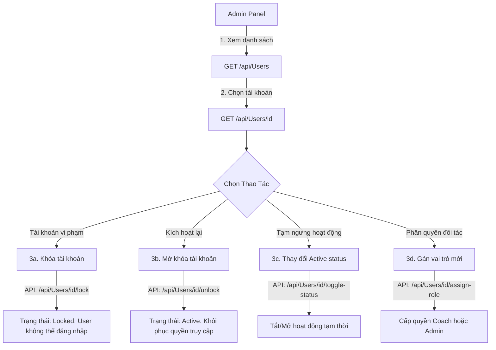
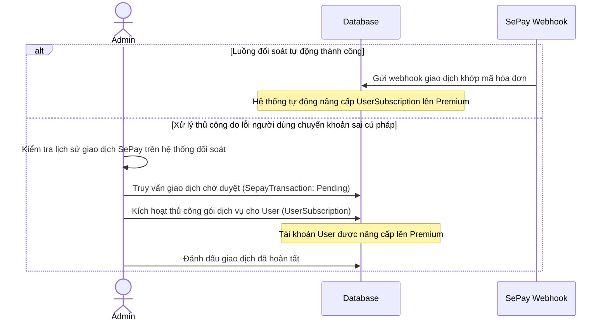

# ⚙️ MenuGreen — Luồng Nghiệp Vụ Quản Trị Viên (Admin Workflow)

Tài liệu này chi tiết quy trình vận hành và quản lý hệ thống của **Quản trị viên (Admin)** trong MenuGreen. Mọi hành động của Admin đều bị kiểm soát nghiêm ngặt bởi chính sách `AdminOnly`.

---

## 1. Quản trị tài khoản & Bảo mật (User Account Administration)

Admin chịu trách nhiệm kiểm soát bảo mật, xử lý các tài khoản vi phạm chính sách cộng đồng hoặc nâng cấp vai trò cho đối tác.

### 1.1 Khóa & Mở khóa tài khoản
* **Khóa (Lock)**: Khi phát hiện tài khoản spam hoặc vi phạm quy định, Admin gọi API `/api/Users/{id}/lock`. Người dùng sẽ ngay lập tức bị thu hồi các JWT token đang hoạt động, không thể thực hiện đăng nhập mới và nhận thông báo tài khoản bị khóa.
* **Mở khóa (Unlock)**: Khi khiếu nại của người dùng được giải quyết, Admin khôi phục quyền truy cập bằng cách gọi `/api/Users/{id}/unlock`.

### 1.2 Quản lý vai trò (Role Assignment)
* Mặc định mọi tài khoản đăng ký mới có vai trò là `User`.
* Khi đối tác đăng ký trở thành huấn luyện viên hoặc quản trị viên mới được bổ nhiệm, Admin sử dụng chức năng gán quyền `/api/Users/{id}/assign-role` với các giá trị: `User`, `Coach`, hoặc `Admin`.

---

## 2. Quản trị dữ liệu danh mục (Database Curation)

Đảm bảo độ chính xác và an toàn của dữ liệu dinh dưỡng dành riêng cho thị trường Việt Nam.

### 2.1 Quản lý Thực phẩm & Món ăn (Food Catalog)
* **Duyệt thực phẩm mới**: Khi người dùng hoặc AI Coach đề xuất món ăn mới chưa có trong cơ sở dữ liệu master, món ăn đó sẽ ở trạng thái chờ duyệt (`IsVerified = false`). Admin kiểm tra thông số calo/macros và bấm xác minh (`IsVerified = true`).
* **Cập nhật & Xóa**: Admin thêm thực phẩm mới, chỉnh sửa thông số dinh dưỡng bị sai lệch, hoặc xóa bỏ các bản ghi trùng lặp (`POST / PUT / DELETE /api/Foods`).

### 2.2 Quản lý Công thức & Liên kết dị ứng (Recipes & Allergies)
* **Nhập công thức nấu ăn**: Admin cập nhật các công thức nấu ăn thuần Việt chi tiết (các bước làm, thời gian chuẩn bị, độ khó) và liên kết nguyên liệu với bảng thực phẩm (`POST /api/Recipes`).
* **Gắn thẻ dị ứng**: Nhằm bảo vệ người dùng, Admin phải cấu hình bảng liên kết dị ứng thực phẩm (`FoodAllergenTag`). Mỗi món ăn trong cơ sở dữ liệu phải được gắn thẻ cảnh báo dị ứng tương ứng (ví dụ: bún riêu cua phải gắn tag dị ứng *Hải sản/Cua*).

### 2.3 Quản trị Nguyên liệu thay thế (Ingredient Substitutions)
* Cấu hình ma trận thay thế nguyên liệu (`IngredientSubstitutionController`).
* Khi một nguyên liệu trong thực đơn bị thiếu hoặc nằm trong danh sách dị ứng của người dùng, hệ thống dựa vào cấu hình của Admin để gợi ý nguyên liệu thay thế an toàn và tương đương về dinh dưỡng (ví dụ: thay thế sữa bò bằng sữa đậu nành).

---

## 3. Quản lý gói dịch vụ & Giao dịch (Subscriptions & Payments)

Theo dõi doanh thu, đối soát các giao dịch qua cổng SePay và xử lý sự cố thanh toán.

### 3.1 Cấu hình gói dịch vụ (Subscription Plans)
* Admin thiết kế các gói dịch vụ trả phí (`POST /api/SubscriptionPlan`) bao gồm các thông số: Tên gói (ví dụ: Premium 1 Month), Số tháng sử dụng, Giá tiền (VND), Trạng thái kích hoạt (`IsActive`).
* Admin có thể tạm ngưng cung cấp một gói dịch vụ bằng cách gọi `/api/SubscriptionPlan/{id}/UpdateStatus` với trạng thái `isActive = false` mà không làm ảnh hưởng đến các thành viên đang trong thời hạn sử dụng gói đó.

### 3.2 Đối soát giao dịch SePay thủ công
Trong trường hợp người dùng chuyển khoản đúng số tiền nhưng ghi sai nội dung chuyển khoản (khiến hệ thống tự động không nhận diện được hóa đơn), Admin thực hiện:
1. Tra cứu mã giao dịch ngân hàng trên dashboard SePay.
2. Tìm kiếm hóa đơn tương ứng của người dùng qua giao diện Admin (`GET /api/Sepay/pending`).
3. Khớp thủ công giao dịch -> Hệ thống gọi API kích hoạt gói `UserSubscription` và gửi thông báo kích hoạt thành công tới thiết bị người dùng.

---

## 4. Quản trị Trợ lý AI & Dữ liệu huấn luyện (AI & Conversation Audit)

Đảm bảo Trợ lý AI hoạt động thông minh, không đưa ra lời khuyên dinh dưỡng sai lệch và ngày càng được cải thiện.

### 4.1 Quản lý Dữ liệu Crawler (Crawler Normalization)
* Hệ thống chạy các crawler định kỳ thu thập món ăn từ internet. Dữ liệu cào về thường thô và chưa được định lượng chuẩn xác.
* Admin truy cập màn hình `AiAdmin` để kiểm duyệt, làm sạch dữ liệu cào (normalize) trước khi lưu vào danh mục thực phẩm chính thức.

### 4.2 Tối ưu hóa mô hình AI (Curation & Training Cấu trúc)
1. **Kiểm tra lịch sử hội thoại**: Admin xem xét ngẫu nhiên các cuộc đối thoại giữa người dùng và Trợ lý AI (`AiConversation`, `AiMessage`) để phát hiện các trường hợp AI trả lời không tốt hoặc sai thông tin dinh dưỡng.
2. **Đánh giá Feedback**: Xem xét các phản hồi đánh giá tiêu cực (Dislike) từ phía người dùng đối với các câu trả lời của AI.
3. **Curation dữ liệu huấn luyện**: Admin chọn lọc các câu trả lời xuất sắc hoặc sửa đổi các câu trả lời chưa tốt thành câu trả lời mẫu chuẩn. Dữ liệu này được chuyển đổi thành các bộ mẫu huấn luyện (Training Samples) để phục vụ quá trình tinh chỉnh (Fine-tuning) mô hình Gemini hoặc cập nhật vào ngữ cảnh (Few-shot prompts) của trợ lý AI.

### 4.3 Quản trị Thẻ kiến thức Micro-Learning (Micro-Learning Curation)
* **CRUD kiến thức**: Admin chịu trách nhiệm tạo mới, cập nhật hoặc xóa bỏ các thẻ kiến thức dinh dưỡng (`POST / PUT / DELETE /api/admin/micro-learning/cards`) dựa trên danh mục phân loại (`categories`).
* **Biên soạn Quiz**: Admin cấu hình câu hỏi trắc nghiệm đính kèm mỗi thẻ, bao gồm định nghĩa các đáp án đúng/sai, viết phản hồi (feedback) giải thích lý do, và thiết lập điểm thưởng tương ứng khi học viên hoàn thành quiz.
