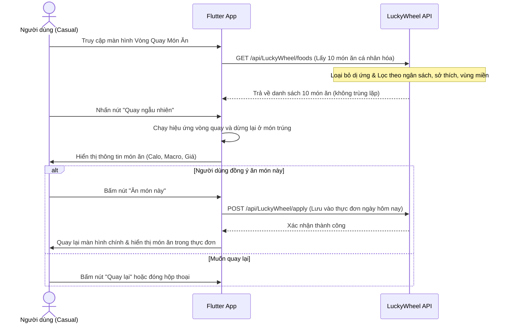

# 🥗 MenuGreen — Luồng Nghiệp Vụ Người Dùng Phổ Thông (Casual User Workflow)

Tài liệu này chi tiết hành trình của **Người dùng phổ thông (Casual User)** - những người chưa có kế hoạch ăn uống cụ thể hoặc hay băn khoăn *"Hôm nay ăn gì?"*. Luồng nghiệp vụ tập trung vào các tính năng gợi ý nhanh, tự động hóa và game hóa (Gamification) để tăng tương tác.

---

## 1. Đăng ký & Onboarding cho nhóm Casual
1. **Đăng ký tài khoản**: Đăng ký qua Email + OTP hoặc Google Sign-In nhanh. Vai trò mặc định ban đầu là `Free`.
2. **Onboarding**:
   - Nhập thông tin nhân trắc học (tuổi, chiều cao, cân nặng).
   - Chọn mục tiêu sức khỏe cơ bản (ví dụ: Giữ cân, Giảm cân lành mạnh).
   - Chọn mức độ hoạt động thể chất (thường là Vận động nhẹ hoặc Vừa).
   - Thiết lập các nhóm chất gây dị ứng và sở thích ẩm thực.
   - Chọn nhóm hành vi: **Casual / Simple Eater** (Nhóm Ăn uống đơn giản).
3. **Nâng cấp gói cước**: Người dùng mua gói cước Casual/Pro thông qua quét mã QR SePay tự động. Hệ thống nâng cấp vai trò người dùng thành `Casual`.

## 2. Vòng Quay Món Ăn (Food Lucky Wheel Flow)
Giúp người dùng Casual nhanh chóng quyết định "Hôm nay ăn gì" bằng cách lựa chọn ngẫu nhiên từ danh sách 10 món ăn được gợi ý cá nhân hóa và an toàn.

---

## 3. Khởi Động Hàng Ngày 1 Chạm (Daily Starter Flow)
Dành cho những ngày người dùng không muốn mất thời gian suy nghĩ thực đơn phức tạp.

1. **Xem Dashboard hôm nay**: 
   - Hệ thống hiển thị câu trích dẫn truyền cảm hứng (Dynamic Quote), lượng calo cần nạp.
   - Gọi API: `GET /api/DailyStarter/today`.
2. **Khởi động nhanh thực đơn**:
   - Hệ thống hiển thị danh sách 3 thực đơn tiêu biểu (Featured Meals) phù hợp với calo còn lại trong ngày.
   - Gọi API: `GET /api/DailyStarter/featured-meals`.
   - Người dùng bấm **Chọn thực đơn này** -> Hệ thống tự động áp dụng thực đơn mẫu vào kế hoạch ăn uống hôm nay.
   - Gọi API: `POST /api/DailyStarter/select-meal`.
3. **Ghi nhật ký ăn uống nhanh (Start Log Flow)**:
   - Thay vì tìm từng món, người dùng bấm "Ghi nhận nhanh" -> Hệ thống tự động nhận diện khung giờ hiện tại (Sáng/Trưa/Tối) để đề xuất đĩa ăn phù hợp nhất và lưu nhanh chỉ bằng 1 lần chạm.
   - Gọi API: `POST /api/DailyStarter/start-log`.

---

## 4. Học Tập Dinh Dưỡng (Micro-Learning & Quiz)
Giúp người dùng tiếp cận kiến thức dinh dưỡng dễ dàng và thú vị.

1. **Nhận thẻ kiến thức gợi ý**:
   - Hệ thống phân tích lịch sử ăn uống của người dùng để đưa ra thẻ kiến thức phù hợp (ví dụ: thiếu xơ -> đề xuất thẻ "Lợi ích của chất xơ").
   - Gọi API: `GET /api/MicroLearning/cards/recommended`.
2. **Đọc kiến thức**: Xem tiêu đề, tóm tắt và mẹo nhanh (Quick Tips). Có thể lưu lại để đọc sau.
3. **Trả lời câu hỏi trắc nghiệm (Quiz)**:
   - Cuối thẻ có 1 câu hỏi trắc nghiệm đơn giản.
   - Gửi đáp án: `POST /api/MicroLearning/cards/{id}/quiz/submit`.
   - Trả lời đúng: Nhận thông báo chúc mừng hoàn thành quiz thành công.
   - Trả lời sai: Nhận phản hồi giải thích đáp án đúng để học lại.

---

## 5. Nhật Ký Dinh Dưỡng & Chụp Ảnh Quét AI (Food Capture)
1. **Tìm kiếm Catalog**: Tìm nhanh các món ăn Việt Nam truyền thống trong cơ sở dữ liệu có sẵn.
2. **Food Capture (Quét ảnh AI)**:
   - Người dùng chụp ảnh đĩa ăn thực tế.
   - Hệ thống nhận diện thực phẩm, ước lượng khối lượng (gram), calo và tỷ lệ dinh dưỡng.
   - Cảnh báo dị ứng nếu món ăn chứa thành phần nằm trong danh sách dị ứng của người dùng.
   - Lưu vào nhật ký ăn uống (`MealLog`).
