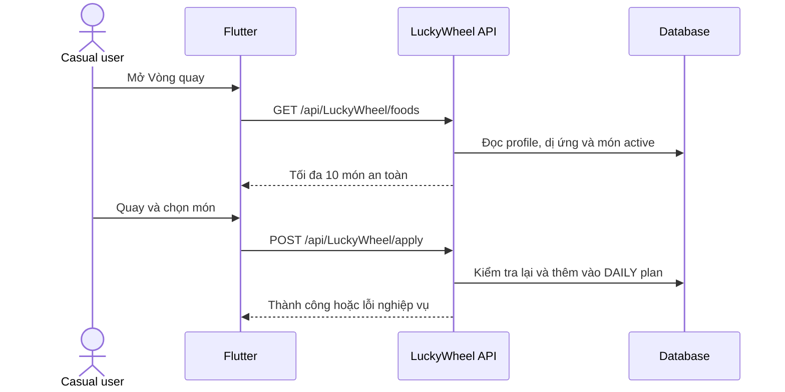

# MenuGreen — Luồng người dùng Casual theo hệ thống hiện tại

Ngày đối chiếu source: **22/07/2026**

## 1. Phạm vi

Casual là nhóm người dùng muốn chọn món nhanh, ghi nhận bữa ăn đơn giản và nhận nội dung hỗ trợ theo dữ liệu cá nhân. Gói Casual hiện cung cấp ba lối vào chính:

1. **Vòng quay món ăn**.
2. **Khởi động 1 chạm**.
3. **Góc Cảm xúc & Thèm ăn**, kết hợp gợi ý món theo tâm trạng với Micro-Learning.

Các tính năng dùng chung như tìm món, cân nặng, ăn ngoài, yêu thích hoặc kế hoạch ăn không thuộc riêng Casual Hub và được mô tả ở workflow chung.

## 2. Đăng ký, onboarding và quyền truy cập

### 2.1 Tạo tài khoản

Người dùng có thể đăng ký bằng Email + OTP hoặc Google Sign-In. Tài khoản mới thuộc tầng truy cập thông thường; role kỹ thuật có thể là `User`/`Free` tùy dữ liệu hệ thống.

### 2.2 Onboarding

Người dùng nhập hoặc lựa chọn:

- Chiều cao, cân nặng và thông tin sức khỏe cơ bản.
- Mục tiêu dinh dưỡng.
- Mức vận động.
- Dị ứng.
- Sở thích ăn uống.
- Nhóm hành vi `casual` tại bước chọn loại người dùng.

Việc chọn `casual` trong hồ sơ cá nhân hóa không tự cấp quyền trả phí. Quyền được xác định từ subscription còn hiệu lực.

### 2.3 Kích hoạt gói

Gói Casual hiện được thiết kế với `FeatureGroup = casual` và giá `0đ`. Khi người dùng chưa có quyền:

1. `CasualHubScreen` hiển thị trạng thái chưa mở.
2. Người dùng chọn một công cụ hoặc nút **Kích hoạt gói Casual 0đ**.
3. Ứng dụng mở `UpgradePlanScreen`.
4. Sau khi kích hoạt, frontend tải lại danh sách subscription active.
5. `hasCasualSubscriptionAccess` chấp nhận gói `casual` hoặc `pro` còn hiệu lực.

Backend bảo vệ ba controller bằng policy `CasualOnly`. Policy này yêu cầu entitlement `casual_features`, được cấp khi subscription active có tên chứa `casual` hoặc `FeatureGroup` là `casual`/`pro`.

> Lưu ý hiện trạng: seed Casual đang trùng ID với Gym/PT. Chi tiết được ghi trong `docs/casual_workflow_implementation_report.md`; luồng kích hoạt chưa được coi là ổn định cho đến khi sửa collision này.

## 3. Điểm truy cập trên Flutter

- Trang Home chỉ hiển thị `CasualPackageCard` khi `_hasCasualAccess = true`.
- Card có ba action: **Vòng quay**, **1 chạm**, **Cảm xúc**.
- `CasualHubScreen` luôn kiểm tra lại subscription qua API trước khi mở công cụ.
- Người chưa có quyền được chuyển tới màn nâng cấp thay vì mở thẳng tính năng.
- Quick action “Hôm nay ăn gì?” và “Góc dinh dưỡng/Cảm xúc” cũng đi qua Casual Hub.

## 4. Vòng quay món ăn

### 4.1 Tải danh sách

```http
GET /api/LuckyWheel/foods
```

Backend thực hiện:

1. Đọc ngân sách, vùng Việt Nam và từ khóa yêu thích trong AI profile.
2. Đọc allergen key của người dùng.
3. Lấy các món đang active.
4. Loại món có allergen trùng với người dùng.
5. Chấm điểm theo ngân sách, vùng và từ khóa yêu thích.
6. Lấy 30 ứng viên có điểm cao nhất.
7. Xáo trộn và trả tối đa 10 món.

Frontend hiển thị vòng quay, hình ảnh, calo, macro, giá dự kiến và thông tin an toàn dị ứng từ response.

### 4.2 Quay và áp dụng món

Người dùng quay trên thiết bị. Khi chấp nhận món, người dùng chọn loại bữa và gọi:

```http
POST /api/LuckyWheel/apply
```

Payload:

```json
{
  "foodId": "uuid",
  "mealType": "Breakfast | Lunch | Dinner | Snack"
}
```

Backend kiểm tra lại món còn active, loại bữa hợp lệ và an toàn dị ứng. Sau đó backend tìm hoặc tạo meal plan `DAILY` của ngày hiện tại theo UTC+7 và thêm món vào kế hoạch.



## 5. Khởi động 1 chạm

Khi mở `DailyStarterScreen`, provider tải:

```http
GET /api/DailyStarter/today
GET /api/DailyStarter/featured-meals
```

Hai request hiện được thực hiện tuần tự trong `DailyStarterProvider.loadAll()`.

### 5.1 Tổng quan hôm nay

`GET /today` trả thông điệp chào mừng, quote/banner, mục tiêu calo, lượng đã dùng, lượng còn lại và trạng thái onboarding.

### 5.2 Ba món nổi bật

`GET /featured-meals` xếp hạng món theo mức phù hợp với người dùng rồi trả tối đa ba món. Người dùng có thể mở chi tiết hoặc chọn món:

```http
POST /api/DailyStarter/select-meal
```

Món được thêm vào kế hoạch của ngày hiện tại theo loại bữa được gửi lên.

### 5.3 Ghi nhanh theo khung giờ

```http
POST /api/DailyStarter/start-log
```

Backend xác định loại bữa từ thời gian hệ thống, lấy món nổi bật phù hợp và tạo meal log thật. Sau khi thành công, frontend tải lại dữ liệu Daily Starter.

### 5.4 Cá nhân hóa

Người dùng có thể xem và cập nhật đồng thời một phần dữ liệu sức khỏe, AI profile và dị ứng qua:

```http
GET /api/DailyStarter/personalization
PUT /api/DailyStarter/personalization
```

Ngoài ra controller còn có endpoint recommendations và lưu sở thích ban đầu.

> Lưu ý hiện trạng: backend đang không build vì `DailyStarterService` tham chiếu thuộc tính `Food.Name` không tồn tại. Do đó luồng Daily Starter có code nhưng chưa thể xác nhận chạy từ build hiện tại.

## 6. Góc Cảm xúc & Thèm ăn và Micro-Learning

Action **Cảm xúc** mở `MicroLearningScreen`, hiện có hai lớp hoạt động.

### 6.1 Gợi ý món theo tâm trạng

Frontend có các trạng thái được khai báo sẵn như:

- Căng thẳng.
- Buồn ngủ/uể oải.
- Thèm ngọt.
- Mệt mỏi sau tập.

Mỗi trạng thái chứa insight và danh sách món “giải cứu” được lưu cục bộ trong app. Chọn món mở meal log sheet để người dùng ghi nhận. Phần mood/rescue này hiện chưa gọi API gợi ý động.

### 6.2 Thẻ Micro-Learning từ backend

Frontend đồng thời gọi:

```http
GET /api/MicroLearning/cards/recommended
GET /api/MicroLearning/categories
```

Backend phân tích ba ngày gần nhất, health profile, dị ứng và eating pattern để ưu tiên category phù hợp. Hệ thống trả tối đa ba thẻ, bỏ qua thẻ đã dismiss và ưu tiên thẻ chưa đọc/chưa làm quiz.

Người dùng có thể:

- Xem chi tiết, summary, tips và quiz.
- Đánh dấu đọc, lưu, bỏ lưu hoặc dismiss.
- Xem danh sách đã lưu.
- Gửi đáp án quiz và nhận điểm nếu đúng.

API liên quan:

```http
GET  /api/MicroLearning/cards/{id}
GET  /api/MicroLearning/cards/saved
POST /api/MicroLearning/cards/{id}/action
POST /api/MicroLearning/cards/{id}/quiz/submit
```

## 7. Trạng thái lỗi và fallback

- Không có entitlement: mở màn nâng cấp, không mở công cụ Casual.
- Subscription API lỗi: Casual Hub không tự cấp quyền; người dùng ở trạng thái chưa mở.
- API Daily Starter lỗi: provider hiển thị thông báo khi cả dữ liệu today và featured đều thất bại.
- Không có card Micro-Learning: giao diện hiển thị danh sách trống; runtime không tự seed nội dung.
- Món vòng quay hết hiệu lực hoặc có dị ứng khi apply: backend trả lỗi và không thêm món.
- Catalog có ít hơn 10 món hợp lệ: vòng quay nhận ít hơn 10 món.

## 8. Ranh giới nghiệp vụ

- Chọn hành vi Casual trong onboarding khác với quyền subscription Casual.
- Mood rescue hiện là nội dung local, còn Micro-Learning card là dữ liệu backend.
- `CasualPackageCard` là khu vực đã kích hoạt; người chưa có quyền chủ yếu vào qua Casual Hub/paywall.
- Office và Gym/PT là entitlement độc lập, không thuộc workflow này.
- Gói `pro` hiện được chấp nhận cho Casual entitlement.

## 9. Tệp nguồn chính

### Frontend

- `frontend/lib/features/casual/views/casual_hub_screen.dart`
- `frontend/lib/features/home/widgets/casual_package_card.dart`
- `frontend/lib/features/subscription/utils/subscription_access.dart`
- `frontend/lib/features/vietnam_local/views/lucky_wheel_screen.dart`
- `frontend/lib/features/vietnam_local/views/daily_starter_screen.dart`
- `frontend/lib/features/vietnam_local/providers/daily_starter_provider.dart`
- `frontend/lib/features/micro_learning/views/micro_learning_screen.dart`

### Backend

- `backend/MenuGreen.API/Authorization/EntitlementHandler.cs`
- `backend/MenuGreen.API/Controllers/LuckyWheelController.cs`
- `backend/MenuGreen.API/Controllers/DailyStarterController.cs`
- `backend/MenuGreen.API/Controllers/MicroLearningController.cs`
- `backend/MenuGreen.BusinessLogicLayer/Services/LuckyWheelService.cs`
- `backend/MenuGreen.BusinessLogicLayer/Services/DailyStarterService.cs`
- `backend/MenuGreen.BusinessLogicLayer/Services/MicroLearningService.cs`
- `backend/database/06_subscription_plans.sql`
- `backend/database/58_casual_subscription_plan.sql`

