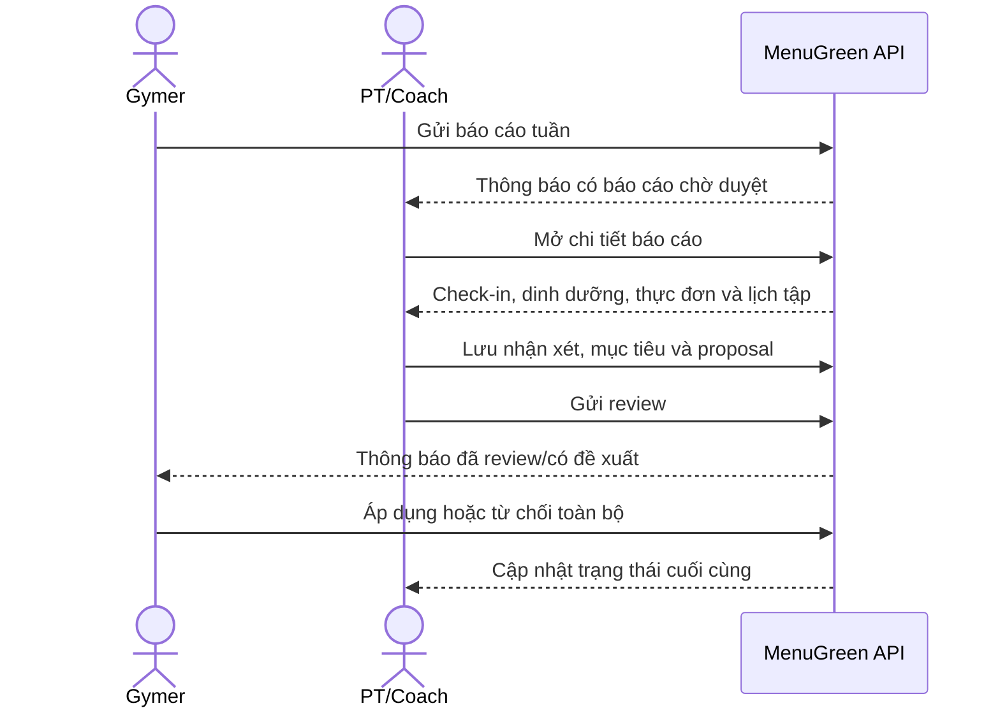
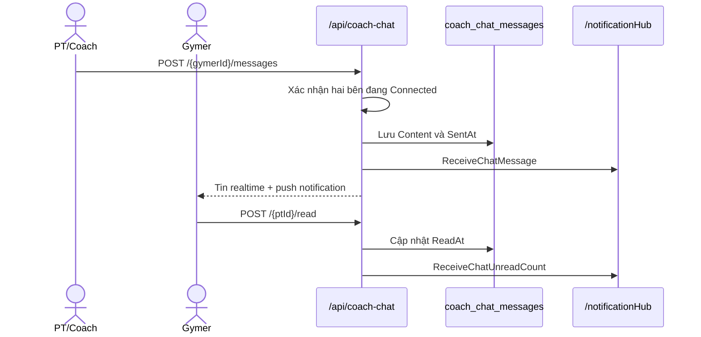
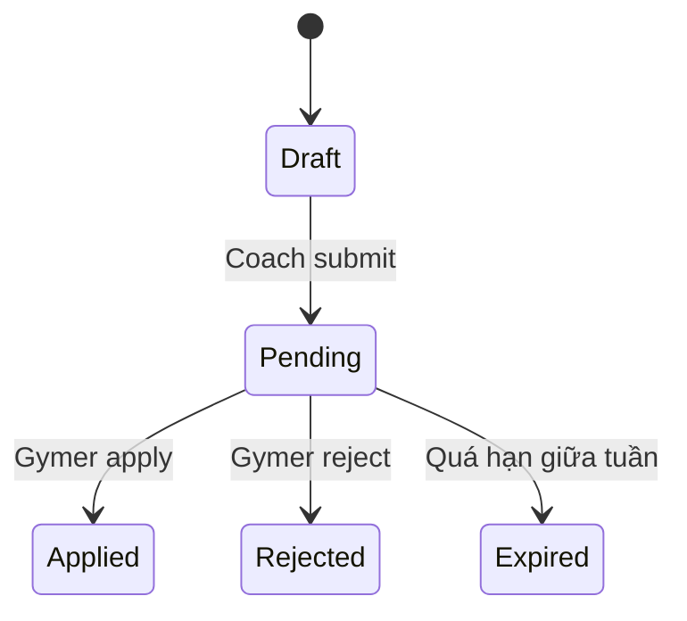

# MenuGreen — Luồng nghiệp vụ PT/Coach

> Cập nhật: 07/08/2026
> Phạm vi: Coach có tài khoản trong MenuGreen, các công cụ quản lý học viên, chat PT–Gymer và PT bên ngoài sử dụng link chia sẻ.

## 1. Mục tiêu của luồng

Coach theo dõi dữ liệu của học viên đã cấp quyền, review báo cáo giữa tuần/cuối tuần và gửi đề xuất thực đơn để Gymer phê duyệt.

Nguyên tắc mới:

- Coach không sửa trực tiếp thực đơn đang có của Gymer trong luồng review.
- Thay đổi được lưu dưới dạng bản nháp proposal.
- Sau khi Coach gửi, proposal chuyển sang `Pending` và Gymer quyết định toàn bộ.
- Báo cáo đang chờ review dùng dữ liệu trực tiếp; báo cáo đã review dùng snapshot để kết quả không thay đổi về sau.



## 2. Đăng ký và kết nối học viên

### 2.1 Đăng ký Coach

Coach đăng ký qua `POST /api/Coaches/register` với các thông tin như chuyên môn, mô tả kinh nghiệm và giá dịch vụ. Tài khoản được gán vai trò `Coach` và dùng các endpoint có policy `CoachOnly`.

### 2.2 Kết nối

1. Coach xuất hiện trong danh sách `GET /api/Coaches`.
2. Gymer gửi yêu cầu kết nối.
3. Coach chấp nhận qua `POST /api/Coaches/approve-connection/{clientId}`.
4. Gymer cấp quyền truy cập dữ liệu.
5. Coach xem danh sách học viên qua `GET /api/Coaches/my-clients`.

Coach chỉ được xem báo cáo khi:

- Kết nối với đúng Gymer.
- Kết nối còn hiệu lực.
- Gymer đã cấp quyền dữ liệu cần thiết.

### 2.3 Dữ liệu Coach có thể xem

| API | Nội dung |
|---|---|
| `GET /api/Coaches/clients/{clientId}/profile` | Hồ sơ sức khỏe và mục tiêu |
| `GET /api/Coaches/clients/{clientId}/nutrition-summary` | Tổng hợp calorie và macro |
| `GET /api/Coaches/clients/{clientId}/weight-trend` | Xu hướng cân nặng |
| Các API meal plan của client | Thực đơn hiện tại và món theo ngày |

## 3. Tổng quan tính năng dành cho PT/Coach

Giao diện Coach có năm tab chính:

| Tab | Tính năng |
|---|---|
| Học viên | Xem yêu cầu kết nối, chấp nhận học viên, mở hồ sơ và chat trực tiếp |
| Lộ trình | Chọn học viên, xem lịch sử và tạo thực đơn ngày/tuần/tháng |
| Báo cáo | Lọc, mở và review báo cáo giữa tuần/cuối tuần |
| Thông báo | Nhận sự kiện kết nối, báo cáo, proposal, lộ trình và chat |
| Cá nhân | Xem thống kê hoạt động và chỉnh sửa hồ sơ Coach |

### 3.1 Quản lý học viên

Coach có thể:

- Xem học viên chờ duyệt và học viên đã kết nối.
- Chấp nhận yêu cầu kết nối.
- Xem hồ sơ sức khỏe, dị ứng, mục tiêu và cấu hình tập luyện.
- Xem tổng hợp dinh dưỡng và xu hướng cân nặng.
- Xem các yêu cầu review của từng học viên.
- Gửi feedback riêng và xem lịch sử feedback.
- Mở chat trực tiếp từ biểu tượng tin nhắn trên thẻ học viên.

### 3.2 Quản lý lộ trình thực đơn

Coach có thể:

- Lọc lịch sử thực đơn theo ngày, tuần hoặc tháng.
- Tạo kế hoạch `daily`, `weekly` hoặc `monthly`.
- Thiết lập calorie mục tiêu, khoảng calorie, protein và macro.
- Phân biệt ngày nghỉ và ngày tập dựa trên cấu hình Gym của học viên.
- Lấy danh sách món/công thức phù hợp từ API suggestions.
- Thêm, thay hoặc xóa món; sắp xếp theo bữa và thời gian.
- Viết ghi chú cho học viên.
- Lưu nháp, tiếp tục chỉnh sửa hoặc xóa bản nháp.
- Submit lộ trình để Gymer nhận và chấp nhận/từ chối.

Các trạng thái lộ trình thường gặp:

| Trạng thái | Ý nghĩa |
|---|---|
| `Draft` | Coach đang soạn |
| `PendingAcceptance` | Đã gửi, chờ Gymer chấp nhận |
| `Approved` | Gymer đã duyệt và lộ trình có hiệu lực |
| `Rejected` | Gymer đã từ chối |

### 3.3 Feedback và mục tiêu sức khỏe

Các endpoint Coach cũ vẫn hỗ trợ:

- `POST /api/Coaches/clients/{clientId}/feedback` để gửi feedback độc lập với báo cáo tuần.
- `GET /api/Coaches/clients/{clientId}/feedback` để xem lịch sử.
- `PUT /api/Coaches/clients/{clientId}/health-targets` để cập nhật mục tiêu theo quyền Coach hiện có.
- `PUT /api/Coaches/clients/{clientId}/meal-plan/{planId}` để chỉnh sửa lộ trình nháp/hợp lệ theo service.

Đối với thay đổi phát sinh từ **review giữa tuần/cuối tuần**, phải dùng `MealPlanProposal` và chờ Gymer duyệt; không dùng endpoint cũ để bỏ qua bước phê duyệt.

### 3.4 Báo cáo và chương trình cá nhân

- Xem báo cáo theo tuần, tháng, trạng thái và học viên.
- Review chỉ số check-in, mức tuân thủ, calorie/macro và món từng ngày.
- Đề xuất mục tiêu mới và thay đổi thực đơn.
- Tạo chương trình cá nhân qua `/api/PtReview/coach/personal-programs`.
- Theo dõi trạng thái proposal/lộ trình sau khi gửi.

## 4. Chat giữa PT/Coach và Gymer

### 4.1 Điều kiện và cách mở

- Chỉ PT/Coach và Gymer có kết nối `Connected` mới nhắn tin được.
- Chat không phụ thuộc vào quyền xem dữ liệu sức khỏe (`DataAccessGranted`).
- Coach mở chat từ biểu tượng tin nhắn trên thẻ học viên.
- Notification loại `coach_chat_message` mở thẳng `CoachChatScreen` bằng deep link `chat:{partnerId}`.
- Khi kết nối bị ngắt, API từ chối tải lịch sử mới hoặc gửi thêm tin.

### 4.2 Luồng realtime



Backend lưu tin trước rồi mới phát realtime. Vì vậy, SignalR chỉ giúp cập nhật tức thời; REST API vẫn là nguồn dữ liệu chuẩn để tải lại lịch sử.

### 4.3 API chat

| Method | Endpoint | Mục đích |
|---|---|---|
| `GET` | `/api/coach-chat/partners?scope=coach` | Danh sách Gymer đã kết nối |
| `GET` | `/api/coach-chat/{partnerId}/messages?before={time}&take=50` | Lấy lịch sử hai chiều |
| `POST` | `/api/coach-chat/{partnerId}/messages` | Gửi tin nhắn |
| `POST` | `/api/coach-chat/{partnerId}/read` | Đánh dấu tin của đối phương đã đọc |
| `GET` | `/api/coach-chat/unread-count?scope=coach` | Tổng số tin chưa đọc của Coach |

`scope=coach` chỉ trả các connection mà người hiện tại là Coach; `scope=gymer` chỉ trả connection mà người hiện tại là học viên. Nếu không truyền `scope`, backend trả tất cả partner hợp lệ của tài khoản.

Nội dung gửi là JSON `{ "content": "..." }`, bắt buộc từ 1 đến 2.000 ký tự sau khi trim. API lịch sử mặc định lấy 50 tin, tối đa 100 tin mỗi lần và dùng `before` để phân trang ngược thời gian.

### 4.4 Realtime và notification

Chat dùng SignalR `/notificationHub` với JWT và tự động reconnect.

| Event | Dữ liệu |
|---|---|
| `ReceiveChatMessage` | `Id`, người gửi/nhận, nội dung, thời gian, `ReadAt`, `IsMine` |
| `ReceiveChatUnreadCount` | Tổng số tin chưa đọc của người nhận |

Mỗi tin mới đồng thời tạo notification:

- Type `coach_chat_message`.
- Tiêu đề chứa tên người gửi.
- Body chứa nội dung tin.
- Action URL `chat:{senderId}`.

Khi người dùng đang mở đúng cuộc trò chuyện, client đánh dấu tin đến là đã đọc ngay. Khi đang ở màn hình khác, badge của partner và tổng unread tăng lên.

### 4.5 Bảo mật, lỗi và giới hạn

- Tất cả API và hub yêu cầu đăng nhập.
- `403` khi không có kết nối hợp lệ hoặc cố tự nhắn cho chính mình.
- `400` khi nội dung trống hoặc quá 2.000 ký tự.
- Tin nhắn lưu trong `coach_chat_messages` với index phục vụ lịch sử và unread count.
- Phiên bản hiện tại chỉ hỗ trợ văn bản; chưa hỗ trợ file/ảnh, sửa, thu hồi, reaction, typing indicator hoặc dấu đã xem ở phía người gửi.
- PT guest dùng token chia sẻ không được tham gia chat nội bộ.

## 5. Danh sách báo cáo PT

Màn hình Coach: **Báo cáo PT**.

API chính: `GET /api/PtReview/coach/reports`.

Coach có thể lọc theo:

- Tuần bắt đầu (`weekStart`).
- Tháng (`month`).
- Trạng thái (`status`).
- Học viên (`clientId`).

Mỗi thẻ báo cáo hiển thị tên học viên, loại báo cáo, khoảng ngày, cân nặng và trạng thái. Khi bấm vào thẻ, ứng dụng gọi:

```http
GET /api/PtReview/coach/reports/{reportId}
```

Backend phải trả `404` chỉ khi report không tồn tại hoặc không thuộc Coach hiện tại. UI phải hiển thị lỗi và nút thử lại; không được giữ spinner vô hạn.

## 6. Chi tiết báo cáo

Chi tiết báo cáo gồm:

- Loại báo cáo và khoảng thời gian.
- Cân nặng, tỷ lệ mỡ, số buổi tập và cảm nhận thể trạng.
- Dữ liệu calorie, protein, carb và fat.
- Mức độ tuân thủ thực đơn.
- Món đã lên kế hoạch và nhật ký thực tế theo từng ngày.
- Nhận xét của Gymer, nếu có.
- Form nhận xét, calorie/protein mục tiêu và đề xuất thực đơn của Coach.

### 6.1 Báo cáo đang chờ duyệt

Chi tiết được tổng hợp từ dữ liệu mới nhất ở thời điểm Coach mở màn hình. Cách này giúp Coach thấy các log vừa được Gymer bổ sung sau khi tạo yêu cầu.

### 6.2 Báo cáo đã review

Chi tiết dùng snapshot đã lưu tại thời điểm gửi review. Nhận xét và chỉ số đã chốt không thay đổi dù dữ liệu hằng ngày của Gymer được cập nhật sau đó.

## 7. Review giữa tuần

| Thuộc tính | Quy tắc |
|---|---|
| Ngày báo cáo | Thứ Năm, giờ Việt Nam |
| Dữ liệu Coach xem | Thứ Hai đến thời điểm Gymer gửi |
| Ngày được đề xuất thay đổi | Thứ Sáu đến Chủ Nhật cùng tuần |
| Loại proposal | `CurrentWeekAdjustment` |
| Hạn Gymer xử lý | Trước 00:00 thứ Sáu |

Quy trình:

1. Coach mở báo cáo `Pending`.
2. Coach đọc check-in, mức tuân thủ và dữ liệu từng ngày.
3. Coach nhập nhận xét, calorie và protein đề xuất.
4. Nếu cần điều chỉnh thực đơn, Coach tạo bản nháp proposal.
5. Coach thêm các item `Add`, `Replace` hoặc `Remove` cho thứ Sáu–Chủ Nhật.
6. Coach gửi review; hệ thống gửi proposal sang Gymer ở trạng thái `Pending`.

Coach có thể gửi nhận xét và mục tiêu mà không cần thay đổi món ăn. Khi đó màn hình Gymer vẫn hiển thị review và thông báo không có thay đổi thực đơn.

## 8. Review cuối tuần

| Thuộc tính | Quy tắc |
|---|---|
| Ngày báo cáo | Chủ Nhật, giờ Việt Nam |
| Dữ liệu Coach xem | Thứ Hai đến Chủ Nhật |
| Phạm vi kế hoạch | Thứ Hai đến Chủ Nhật tuần tiếp theo |
| Loại proposal | `NextWeekPlan` |
| Tự động hết hạn | Không |

Quy trình:

1. Coach đánh giá kết quả toàn tuần.
2. Coach nhập nhận xét và mục tiêu tuần kế tiếp.
3. Coach tạo thực đơn cho đủ phạm vi tuần kế tiếp.
4. Coach gửi review và kế hoạch cho Gymer phê duyệt.
5. Chỉ sau khi Gymer chọn **Áp dụng toàn bộ**, kế hoạch mới được ghi vào thực đơn.

Backend kiểm tra sự tồn tại của kế hoạch tuần mới trước khi hoàn tất review cuối tuần.

## 9. Tạo và chỉnh sửa proposal

### 9.1 Tạo bản nháp

```http
POST /api/meal-plan-proposals/reviews/{reviewRequestId}/draft
```

Backend xác định loại proposal và khoảng ngày dựa trên loại báo cáo. Coach không được tự ý đặt ngày ngoài phạm vi hợp lệ.

### 9.2 Chỉnh sửa bản nháp

```http
PUT /api/meal-plan-proposals/{proposalId}
```

Quy tắc item:

| Action | Trường bắt buộc | Ý nghĩa |
|---|---|---|
| `Add` | `PlannedDate`, `MealType`, một trong `FoodId`/`RecipeId` | Thêm món mới |
| `Replace` | `ExistingMealPlanItemId`, món mới | Thay món đang tồn tại |
| `Remove` | `ExistingMealPlanItemId` | Xóa món đang tồn tại |

Quy tắc kiểm tra:

- `Replace` và `Remove` phải tham chiếu `MealPlanItem` thuộc đúng Gymer và đúng phạm vi ngày.
- `Add` và món mới của `Replace` chỉ được chọn một trong `FoodId` hoặc `RecipeId`.
- Không được dùng proposal đã `Pending`, `Applied`, `Rejected` hoặc `Expired` như bản nháp.
- `SortOrder` quyết định thứ tự hiển thị.
- `QuantityG` và `TargetCalories` phải là giá trị hợp lệ, không âm.

### 9.3 Gửi proposal

```http
POST /api/meal-plan-proposals/{proposalId}/submit
```

Sau khi gửi:

- Trạng thái đổi từ `Draft` sang `Pending`.
- `SubmittedAt` được ghi nhận.
- Coach không tiếp tục chỉnh sửa proposal đó.
- Gymer nhận notification và thấy đề xuất trong màn hình **Xem chi tiết**.

## 10. Gửi review

Coach gửi nhận xét qua:

```http
POST /api/PtReview/coach/reports/{reportId}/review
```

Payload review có thể chứa:

- Nhận xét chuyên môn.
- Calorie mục tiêu.
- Protein mục tiêu.
- Các chỉ số mục tiêu khác được backend hỗ trợ.
- Tham chiếu/bản nháp thay đổi thực đơn.

Khi thành công, report chuyển từ `Pending` sang `Reviewed`. Notification có deep link `gymer_weekly_report:{reportId}` hoặc `meal_plan_proposal:{proposalId}`.

## 11. Trạng thái và thời hạn



Job nền gửi nhắc nhở proposal giữa tuần đang chờ vào khoảng 23:45 thứ Năm và chuyển proposal sang `Expired` lúc 00:00 thứ Sáu. Proposal cuối tuần không tự động hết hạn hoặc tự áp dụng.

Coach có thể xem trạng thái sau cùng nhưng không được thay Gymer áp dụng/từ chối.

## 12. API Coach/PT chính

### 12.1 Quản lý học viên và lộ trình

| Method | Endpoint | Mục đích |
|---|---|---|
| `GET` | `/api/Coaches/my-clients` | Lấy yêu cầu và học viên của Coach |
| `POST` | `/api/Coaches/approve-connection/{clientId}` | Chấp nhận kết nối |
| `GET` | `/api/Coaches/clients/{clientId}/profile` | Xem hồ sơ học viên |
| `GET` | `/api/Coaches/clients/{clientId}/nutrition-summary` | Xem tổng hợp dinh dưỡng |
| `GET` | `/api/Coaches/clients/{clientId}/weight-trend` | Xem xu hướng cân nặng |
| `POST` | `/api/Coaches/clients/{clientId}/feedback` | Gửi feedback riêng |
| `GET` | `/api/Coaches/clients/{clientId}/feedback` | Xem lịch sử feedback |
| `GET` | `/api/Coaches/clients/{clientId}/meal-plans` | Lấy lịch sử lộ trình |
| `GET` | `/api/Coaches/clients/{clientId}/meal-plans/{planId}` | Lấy chi tiết một lộ trình |
| `POST` | `/api/Coaches/clients/{clientId}/meal-plans` | Tạo lộ trình mới |
| `PUT` | `/api/Coaches/clients/{clientId}/meal-plan/{planId}` | Cập nhật lộ trình |
| `POST` | `/api/Coaches/clients/{clientId}/meal-plans/{planId}/submit` | Gửi lộ trình cho Gymer |
| `DELETE` | `/api/Coaches/clients/{clientId}/meal-plans/{planId}` | Xóa/vô hiệu hóa lộ trình hợp lệ |
| `GET` | `/api/Coaches/clients/{clientId}/suggestions` | Gợi ý món theo mục tiêu |
| `GET` | `/api/Coaches/clients/{clientId}/gym-config` | Lấy cấu hình tập luyện theo ngày |
| `GET` | `/api/Coaches/clients/{clientId}/review-requests` | Lấy báo cáo của một học viên |
| `PUT` | `/api/Coaches/clients/{clientId}/health-targets` | Cập nhật mục tiêu theo quyền Coach cũ |

### 12.2 Báo cáo trong ứng dụng

| Method | Endpoint | Mục đích |
|---|---|---|
| `GET` | `/api/PtReview/coach/reports` | Danh sách báo cáo được giao cho Coach |
| `GET` | `/api/PtReview/coach/reports/{reportId}` | Chi tiết báo cáo |
| `POST` | `/api/PtReview/coach/reports/{reportId}/review` | Gửi nhận xét và mục tiêu |
| `POST` | `/api/meal-plan-proposals/reviews/{reviewRequestId}/draft` | Tạo proposal nháp |
| `PUT` | `/api/meal-plan-proposals/{proposalId}` | Cập nhật item trong bản nháp |
| `POST` | `/api/meal-plan-proposals/{proposalId}/submit` | Gửi proposal cho Gymer |
| `GET` | `/api/meal-plan-proposals/{proposalId}` | Xem chi tiết/trạng thái proposal |

### 12.3 Chương trình cá nhân

| Method | Endpoint | Mục đích |
|---|---|---|
| `POST` | `/api/PtReview/coach/personal-programs` | Coach tạo chương trình cá nhân |
| `GET` | `/api/PtReview/coach/personal-programs` | Coach xem chương trình đã tạo |

Gymer nhận chương trình qua `GET /api/PtReview/my-personal-programs` và quyết định bằng endpoint `accept` hoặc `reject` tương ứng.

## 13. PT bên ngoài qua link chia sẻ

PT không có tài khoản MenuGreen vẫn có thể review một lần qua token:

1. Gymer gửi link `https://menugreen.food/shared-reports/{token}`.
2. PT gọi `GET /api/PtReview/shared-reports/{token}` mà không cần đăng nhập.
3. PT gửi nhận xét qua `POST /api/PtReview/shared-reports/{token}/submit`.
4. Gymer nhận notification và quyết định áp dụng hoặc từ chối.

Luồng guest không cấp quyền truy cập lâu dài vào hồ sơ học viên. Token phải đúng, còn hạn và chỉ truy cập được đúng báo cáo được chia sẻ.

## 14. Dữ liệu và migration

### `meal_plan_proposals`

Lưu proposal cấp đầu: `UserId`, `CoachId`, `ReviewRequestId`, `ProposalType`, `Status`, `PeriodStart`, `PeriodEnd`, `ExpiresAt`, phiên bản kế hoạch nguồn và các mốc tạo/gửi/xử lý.

### `meal_plan_proposal_items`

Lưu từng thay đổi: `Action`, `PlannedDate`, `MealType`, `ExistingMealPlanItemId`, `FoodId`, `RecipeId`, `QuantityG`, `TargetCalories`, `SortOrder`.

Migration và script liên quan:

- Migration EF: `20260806093402_AddMealPlanProposals`.
- `backend/database/58_meal_plan_proposals.sql`: tạo bảng, khóa ngoại và index theo cách idempotent.
- `backend/database/demo/current_week_reporting.sql`: dữ liệu mẫu tùy chọn từ đầu tuần hiện tại đến ngày chạy thử.

## 15. Xử lý lỗi và bảo mật

- `401`: chưa đăng nhập/token không hợp lệ.
- `403`: không phải Coach được giao report hoặc chưa có quyền dữ liệu.
- `404`: report/proposal không tồn tại trong phạm vi truy cập.
- `409`: sai trạng thái, proposal đã xử lý, hết hạn hoặc xung đột phiên bản meal plan.
- `422`/`400`: item sai phạm vi ngày, thiếu món mới hoặc dữ liệu không hợp lệ.

Ứng dụng phải kết thúc trạng thái loading khi API lỗi và hiển thị thông báo có thể thử lại. Log FCM hoặc cảnh báo Android back callback không phải nguyên nhân của lỗi `404` tại API report detail.

## 16. Tiêu chí nghiệm thu chính

- Coach chỉ xem được report của học viên thuộc phạm vi được cấp quyền.
- Mở hai report chờ duyệt không tạo vòng loading vô hạn.
- Chi tiết pending phản ánh log mới nhất; reviewed dùng snapshot đã chốt.
- Midweek chỉ sửa thứ Sáu–Chủ Nhật của tuần hiện tại.
- Final chỉ lập thực đơn cho tuần kế tiếp.
- Proposal gửi rồi không chỉnh sửa được.
- Gymer nhìn thấy đủ ngày, bữa, món cũ/mới, gram và calorie.
- Chỉ Gymer sở hữu proposal mới áp dụng hoặc từ chối được.
- Apply chạy nguyên tử và idempotent.
- Proposal giữa tuần hết hạn đúng giờ Việt Nam và không tự sửa thực đơn.
- Coach chỉ chat được với Gymer đang có kết nối `Connected`.
- Tin nhắn được lưu trước khi phát realtime và không bị nhân đôi trên UI.
- Badge chưa đọc cập nhật khi có tin mới và trở về 0 sau khi mở cuộc trò chuyện.
- Notification chat mở đúng Gymer/PT tương ứng.
