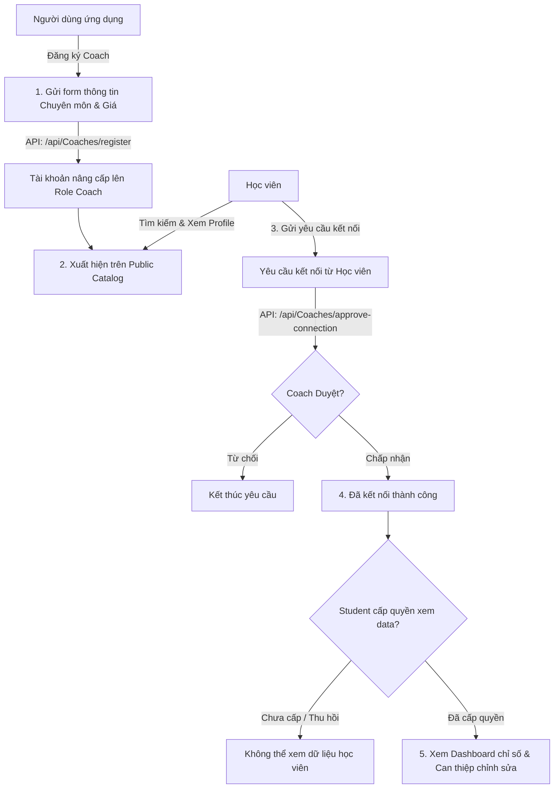
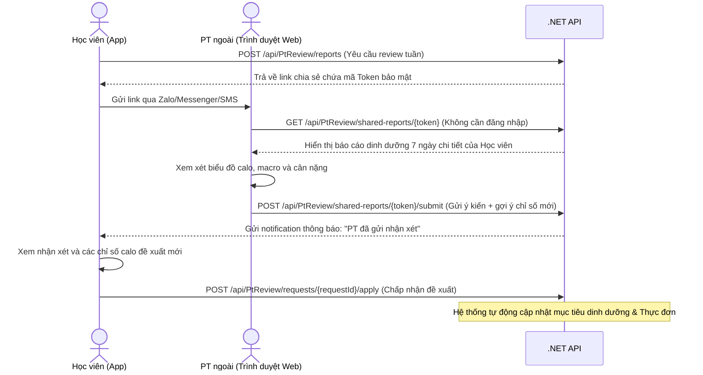

# 👟 MenuGreen — Luồng Nghiệp Vụ Huấn Luyện Viên (Coach / PT Workflow)

Tài liệu này mô tả chi tiết quy trình làm việc của **Huấn luyện viên (Coach/PT)** trong hệ thống MenuGreen, bao gồm hai hình thức: Coach chính thức trong hệ sinh thái ứng dụng và PT tự do bên ngoài (Guest PT) tương tác qua liên kết chia sẻ.

---

## 1. Hệ sinh thái Huấn luyện viên chính thức (In-app Coaches Ecosystem)

Quy trình này áp dụng cho các Coach đăng ký tài khoản trong hệ thống và chăm sóc học viên (student) dài hạn.

### 1.1 Đăng ký & cấu hình Profile Coach
* Bất kỳ người dùng nào cũng có thể đăng ký làm Coach thông qua form đăng ký trong app.
* Thông tin đăng ký bao gồm:
  * **Specialty (Chuyên môn)**: Ví dụ: Tăng cơ (Bulking), Giảm mỡ (Shredding), Ăn chay (Vegan), Dinh dưỡng bệnh lý...
  * **Price (Giá dịch vụ)**: Mức phí tư vấn mỗi tháng (VNĐ).
  * **Bio / Experience**: Giới thiệu bản thân và kinh nghiệm huấn luyện.
* Sau khi gọi API `POST /api/Coaches/register`, hệ thống nâng cấp vai trò của tài khoản lên **Coach** và kích hoạt quyền truy cập các endpoint thuộc chính sách `CoachOnly`.

### 1.2 Kết nối Học viên (Student Connection)
* Coach xuất hiện trong danh mục tìm kiếm công khai (`GET /api/Coaches`). Học viên có thể tìm kiếm, lọc theo chuyên môn và giá, sau đó nhấn "Yêu cầu kết nối".
* Coach xem danh sách yêu cầu chờ duyệt (`GET /api/Coaches/my-clients` lọc trạng thái pending).
* Coach bấm Chấp nhận (`POST /api/Coaches/approve-connection/{clientId}`) để thiết lập liên kết chính thức.

### 1.3 Giám sát & Quản lý Học viên (Student Care)
Sau khi kết nối và được học viên cấp quyền xem dữ liệu (`Grant Access`), Coach có thể truy cập các thông tin sau qua màn hình **Coach Dashboard**:
1. **Xem hồ sơ chi tiết (`GET /api/Coaches/clients/{clientId}/profile`)**: Chiều cao, cân nặng hiện tại, cân nặng mục tiêu, các chất gây dị ứng (Allergies) để tránh đề xuất món ăn nguy hại.
2. **Xem nhật ký dinh dưỡng 7 ngày gần nhất (`GET /api/Coaches/clients/{clientId}/nutrition-summary`)**: Theo dõi sát sao lượng calo nạp vào, phân phối đạm (protein), đường bột (carbs), chất béo (fat) thực tế mỗi ngày.
3. **Xem xu hướng cân nặng (`GET /api/Coaches/clients/{clientId}/weight-trend`)**: Đánh giá hiệu quả của thực đơn đối với sự thay đổi thể trạng học viên.

### 1.4 Hành động của Coach (Coach Actions)
Coach có quyền trực tiếp can thiệp vào quá trình tập luyện của học viên mà không cần thông qua bước phê duyệt trung gian:
* **Gửi nhận xét dinh dưỡng (`POST /api/Coaches/clients/{clientId}/feedback`)**: Gửi các lời khuyên, động viên hoặc nhắc nhở học viên. Học viên sẽ nhận được thông báo tức thì trên thiết bị di động.
* **Điều chỉnh thực đơn tuần của học viên (`PUT /api/Coaches/clients/{clientId}/meal-plan/{planId}`)**: Coach trực tiếp sửa đổi kế hoạch bữa ăn của học viên để phù hợp hơn với thực tế tập luyện.
* **Thay đổi chỉ tiêu dinh dưỡng (`PUT /api/Coaches/clients/{clientId}/health-targets`)**: Thay đổi giới hạn calo và macro hàng ngày (ví dụ: tăng calo vào ngày học viên tập luyện nặng, giảm calo vào ngày nghỉ). Dữ liệu này sẽ cập nhật trực tiếp vào `HealthProfile` của học viên.

---

## 2. Luồng đánh giá nhanh một lần (Guest PT Review)

Quy trình này thiết kế riêng cho các huấn luyện viên tự do ở bên ngoài phòng gym (không cài đặt ứng dụng MenuGreen). Học viên có thể nhờ PT của mình đánh giá nhanh thực đơn hàng tuần thông qua liên kết chia sẻ bảo mật.

### 2.1 Tạo Báo cáo & Chia sẻ
* Học viên chọn một tuần dinh dưỡng cụ thể trong nhật ký ăn uống và bấm "Nhờ PT nhận xét".
* Hệ thống đóng gói dữ liệu và tạo một Token ngẫu nhiên có thời hạn hết hạn (expiry). Trả về URL dạng:
  `https://menugreen.food/shared-reports/pt-review-token-xyz123`
* Học viên gửi đường link này cho PT của mình qua bất cứ kênh chat nào.

### 2.2 Xem & Phản hồi báo cáo (Giao diện Web của PT)
* PT click vào link sẽ được dẫn tới một trang web tối giản, thân thiện với thiết bị di động (không yêu cầu đăng nhập tài khoản).
* API `GET /api/PtReview/shared-reports/{token}` trả về:
  * Tổng năng lượng calo & tỷ lệ macros học viên đã tiêu thụ mỗi ngày trong tuần đó.
  * Biểu đồ thay đổi cân nặng trong tuần.
  * Các ghi chú hoặc thắc mắc của học viên.
* PT viết nhận xét chuyên môn và nhập các thông số đề xuất mới (Calo, Protein, Carbs, Fat mục tiêu) rồi nhấn **Gửi đánh giá**.
* API `POST /api/PtReview/shared-reports/{token}/submit` ghi nhận thông tin và chuyển trạng thái yêu cầu từ `Pending` sang `Reviewed`.

### 2.3 Phê duyệt từ phía Học viên
* Ngay sau khi PT submit đánh giá, học viên nhận được thông báo đẩy (push notification) trên điện thoại.
* Học viên mở màn hình kết quả đánh giá để đọc feedback.
* Học viên có 2 lựa chọn:
  * **Apply (Áp dụng)**: Hệ thống tự động cập nhật các mục tiêu calo/macros mới do PT đề xuất vào hồ sơ sức khỏe hiện tại của học viên.
  * **Reject (Từ chối)**: Đóng yêu cầu và giữ nguyên các chỉ số hiện tại.
* Trạng thái yêu cầu được cập nhật tương ứng thành `Applied` hoặc `Rejected`.
