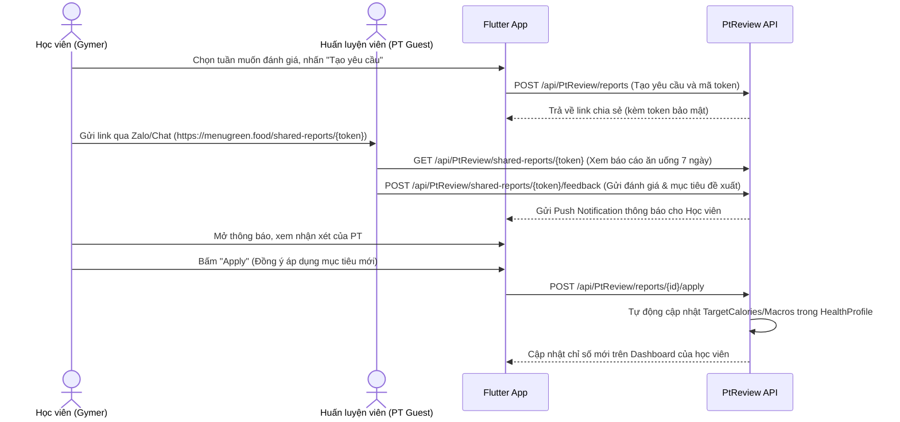

# 🥗 MenuGreen — Luồng Nghiệp Vụ Người Tập Gym/Thể Hình (Gymer User Workflow)

Tài liệu này chi tiết hành trình của **Người tập luyện thể thao (Gymer)** - nhóm người dùng có mục tiêu hình thể rõ ràng (tăng cơ, giảm mỡ, siết cơ), cần theo dõi sát sao lượng Calo và tỷ lệ các chất đa lượng (Macronutrients) đặc biệt là Protein.

---

## 1. Đăng ký & Onboarding cho nhóm Gymer
1. **Đăng ký**: Đăng ký tài khoản mới qua Email + OTP hoặc Google Sign-In.
2. **Onboarding**:
   - Nhập chỉ số cơ bản (tuổi, chiều cao, cân nặng).
   - Chọn mục tiêu sức khỏe thể hình: **Tăng cơ (Gain Muscle)** hoặc **Giảm mỡ tăng cơ (Recomp)**. Nhập cân nặng mục tiêu.
   - Chọn mức độ hoạt động thể chất cao: **Vận động nặng (Active / Very Active)** (tập luyện 5-7 buổi/tuần).
   - Hệ thống tính toán chỉ số TDEE và đề xuất mức calo thặng dư (Surplus - để tăng cơ) hoặc thâm hụt (Deficit - để giảm mỡ), đồng thời thiết lập tỷ lệ dinh dưỡng giàu Protein (thường chiếm 25-30% tổng calo).
   - Chọn nhóm hành vi: **Thể hình/PT (Gymer/Fitness)**.
3. **Nâng cấp gói cước**: Thanh toán tự động qua SePay, nâng cấp vai trò tài khoản thành `Gymer`.

---

## 2. Thiết Lập Mục Tiêu Gym & PT (Gym Goals Management)
Người dùng quản lý kế hoạch thể thao chuyên sâu của mình thông qua `GymGoalsController`.

1. **Thiết lập mục tiêu thể thao**:
   - Cấu hình chỉ tiêu cụ thể: Cân nặng mục tiêu, Tỷ lệ mỡ mục tiêu (Target Body Fat %), Lượng Protein tối thiểu cần đạt mỗi ngày.
   - Gọi API: `POST /api/GymGoals/setup`.
2. **Theo dõi chỉ số hình thể**:
   - Nhập cân nặng và lượng mỡ cơ thể (Body Fat %) định kỳ.
   - Hệ thống tự động so sánh với mục tiêu và tính toán xu hướng phát triển cơ bắp.

---

## 3. Quy Trình PT Review (Đánh Giá Từ Huấn Luyện Viên Bên Ngoài)
Hỗ trợ người dùng đang tập luyện với PT cá nhân ngoài đời thực có thể dễ dàng kiểm tra chế độ ăn uống thông qua `PtReviewController` mà PT không cần đăng nhập ứng dụng.

---

## 4. Hợp Tác Dài Hạn Với Huấn Luyện Viên Hệ Thống (Coaches Ecosystem)
Cho phép Gymer kết nối và nhận sự chăm sóc dài hạn từ các chuyên gia dinh dưỡng được chứng nhận trên hệ thống MenuGreen thông qua `CoachesController`.

1. **Tìm kiếm & Gửi yêu cầu**:
   - Học viên tìm kiếm huấn luyện viên theo chuyên môn (Tăng cơ, Giảm mỡ, KETO...) và gửi yêu cầu kết nối.
   - Gọi API: `POST /api/Coaches/connect/{coachId}`.
2. **Quản lý quyền truy cập dữ liệu**:
   - Để huấn luyện viên có thể theo dõi và can thiệp, học viên phải bấm **Cấp quyền truy cập (Grant Access)**.
   - Sau khi kết nối thành công, Huấn luyện viên có thể xem Nhật ký ăn uống 7 ngày qua, Hồ sơ sức khỏe, và Biểu đồ cân nặng.
   - Học viên có quyền **Thu hồi quyền truy cập (Revoke Access)** bất cứ lúc nào để bảo mật quyền riêng tư.
3. **Huấn luyện viên điều chỉnh thực đơn**:
   - Huấn luyện viên có thể điều chỉnh trực tiếp kế hoạch thực đơn tuần của học viên hoặc thay đổi chỉ tiêu Calo/Macros hàng ngày.

---

## 5. Chương Trình Lộ Trình Tuần Dài Hạn (Premium Programs)
Gymer tham gia các lộ trình tập luyện có cam kết cao để đạt được mục tiêu thể hình mong muốn.

1. **Đăng ký chương trình**: Người dùng đăng ký chương trình (ví dụ: *Tăng 3kg cơ nách trong 8 tuần*).
2. **Luồng hoạt động theo tuần**:
   - **Nhận kế hoạch tuần**: Mỗi đầu tuần, hệ thống mở khóa bài học dinh dưỡng, thực đơn đề xuất đặc thù cho tăng cơ/giảm mỡ.
   - **Check-in định kỳ**: Mỗi cuối tuần, người dùng bắt buộc phải cập nhật Cân nặng, Số đo các vòng, Tỷ lệ mỡ. Gọi API: `POST /api/PremiumPrograms/checkin`.
   - **Mở khóa Milestone**: Nhận huy hiệu và điểm thưởng khi hoàn thành xuất sắc chỉ tiêu calo và protein liên tục 7 ngày.
3. **Lễ tốt nghiệp (Graduation)**:
   - Sau khi kết thúc lộ trình (8 - 12 tuần), người dùng thực hiện check-in cuối cùng.
   - Hệ thống xuất file báo cáo phân tích sự phát triển cơ bắp, lượng mỡ đã giảm và cấp chứng nhận hoàn thành.
