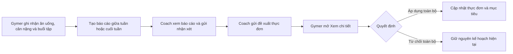
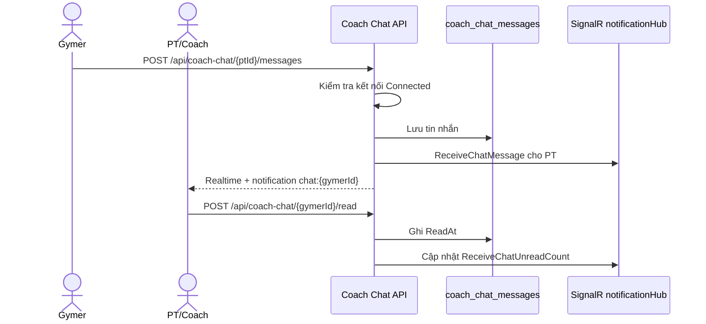
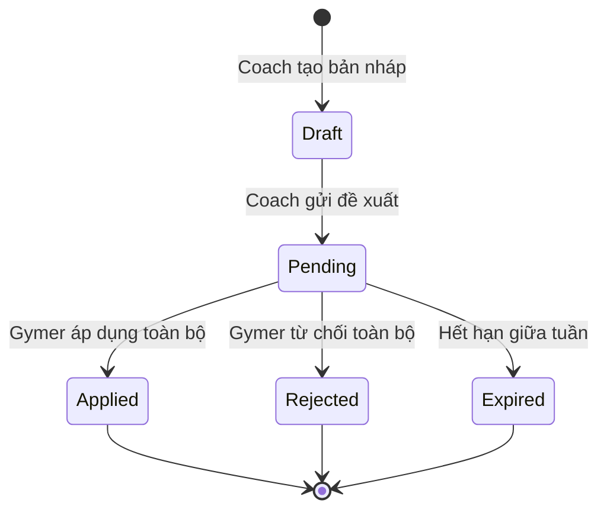

# MenuGreen — Luồng nghiệp vụ Gymer

> Cập nhật: 07/08/2026
> Phạm vi: tài khoản có vai trò `Gymer`, kết nối Coach/PT, chat trực tiếp, báo cáo giữa tuần và cuối tuần, đề xuất thay đổi thực đơn.

## 1. Mục tiêu của luồng

Gymer theo dõi dinh dưỡng và luyện tập hằng ngày, gửi báo cáo định kỳ cho Coach, nhận nhận xét và chủ động quyết định có áp dụng các thay đổi do Coach đề xuất hay không.

Nguyên tắc quan trọng:

- Coach không sửa trực tiếp thực đơn đang dùng của Gymer.
- Mọi thay đổi thực đơn được lưu thành một `MealPlanProposal`.
- Gymer xem chi tiết đề xuất trên một màn hình riêng rồi **Áp dụng toàn bộ** hoặc **Từ chối toàn bộ**.
- Việc áp dụng phải được thực hiện một lần, trong transaction và không tạo món trùng khi gọi lại API.



## 2. Đăng ký, onboarding và mục tiêu sức khỏe

1. Gymer đăng ký bằng email/OTP hoặc Google Sign-In.
2. Trong onboarding, Gymer nhập tuổi, giới tính, chiều cao, cân nặng, mức vận động và mục tiêu.
3. Hệ thống tính TDEE, năng lượng và macro gợi ý.
4. Gymer có thể thiết lập mục tiêu tập luyện chi tiết tại `POST /api/GymGoals/setup`.
5. Tài khoản cần có vai trò `Gymer` để dùng các API báo cáo và phê duyệt đề xuất.

Dữ liệu hằng ngày cần được ghi nhận đầy đủ vì báo cáo tuần được tổng hợp từ:

- Nhật ký món ăn và tổng calorie/macro thực tế.
- Thực đơn đã lên kế hoạch.
- Cân nặng và tỷ lệ mỡ cơ thể, nếu có.
- Số buổi tập.
- Cảm nhận thể trạng của Gymer.

## 3. Kết nối với Coach

### 3.1 Tìm và kết nối

1. Gymer xem danh sách Coach qua `GET /api/Coaches`.
2. Gymer gửi yêu cầu qua `POST /api/Coaches/connect/{coachId}`.
3. Coach chấp nhận kết nối.
4. Gymer cấp quyền truy cập dữ liệu qua `POST /api/Coaches/grant-access/{coachId}`.

Khi đã được cấp quyền, Coach có thể xem hồ sơ, thống kê dinh dưỡng, cân nặng và báo cáo của Gymer. Gymer có thể thu hồi quyền hoặc ngắt kết nối bất kỳ lúc nào.

### 3.2 Quyền riêng tư

- Chỉ Coach đang kết nối và được cấp quyền mới được xem dữ liệu của Gymer.
- Việc thu hồi quyền không tự động xóa dữ liệu báo cáo đã tạo trước đó.
- Coach không được gọi API áp dụng hoặc từ chối đề xuất thay cho Gymer.

## 4. Các tính năng PT/Coach dành cho Gymer

Trong khu vực **Gói Gym / PT**, Gymer có bốn nhóm công cụ chính:

| Tính năng | Gymer có thể thực hiện |
|---|---|
| Mục tiêu Gym | Thiết lập calorie, protein, cân nặng, tỷ lệ mỡ và lịch tập mục tiêu |
| HLV & PT Review | Tìm Coach, kết nối, cấp quyền dữ liệu, gửi báo cáo và nhận review |
| Lộ trình | Nhận kế hoạch dinh dưỡng ngày/tuần/tháng hoặc chương trình cá nhân từ Coach |
| Chat với PT | Nhắn tin trực tiếp với Coach đang kết nối |

Các tính năng phối hợp với PT gồm:

- Xem hồ sơ Coach, chuyên môn, kinh nghiệm và giá dịch vụ.
- Gửi yêu cầu kết nối, cấp/thu hồi quyền truy cập dữ liệu và ngắt kết nối.
- Nhận feedback riêng từ Coach qua `GET /api/Coaches/my-feedback`.
- Gửi báo cáo giữa tuần và cuối tuần để Coach đánh giá.
- Nhận mục tiêu calorie/protein mới nhưng vẫn giữ quyền áp dụng hoặc từ chối.
- Nhận lộ trình thực đơn do Coach tạo, xem trạng thái và lịch sử.
- Nhận chương trình cá nhân và chọn chấp nhận hoặc từ chối.
- Nhận thông báo khi có review, proposal, lộ trình hoặc tin nhắn mới.

## 5. Chat giữa Gymer và PT

### 5.1 Điều kiện sử dụng

- Gymer và PT/Coach phải có một `CoachConnection` ở trạng thái `Connected`.
- Chat không yêu cầu PT phải được cấp quyền xem dữ liệu sức khỏe; quyền chat và quyền dữ liệu là hai phạm vi riêng.
- Sau khi ngắt kết nối, hai bên không thể tải hoặc gửi thêm tin nhắn qua API chat.
- PT bên ngoài chỉ có link review và không có tài khoản MenuGreen thì không dùng được chat trong ứng dụng.

### 5.2 Cách Gymer mở chat

1. Vào **Gói Gym / PT**.
2. Chọn **Chat với PT**.
3. Nếu chỉ có một PT đang kết nối, ứng dụng mở thẳng cuộc trò chuyện.
4. Nếu có nhiều PT, ứng dụng hiển thị danh sách theo tin nhắn mới nhất.
5. Mỗi dòng hiển thị tên, ảnh đại diện, tin nhắn cuối và số tin chưa đọc.

Gymer cũng có thể mở chat từ notification `coach_chat_message`. Deep link có dạng `chat:{partnerId}` và đưa thẳng đến đúng cuộc trò chuyện.

### 5.3 Luồng gửi và nhận tin



Khi màn hình chat đang mở:

- Tin nhắn mới được thêm ngay qua SignalR mà không cần tải lại toàn màn hình.
- Ứng dụng tự cuộn xuống tin nhắn mới nhất.
- Tin nhận được tự động đánh dấu đã đọc.
- Tin gửi thành công được thêm vào danh sách theo `Id`, tránh hiển thị trùng.
- Nếu realtime mất kết nối, SignalR tự thử kết nối lại; lịch sử vẫn được tải bằng REST API.

### 5.4 API chat

| Method | Endpoint | Mục đích |
|---|---|---|
| `GET` | `/api/coach-chat/partners?scope=gymer` | Danh sách PT đang kết nối và số tin chưa đọc |
| `GET` | `/api/coach-chat/{partnerId}/messages?before={time}&take=50` | Lấy lịch sử tin nhắn |
| `POST` | `/api/coach-chat/{partnerId}/messages` | Gửi tin nhắn văn bản |
| `POST` | `/api/coach-chat/{partnerId}/read` | Đánh dấu các tin từ PT là đã đọc |
| `GET` | `/api/coach-chat/unread-count?scope=gymer` | Tổng số tin chat chưa đọc |

Payload gửi tin:

```json
{
  "content": "Em đã cập nhật bữa trưa hôm nay, PT xem giúp em nhé."
}
```

Phân trang lịch sử dùng `before` và `take`; backend giới hạn `take` từ 1 đến 100, mặc định 50.

### 5.5 Realtime, thông báo và trạng thái đọc

Chat dùng cùng SignalR hub với notification tại `/notificationHub` và yêu cầu access token.

| Event | Ý nghĩa |
|---|---|
| `ReceiveChatMessage` | Nhận một tin nhắn mới |
| `ReceiveChatUnreadCount` | Đồng bộ tổng số tin chưa đọc |

Backend đồng thời tạo notification:

- Type: `coach_chat_message`.
- Action URL: `chat:{senderId}`.
- Tiêu đề chứa tên người gửi.
- Nội dung notification là nội dung tin nhắn.

Trường `ReadAt` được ghi khi người nhận mở cuộc trò chuyện. Phiên bản hiện tại chưa hiển thị dấu đã xem cho người gửi.

### 5.6 Dữ liệu, bảo mật và giới hạn hiện tại

Tin nhắn được lưu trong bảng `coach_chat_messages`:

| Trường | Ý nghĩa |
|---|---|
| `Id` | Mã tin nhắn |
| `SenderId` | Người gửi |
| `ReceiverId` | Người nhận |
| `Content` | Nội dung văn bản, tối đa 2.000 ký tự |
| `SentAt` | Thời điểm gửi UTC |
| `ReadAt` | Thời điểm đọc, có thể rỗng |

API trả `403` nếu hai người không còn kết nối hoặc người dùng cố tự nhắn cho chính mình. Hiện chat chưa hỗ trợ ảnh/tệp, thu hồi, chỉnh sửa tin nhắn, typing indicator hoặc tìm kiếm nội dung.

## 6. Báo cáo PT/Coach trong ứng dụng

Màn hình Gymer: **Đồng hành Gym / PT** → tab **PT Review**.

### 6.1 Báo cáo giữa tuần

| Thuộc tính | Quy tắc |
|---|---|
| Thời điểm tạo | Thứ Năm, 00:00–23:59 theo giờ Việt Nam |
| Phạm vi dữ liệu | Từ thứ Hai đến thời điểm gửi báo cáo |
| Phạm vi Coach được sửa | Các ngày còn lại của tuần, từ thứ Sáu đến Chủ Nhật |
| Loại đề xuất | `CurrentWeekAdjustment` |
| Hết hạn | 00:00 thứ Sáu nếu Gymer chưa xử lý |
| Khi hết hạn | Trạng thái `Expired`, giữ nguyên thực đơn cũ |

Gymer check-in các thông tin:

- Cân nặng thực tế.
- Tỷ lệ mỡ cơ thể, nếu có.
- Số buổi đã tập.
- Cảm nhận thể trạng.

Hệ thống chỉ tạo một báo cáo giữa tuần cho mỗi Gymer trong một tuần.

### 6.2 Báo cáo cuối tuần

| Thuộc tính | Quy tắc |
|---|---|
| Thời điểm tạo | Chủ Nhật theo giờ Việt Nam |
| Phạm vi dữ liệu | Toàn bộ thứ Hai đến Chủ Nhật |
| Phạm vi Coach đề xuất | Thực đơn cho tuần kế tiếp |
| Loại đề xuất | `NextWeekPlan` |
| Hết hạn tự động | Không |

Báo cáo cuối tuần dùng để tổng kết kết quả và chuẩn bị kế hoạch cho tuần tiếp theo. Coach cần gửi kế hoạch tuần mới trước khi hoàn tất review cuối tuần.

> Trong môi trường phát triển, cấu hình `PtReview:AllowWeeklyReportAnyDay` có thể cho phép tạo báo cáo ngoài ngày quy định. Quy tắc production vẫn theo bảng trên.

## 7. Danh sách báo cáo và màn hình tổng quan

Danh sách báo cáo hiển thị:

- Tên Coach/PT hoặc người gửi.
- Loại báo cáo: giữa tuần hoặc cuối tuần.
- Khoảng ngày của báo cáo.
- Cân nặng check-in.
- Trạng thái như `Chờ duyệt`, `Đã review`, `Đã áp dụng`, `Đã từ chối` hoặc `Đã hết hạn`.

Khi mở một báo cáo đã được review, màn hình tổng quan chỉ hiển thị:

- Chỉ số check-in của Gymer.
- Nhận xét của PT/Coach.
- Calorie và protein mục tiêu được đề xuất.
- Nút **Xem chi tiết**.

Đề xuất điều chỉnh giữa tuần không hiển thị thành thẻ thao tác ở màn hình tổng quan. Người dùng phải vào **Xem chi tiết** để xem và quyết định.

## 8. Màn hình “Xem chi tiết”

Nút **Xem chi tiết** mở một route riêng có AppBar và mũi tên quay lại. Khi quay lại, Gymer thấy nguyên màn hình tổng quan trước đó.

Màn hình chi tiết gồm:

1. Khoảng thời gian báo cáo.
2. Các chỉ số check-in của Gymer.
3. Nhận xét và mục tiêu từ Coach/PT.
4. Đề xuất thay đổi thực đơn, nhóm theo ngày và bữa ăn.
5. Nút **Từ chối toàn bộ** và **Áp dụng toàn bộ** nếu đề xuất đang chờ xử lý.

Mỗi thay đổi thực đơn cần thể hiện rõ:

| Hành động | Nội dung hiển thị |
|---|---|
| `Add` | Ngày, bữa, món mới, định lượng và calorie |
| `Replace` | Món cũ → món mới, định lượng và calorie mới |
| `Remove` | Ngày, bữa và món bị loại bỏ |

Ví dụ:

```text
07/08/2026 · Bữa phụ
Thêm: Bánh ít nhân dừa · 100 g · 215 kcal

08/08/2026 · Bữa trưa
Thay: Cơm gà → Cơm cá hồi · 350 g · 620 kcal
```

Nếu báo cáo cũ chỉ có `suggestedChanges`, ứng dụng vẫn hiển thị nội dung cũ như dữ liệu dự phòng. Nếu không có thay đổi, hiển thị thông báo rõ ràng thay vì để màn hình tải vô hạn.

## 9. Phê duyệt đề xuất

### 9.1 Áp dụng toàn bộ

Khi Gymer chọn **Áp dụng toàn bộ**:

1. Ứng dụng gọi `POST /api/meal-plan-proposals/{proposalId}/apply`.
2. Backend khóa đề xuất đang xử lý và kiểm tra trạng thái.
3. Toàn bộ item `Add`, `Replace`, `Remove` được áp dụng trong cùng một transaction.
4. Mục tiêu calorie/macro từ review được cập nhật nếu có.
5. Đề xuất chuyển sang `Applied` và ghi `ActionedAt`.
6. UI tải lại báo cáo và không còn hiển thị nút thao tác.

### 9.2 Từ chối toàn bộ

Khi Gymer chọn **Từ chối toàn bộ**:

1. Ứng dụng gọi `POST /api/meal-plan-proposals/{proposalId}/reject`.
2. Đề xuất chuyển sang `Rejected`.
3. Thực đơn và mục tiêu hiện tại được giữ nguyên.

Không hỗ trợ duyệt từng món riêng lẻ trong phiên bản hiện tại.

## 10. Vòng đời trạng thái



`Expired` chỉ áp dụng cho đề xuất điều chỉnh giữa tuần. Đề xuất kế hoạch tuần kế tiếp không tự động hết hạn.

## 11. Thông báo và deep link

Gymer nhận thông báo khi:

- Coach đã review báo cáo.
- Coach gửi đề xuất điều chỉnh thực đơn.
- Đề xuất sắp tới hạn xử lý.

Deep link liên quan:

- `gymer_weekly_report:{reportId}`: mở báo cáo của Gymer.
- `meal_plan_proposal:{proposalId}`: mở màn hình chi tiết đề xuất.

Nếu FCM đăng ký token thất bại, dữ liệu báo cáo vẫn hoạt động qua API; chỉ push notification có thể không đến thiết bị.

## 12. API dành cho Gymer

### 12.1 Báo cáo và kết quả review

| Method | Endpoint | Mục đích |
|---|---|---|
| `POST` | `/api/PtReview/reports` | Tạo báo cáo giữa tuần/cuối tuần |
| `GET` | `/api/PtReview/my-requests` | Lấy danh sách báo cáo của Gymer |
| `GET` | `/api/PtReview/requests/{requestId}/result` | Lấy kết quả review |
| `POST` | `/api/PtReview/requests/{requestId}/apply` | Áp dụng mục tiêu của review cũ |
| `POST` | `/api/PtReview/requests/{requestId}/reject` | Từ chối review cũ |

### 12.2 Đề xuất thực đơn mới

| Method | Endpoint | Mục đích |
|---|---|---|
| `GET` | `/api/meal-plan-proposals/mine` | Lấy các đề xuất của Gymer |
| `GET` | `/api/meal-plan-proposals/{proposalId}` | Lấy chi tiết đề xuất và từng item |
| `POST` | `/api/meal-plan-proposals/{proposalId}/apply` | Áp dụng toàn bộ đề xuất |
| `POST` | `/api/meal-plan-proposals/{proposalId}/reject` | Từ chối toàn bộ đề xuất |

API chi tiết phải trả về lỗi rõ ràng (`403`, `404`, `409`) và UI phải chuyển sang trạng thái lỗi/có thể thử lại, không giữ loading spinner vô hạn.

## 13. Dữ liệu lưu trữ

Hai bảng chính của chức năng đề xuất:

- `meal_plan_proposals`: chủ sở hữu, Coach, báo cáo nguồn, loại đề xuất, khoảng ngày, trạng thái và các mốc thời gian.
- `meal_plan_proposal_items`: hành động, ngày, loại bữa, món cũ, món mới, định lượng, calorie và thứ tự hiển thị.

Migration chính: `20260806093402_AddMealPlanProposals`.

Các script phục vụ cài đặt và dữ liệu mẫu tuần hiện tại:

- `backend/database/58_meal_plan_proposals.sql`
- `backend/database/59_current_week_reporting_demo.sql`

Script dữ liệu mẫu hiện tại tạo dữ liệu từ đầu tuần `03/08/2026` đến ngày `07/08/2026` và được thiết kế để có thể chạy lại an toàn.

## 14. Luồng PT bên ngoài qua link chia sẻ

Luồng cũ vẫn được hỗ trợ cho PT không có tài khoản MenuGreen:

1. Gymer tạo yêu cầu qua `POST /api/PtReview/reports`.
2. Gymer chia sẻ link có token.
3. PT xem qua `GET /api/PtReview/shared-reports/{token}` mà không cần đăng nhập.
4. PT gửi nhận xét qua `POST /api/PtReview/shared-reports/{token}/submit`.
5. Gymer mở kết quả và áp dụng hoặc từ chối.

Token chia sẻ phải có thời hạn, không được lộ dữ liệu của báo cáo khác và không thay thế cơ chế kết nối/cấp quyền của Coach trong ứng dụng.

## 15. Tiêu chí nghiệm thu chính

- Gymer chỉ tạo được một báo cáo cùng loại trong một tuần.
- Báo cáo giữa tuần chỉ lấy dữ liệu từ thứ Hai đến thời điểm gửi.
- Màn hình tổng quan không hiển thị thẻ đề xuất thao tác.
- **Xem chi tiết** mở màn hình riêng và có mũi tên quay lại.
- Chi tiết hiển thị đủ ngày, bữa, món cũ/mới, gram và calorie.
- `Apply` hoặc `Reject` xử lý toàn bộ proposal và cập nhật trạng thái ngay trên UI.
- Proposal hết hạn giữa tuần không thể áp dụng.
- Lỗi API không làm màn hình quay loading vô hạn.
- Gymer không thể xem hoặc xử lý proposal thuộc người dùng khác.
- Chỉ PT/Coach đang kết nối mới xuất hiện trong danh sách chat.
- Tin nhắn mới xuất hiện realtime, cập nhật badge chưa đọc và mở đúng cuộc trò chuyện từ notification.
- Tin nhắn rỗng hoặc dài quá 2.000 ký tự không được lưu.
