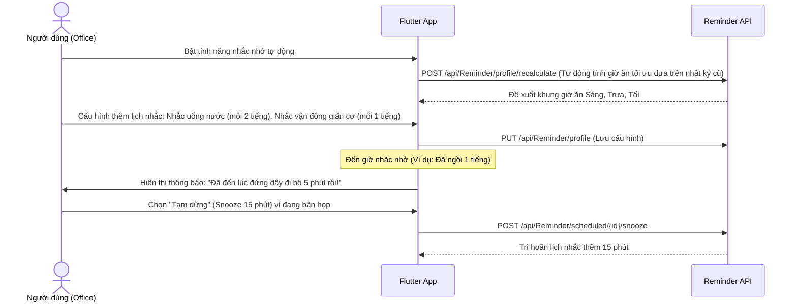

# 🥗 MenuGreen — Luồng Nghiệp Vụ Người Dùng Văn Phòng (Office User Workflow)

Tài liệu này chi tiết hành trình của **Người làm việc văn phòng (Office User)** - nhóm người dùng có lối sống ít vận động (sedentary lifestyle), làm việc ngồi một chỗ thời gian dài, dễ gặp vấn đề về tích tụ mỡ bụng, mỏi vai gáy, và có nhu cầu tự mang cơm hộp (lunchbox) đi làm để tiết kiệm chi phí và đảm bảo vệ sinh.

---

## 1. Đăng ký & Onboarding cho nhóm Office
1. **Đăng ký**: Đăng ký tài khoản mới qua Email + OTP hoặc Google Sign-In.
2. **Onboarding**:
   - Nhập chỉ số cơ bản (tuổi, chiều cao, cân nặng).
   - Chọn mục tiêu sức khỏe: **Duy trì cân nặng (Maintain)** hoặc **Giảm mỡ bụng nhẹ nhàng**. Nhập cân nặng mục tiêu.
   - Chọn mức độ hoạt động thể chất thấp: **Ít vận động (Sedentary)** (làm việc bàn giấy, ít tập thể dục).
   - Hệ thống tính toán chỉ số TDEE thấp tương ứng và kiểm soát calo nghiêm ngặt để tránh tích mỡ thừa.
   - Chọn nhóm hành vi: **Theo dõi sức khỏe / Văn phòng (Office/Health Tracker)**.
3. **Nâng cấp gói cước**: Thanh toán tự động qua SePay, nâng cấp vai trò tài khoản thành `Office`.

---

## 2. Nhắc Nhở Thông Minh Thích Ứng & Thói Quen Sinh Hoạt (Adaptive Reminders)
Giúp người dùng văn phòng xây dựng các thói quen lành mạnh để giảm thiểu tác hại của việc ngồi lâu thông qua `ReminderController`.

---

## 3. Lập Kế Hoạch Ăn Uống Tiết Kiệm & Hộp Cơm Văn Phòng (Budget-Aware Meal Planning)
Người dùng văn phòng thường có nhu cầu tự chuẩn bị cơm trưa mang đi làm (lunchbox) để tiết kiệm và kiểm soát calo tốt hơn.

1. **Thiết lập ngân sách thực phẩm**:
   - Cấu hình giới hạn ngân sách tối đa hàng tuần cho việc đi chợ (`BudgetRequestController`).
   - Gọi API: `POST /api/BudgetRequest` để lưu hạn mức ngân sách.
2. **Lên kế hoạch thực đơn tuần**:
   - Hệ thống tự động gợi ý thực đơn đáp ứng đồng thời: lượng calo giới hạn (để tránh tăng cân) và mức giá nguyên liệu nằm trong ngân sách (Budget-Aware).
   - Công thức gợi ý ưu tiên các món dễ chế biến và bảo quản trong hộp cơm văn phòng.
3. **Mua sắm thông minh (Grocery List)**:
   - Hệ thống tự động gom các nguyên liệu cần mua thành danh sách tổng hợp để người dùng đi chợ một lần cho cả tuần.
4. **Gợi ý thay thế nguyên liệu**:
   - Nếu ở chợ thiếu nguyên liệu, người dùng sử dụng API `/api/IngredientSubstitution/substitutes` để tìm món thay thế có dưỡng chất tương đương.

---

## 4. Học Tập Về Sức Khỏe Văn Phòng (Micro-Learning)
Hệ thống đề xuất các thẻ kiến thức hữu ích trực tiếp liên quan đến sức khỏe công sở:
- *Mẹo tránh đau mỏi vai gáy khi ngồi máy tính lâu.*
- *Lựa chọn đồ ăn vặt lành mạnh chống buồn ngủ chiều (hạt điều, táo, sữa chua không đường).*
- *Bài tập thể dục 3 phút tại bàn làm việc.*

Người dùng đọc thẻ, thực hiện bài kiểm tra trắc nghiệm nhanh để tích lũy điểm thưởng thói quen.

---

## 5. Thực Đơn Hộp Cơm Lưu Sẵn (Meal Templates)
Giúp ghi nhận nhật ký ăn uống nhanh chóng cho các bữa ăn trưa lặp lại mang đi làm.

1. **Lưu bữa trưa yêu thích**: Người dùng lưu tổ hợp các món ăn trưa (ví dụ: cơm gạo lứt + ức gà luộc + bông cải xanh) thành mẫu "Cơm trưa đi làm".
2. **Ghi nhật ký nhanh**: Đến trưa chỉ cần bấm 1 chạm để áp dụng mẫu thực đơn này vào nhật ký ăn uống thực tế, tiết kiệm thời gian ghi chép trong giờ nghỉ trưa.
