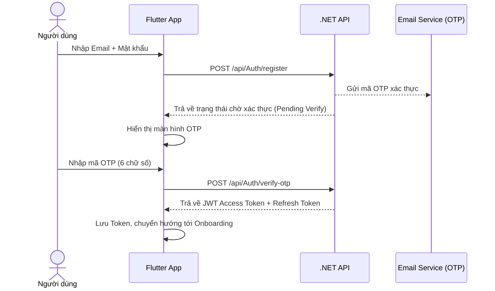
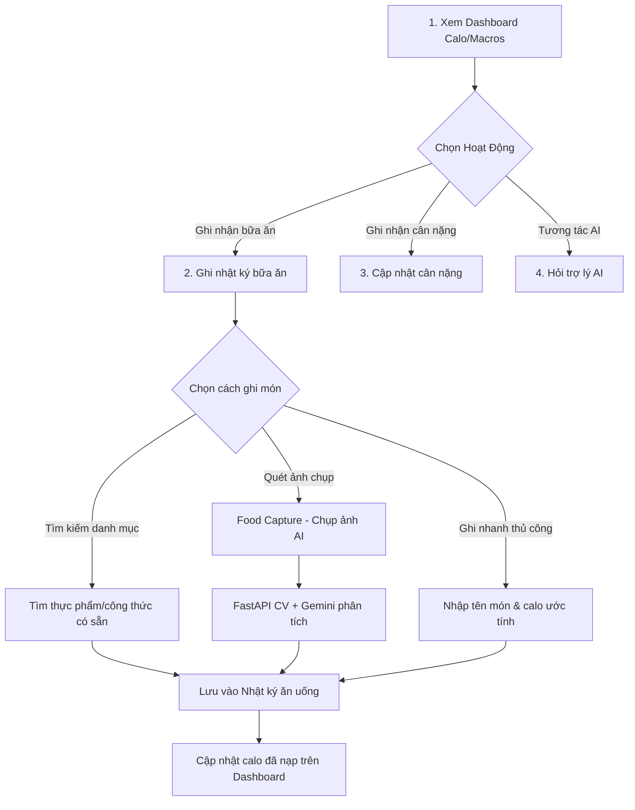
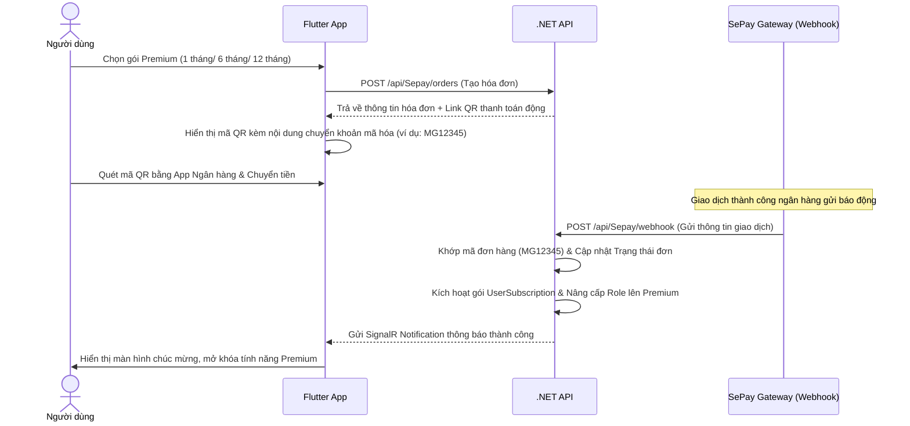
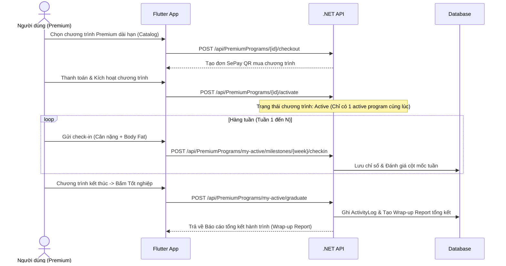

# 🥗 MenuGreen — Luồng Nghiệp Vụ Người Dùng (User Workflow)

Tài liệu này chi tiết hành trình của **Người dùng (User)** từ lúc mới cài đặt ứng dụng MenuGreen cho đến các hoạt động hàng ngày và nâng cấp lên tài khoản Premium.

---

## 1. Đăng ký & Xác thực (Auth & Account)

Quy trình tạo tài khoản mới đảm bảo tính bảo mật và xác minh email tại thị trường Việt Nam.

* **Đăng nhập Google**: Người dùng có thể đăng nhập nhanh thông qua Firebase Auth (Google Sign-In). Nếu là tài khoản mới, hệ thống tự động tạo User và đi thẳng vào luồng Onboarding.
* **Quên mật khẩu**: Yêu cầu nhập Email -> nhận OTP khôi phục -> Đặt lại mật khẩu mới thông qua `/api/Auth/reset-password`.

---

## 2. Thiết lập hồ sơ & Onboarding (5 Bước)

Tất cả người dùng mới bắt buộc phải trải qua quy trình Onboarding 5 bước để cấu hình mục tiêu dinh dưỡng cá nhân hóa.

* **Bước 1: Thông tin cơ bản**: Nhập họ tên, số điện thoại, giới tính, ngày sinh, chiều cao, cân nặng hiện tại.
* **Bước 2: Mục tiêu sức khỏe**: Chọn mục tiêu (Giảm cân, Giữ cân, Tăng cân) và mức độ hoạt động thể chất (Ít vận động, Vận động nhẹ, Vận động vừa, Vận động nặng). Nhập cân nặng mục tiêu.
* **Bước 3: Tính toán Calo & Macros**: Hệ thống tự động tính toán chỉ số TDEE (Total Daily Energy Expenditure) và phân chia tỷ lệ dinh dưỡng (Carbs / Protein / Fat) mặc định theo mục tiêu.
* **Bước 4: Thiết lập dị ứng & Khẩu vị**: Chọn các nhóm chất gây dị ứng (Hải sản, Đậu phộng, Trứng, Sữa...) và sở thích ẩm thực.
* **Bước 5: Phân loại nhóm người dùng**: Người dùng tự chọn nhóm hành vi của mình:
  * **Nhóm A (Ăn uống đơn giản)**: Nhận gợi ý món ăn nhanh trong ngày, ghi chép nhanh.
  * **Nhóm B (Theo dõi sức khỏe)**: Tập trung vào biểu đồ phân tích calo chi tiết, cảnh báo dư thừa.
  * **Nhóm C (Thể hình/PT)**: Có kế hoạch bữa ăn chi tiết, thay đổi TDEE linh hoạt theo ngày tập/ngày nghỉ.

> [!IMPORTANT]
> Toàn bộ dữ liệu của 5 bước được lưu tạm ở Client. Khi người dùng bấm **Hoàn thành**, ứng dụng sẽ gọi duy nhất một API:
> `POST /api/Onboarding/complete` để khởi tạo đồng thời `HealthProfile`, `UserAllergy` và `UserAiProfile`, tối ưu hóa hiệu năng mạng.

---

## 3. Nhật ký & Theo dõi hàng ngày (Nutrition Tracking)

Sau khi hoàn thành Onboarding, người dùng truy cập màn hình chính (Dashboard) để bắt đầu chuỗi hoạt động hàng ngày:

### 3.1 Ghi nhận bữa ăn (Meal Log)
* Người dùng ghi nhận món ăn theo các bữa: **Sáng (Breakfast)**, **Trưa (Lunch)**, **Tối (Dinner)**, và **Ăn nhẹ (Snack)**.
* **Nhận diện món ăn qua hình ảnh (Food Capture - Premium)**: Người dùng chụp ảnh đĩa ăn -> App gửi tới Python CV service -> Hệ thống nhận diện các thực phẩm, ước tính gram, calo, kiểm tra tính an toàn dị ứng (`AllergenRiskResult`) và trả kết quả gợi ý -> Người dùng xác nhận hoặc chỉnh sửa nhanh trước khi lưu.

### 3.2 Theo dõi cân nặng (Weight Log)
* Ghi lại cân nặng hàng ngày/hàng tuần.
* Xem biểu đồ xu hướng (Weight Trend) để so sánh cân nặng thực tế với Cân nặng mục tiêu (Target Weight).

---

## 4. Lên kế hoạch bữa ăn (Meal Planning - Premium)

Tính năng dành riêng cho tài khoản Premium giúp thiết kế thực đơn khoa học và tiết kiệm chi phí.

1. **Khởi tạo Kế hoạch**: Người dùng tạo kế hoạch tuần mới (`POST /api/MealPlan`).
2. **Gợi ý tự động (Recommendation Engine)**:
   * Hệ thống tự động thiết kế thực đơn phù hợp với giới hạn calo hàng ngày và ngân sách tối đa do người dùng cấu hình (Budget-Aware).
   * Công thức được lọc tự động để loại bỏ các món ăn có chứa chất gây dị ứng của người dùng dựa vào tag dị ứng (`FoodAllergenTag`).
3. **Điều chỉnh & Thay thế**:
   * Nếu không thích một món ăn hoặc thiếu nguyên liệu, người dùng có thể yêu cầu gợi ý nguyên liệu thay thế (`GET /api/IngredientSubstitution/substitutes`).
   * Chuyển đổi khối lượng thực phẩm linh hoạt thông qua bộ chuyển đổi đơn vị (`PortionConverter`).
4. **Thực thi kế hoạch (Commit to Log)**:
   * Khi đến ngày ăn, người dùng nhấn "Ăn món này" -> Hệ thống tự động chuyển đổi `MealPlanItem` thành một bản ghi `MealLog` thực tế mà không cần nhập lại từ đầu.

---

## 5. Trợ Lý AI & Huấn Luyện Viên Cá Nhân (AI Coach - Premium)

Trợ lý AI đồng hành 24/7 giúp giải đáp thắc mắc và tự động hóa thao tác trong app.

* **Trò chuyện dinh dưỡng**: Người dùng hỏi về thông tin calo, lời khuyên sức khỏe, công thức chế biến.
* **Tự động hóa hành vi (Function Calling)**:
   * Người dùng có thể chat: *"Tôi vừa ăn một bát phở bò 150g cho bữa sáng"* -> Trợ lý AI tự động phân tích và gọi API ghi nhận bữa ăn (`log_meal`) vào hệ thống thay vì bắt người dùng thao tác thủ công.
   * Chat: *"Lên thực đơn 1600kcal cho ngày mai giúp tôi"* -> AI gọi API tạo `MealPlan` tương ứng.

---

## 6. Đăng ký & Thanh toán Premium (Subscriptions & SePay)

Luồng nâng cấp tài khoản Premium tự động hoàn toàn thông qua cổng thanh toán QR của Việt Nam (SePay).

---

## 7. Quy trình cộng tác với PT / Huấn luyện viên

Người dùng có hai phương thức để PT hoặc Coach hỗ trợ điều chỉnh dinh dưỡng:

### 7.1 Đánh giá một lần (PT Review - Free & Premium)
1. **Tạo yêu cầu**: Người dùng chọn tuần cần đánh giá và bấm "Tạo link đánh giá". Hệ thống tạo một bản ghi `PtReviewRequest` kèm một mã bảo mật duy nhất (token-link).
2. **Chia sẻ**: Người dùng copy liên kết (ví dụ: `https://menugreen.food/shared-reports/abc-xyz-123`) gửi cho PT của mình qua Zalo/Messenger.
3. **Nhận kết quả**: Sau khi PT xem qua web và gửi nhận xét, người dùng nhận được thông báo. Người dùng xem chi tiết phản hồi và có quyền bấm **Áp dụng (Apply)** để tự động cập nhật lại thực đơn và mục tiêu calo theo lời khuyên của PT, hoặc bấm **Từ chối (Reject)**.

### 7.2 Theo dõi dài hạn (Coaches Ecosystem - Premium)
1. **Tìm kiếm & Kết nối**: Người dùng vào danh mục Coach, xem thông tin và gửi yêu cầu kết nối với một Coach ưa thích (`POST /api/Coaches/connect/{coachId}`).
2. **Cấp quyền truy cập dữ liệu**: Sau khi Coach chấp nhận kết nối, người dùng bấm **Cấp quyền (Grant Access)** để Coach có thể xem hồ sơ sức khỏe, nhật ký ăn uống và biểu đồ cân nặng của mình. Người dùng có quyền **Thu hồi quyền truy cập (Revoke Access)** bất kỳ lúc nào để bảo vệ quyền riêng tư.
3. **Nhận chỉ dẫn**: Coach sẽ chủ động tối ưu kế hoạch bữa ăn và điều chỉnh chỉ tiêu calo hàng ngày trực tiếp trên tài khoản của người dùng.

---

## 8. Thực đơn đã lưu (Meal Templates)

Thực đơn đã lưu cho phép người dùng lưu một bữa ăn lặp lại gồm nhiều món (ví dụ: "Bữa sáng giảm cân", "Bữa trưa văn phòng") để ghi nhanh vào nhật ký sau này mà không cần tìm lại từng món.

* **Tạo từ Nhật ký (Log to Template)**: Người dùng có thể chọn một bữa ăn bất kỳ trong lịch sử nhật ký ăn uống và bấm "Lưu thành thực đơn" (`POST /api/MealTemplate/from-log/{mealLogId}`).
* **Tạo thủ công**: Người dùng tự tạo thực đơn mới, gán loại bữa ăn (`MealType` như Sáng, Trưa, Tối, Bữa phụ), thêm các món ăn/công thức từ catalog và lưu lại (`POST /api/MealTemplate`).
* **Sử dụng & Nhân bản**:
  * Người dùng có thể nhân bản thực đơn (`POST /api/MealTemplate/{id}/duplicate`).
  * Khi ghi thực đơn vào nhật ký (`POST /api/MealTemplate/{id}/log`), người dùng chọn ngày và có thể điều chỉnh ghi đè khối lượng (quantity override) của từng món trước khi xác nhận. Hệ thống sẽ tự động tạo các bản ghi `MealLog` tương ứng.

---

## 9. Góc dinh dưỡng & Bài kiểm tra (Micro-Learning & Quiz)

Góc dinh dưỡng là lớp game hóa (gamification) giúp tăng sự tương tác của người dùng thông qua việc cung cấp kiến thức dinh dưỡng ngắn gọn và các bài kiểm tra có thưởng.

* **Cá nhân hóa nội dung**: Hệ thống tự động phân tích hồ sơ sức khỏe (`HealthProfile`), dị ứng và nhật ký ăn uống để đề xuất các thẻ kiến thức (Micro-learning Cards) phù hợp nhất (`GET /api/MicroLearning/cards/recommended`).
* **Đọc & Lưu trữ**: Người dùng có thể đọc các thẻ (bao gồm mẹo nhanh - Quick Tips), lưu thẻ để đọc lại (`GET /api/MicroLearning/cards/saved`) hoặc ẩn thẻ đi.
* **Làm Quiz nhận quà**: Mỗi thẻ kiến thức đi kèm 1 bài kiểm tra trắc nghiệm ngắn. Khi trả lời đúng, người dùng sẽ nhận được phản hồi giải thích chi tiết và tích lũy điểm thưởng (`POST /api/MicroLearning/cards/{id}/quiz/submit`).

---

## 10. Nhắc nhở thông minh thích ứng (Adaptive Reminders)

Hệ thống quản lý lịch nhắc nhở ăn uống tối ưu và nhắc nhở tùy chỉnh cho người dùng.

* **Tự động tính toán giờ ăn**: Hệ thống phân tích lịch sử nhật ký ăn uống (`MealLog`) của người dùng để tính toán giờ ăn trung bình thực tế cho bữa Sáng, Trưa, Tối (`POST /api/Reminder/profile/recalculate`). Người dùng có thể sử dụng giờ ăn đề xuất này hoặc tự điều chỉnh thủ công (`PUT /api/Reminder/profile`).
* **Lịch nhắc nhở tùy chỉnh**: Người dùng có thể thiết kế các nhắc nhở trong tương lai (Scheduled Reminders).
* **Quản lý & Tương tác**:
  * Người dùng có thể bật/tắt nhắc nhở (`PATCH /api/Reminder/scheduled/{id}`).
  * Khi thông báo đến hạn, người dùng có thể bấm **Tạm dừng (Snooze)** để dời nhắc nhở thêm một khoảng thời gian (mặc định 15 phút) (`POST /api/Reminder/scheduled/{id}/snooze`).

---

## 11. Chương trình Lộ trình Dinh dưỡng dài hạn (Premium Programs)

Chương trình Premium có cấu trúc là lộ trình theo tuần với các cột mốc (milestone), kiểm tra định kỳ (check-in) và lễ tốt nghiệp (graduation), giúp thúc đẩy người dùng cam kết đạt mục tiêu dài hạn (ví dụ: "Giảm 5kg trong 8 tuần").

* **Khám phá & Kích hoạt**: Người dùng duyệt catalog chương trình, thanh toán qua SePay và kích hoạt chương trình (`POST /api/PremiumPrograms/{id}/activate`).
* **Cột mốc & Check-in tuần**: Mỗi tuần, người dùng gửi thông số cân nặng và tỷ lệ mỡ (weight + body fat) để hệ thống ghi nhận tiến trình và đánh giá cột mốc (milestone) tuần.
* **Tốt nghiệp & Báo cáo tổng hợp**: Sau khi hoàn thành tuần cuối cùng, người dùng bấm tốt nghiệp (`POST /api/PremiumPrograms/my-active/graduate`). Hệ thống sẽ tạo một báo cáo tổng kết hành trình (Wrap-up Report) chi tiết ghi lại toàn bộ sự thay đổi thể trạng.

