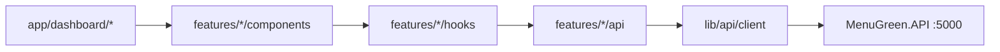

# MenuGreen Admin — Frontend Web

Trang quản trị web cho hệ thống **MenuGreen**, xây dựng bằng **Next.js App Router** + **TypeScript** + **Tailwind CSS**. Ứng dụng kết nối với backend ASP.NET Core (`MenuGreen.API`) để quản lý người dùng, nội dung dinh dưỡng và gói dịch vụ.

---

## Yêu cầu

| Công cụ | Phiên bản gợi ý |
|---------|-----------------|
| Node.js | 20+ |
| pnpm | 9+ |
| Backend API | .NET 9 — chạy tại `http://localhost:5000` |

---

## Cài đặt & chạy

### 1. Cài dependencies

```bash
cd frontend-web
pnpm install
```

> Nếu gặp lỗi `ERR_PNPM_IGNORED_BUILDS` khi cài lần đầu:

```bash
pnpm approve-builds   # chọn sharp, unrs-resolver
pnpm install
```

### 2. Cấu hình môi trường (tuỳ chọn)

Tạo file `.env.local`:

```env
NEXT_PUBLIC_API_BASE_URL=http://localhost:5000/api
```

Mặc định app dùng `http://localhost:5000/api` nếu không set biến này.

### 3. Chạy backend

```bash
cd ../backend/MenuGreen.API
dotnet run
```

Swagger: [http://localhost:5000/swagger](http://localhost:5000/swagger)

### 4. Chạy frontend

```bash
cd frontend-web
pnpm dev
```

Mở [http://localhost:3000](http://localhost:3000) — tự redirect `/dashboard` hoặc `/login`.

---

## Tài khoản demo

| Field | Giá trị |
|-------|--------|
| Email | `admin@menugreen.app` |
| Password | `Demo@123` |

> Chỉ tài khoản có role **Admin** mới vào được dashboard. User thường sẽ bị từ chối sau khi đăng nhập.

Seed data: `backend/database/seeddata.sql`

---

## Scripts

| Lệnh | Mô tả |
|------|-------|
| `pnpm dev` | Chạy dev server (Turbopack) |
| `pnpm build` | Build production |
| `pnpm start` | Chạy bản build |
| `pnpm lint` | ESLint |

---

## Tính năng quản trị

| Module | Route | Mô tả |
|--------|-------|-------|
| Tổng quan | `/dashboard` | Hub điều hướng các module |
| Người dùng | `/dashboard/users` | Danh sách, khóa/mở, gán role |
| Món ăn | `/dashboard/foods` | Tìm kiếm, CRUD món ăn |
| Nguyên liệu | `/dashboard/ingredients` | Tìm kiếm, CRUD nguyên liệu |
| Công thức | `/dashboard/recipes` | CRUD công thức + thành phần |
| Gói thành viên | `/dashboard/subscription-plans` | CRUD gói Free/Pro, bật/tắt |
| Thực đơn mẫu | `/dashboard/meal-plans` | CRUD meal plan, phân phối |
| Đăng nhập | `/login` | Admin login |

---

## Cấu trúc thư mục

```
frontend-web/
├── app/                          # Next.js App Router (routing mỏng)
│   ├── (auth)/login/             # Trang đăng nhập
│   ├── dashboard/                # Khu vực admin (có AuthGuard)
│   ├── layout.tsx                # Root layout + AuthProvider
│   └── page.tsx                  # Redirect → /dashboard
│
├── components/
│   ├── ui/                       # Button, Input, Select, Badge...
│   └── layout/                   # Sidebar, Header, PageHeader
│
├── features/                     # Feature-first modules
│   ├── auth/                     # Login, guard, JWT role check
│   ├── users/
│   ├── foods/
│   ├── ingredients/
│   ├── recipes/
│   ├── subscription-plans/
│   └── meal-plans/
│       ├── api/                  # API client theo domain
│       ├── components/           # UI + form dialogs
│       ├── hooks/                # useUsers, useFoods, ...
│       ├── types.ts
│       └── utils/                # Form mappers / validation
│
├── lib/
│   ├── api/                      # apiClient, endpoints, errors, admin barrel
│   ├── auth/                     # tokenStorage, jwt-utils
│   └── utils/                    # cn(), format date/currency
│
├── providers/
│   └── auth-provider.tsx         # Auth context (login/logout/role)
│
└── types/
    └── common.ts                   # MessageResponse, StatusRequest
```

---

## Kiến trúc



**Nguyên tắc:**

- `app/` chỉ compose UI, không chứa business logic
- Mỗi feature tự quản lý `api`, `hooks`, `components`, `types`
- `lib/` chỉ chứa hạ tầng dùng chung (HTTP client, token, utils)

---

## API & Authentication

### Import API tập trung

```typescript
import {
  authApi,
  userApi,
  foodApi,
  ingredientApi,
  recipeApi,
  subscriptionPlanApi,
  mealPlanApi,
} from "@/lib/api/admin";
```

### Luồng auth

1. `POST /api/Auth/login` → lưu JWT vào `localStorage`
2. Decode claim `role` từ JWT — chỉ cho phép **Admin**
3. `apiClient` tự refresh token khi sắp hết hạn hoặc gặp 401
4. `AuthGuard` bảo vệ toàn bộ route `/dashboard/*`

### Token storage keys

| Key | Mô tả |
|-----|-------|
| `menugreen_access_token` | JWT access token |
| `menugreen_refresh_token` | Refresh token |
| `menugreen_full_name` | Tên hiển thị trên header |

---

## Path alias

```json
"@/*" → "./*"
```

Ví dụ: `@/features/users/api/user-api`, `@/lib/api/client`

---

## Xử lý sự cố

### Hydration mismatch trên `/login`

Thường do extension trình duyệt (Grammarly, v.v.) inject attribute vào `<body>`. App đã dùng `suppressHydrationWarning` trên `<html>` / `<body>`. Nếu vẫn thấy warning, thử cửa sổ ẩn danh hoặc tắt extension trên `localhost`.

### `Failed to fetch` / CORS

- Kiểm tra backend đang chạy tại `http://localhost:5000`
- Backend đã bật CORS `AllowAll` trong Development

### 401 Unauthorized

- Đăng nhập lại bằng tài khoản Admin
- Token hết hạn — logout rồi login lại

### `node: command not found`

Cài Node.js 20+ và đảm bảo `node` có trong PATH (đặc biệt khi dùng Git Bash trên Windows).

---

## Tech stack

- [Next.js 16](https://nextjs.org/) (App Router, Turbopack)
- [React 19](https://react.dev/)
- [TypeScript 5](https://www.typescriptlang.org/)
- [Tailwind CSS 4](https://tailwindcss.com/)
- [pnpm](https://pnpm.io/) — package manager

---

## Liên quan

| Thành phần | Đường dẫn |
|------------|-----------|
| Backend API | `../backend/MenuGreen.API` |
| Flutter mobile app | `../frontend` |
| Seed data | `../backend/database/seeddata.sql` |
